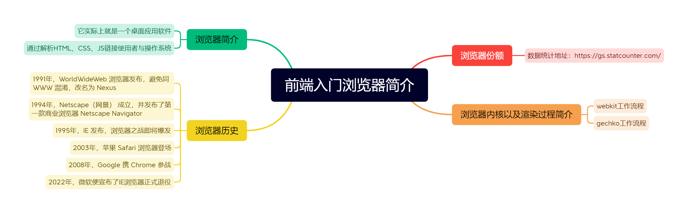
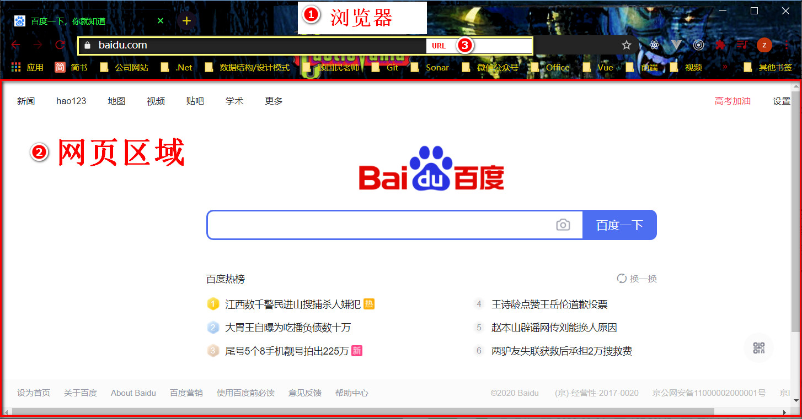
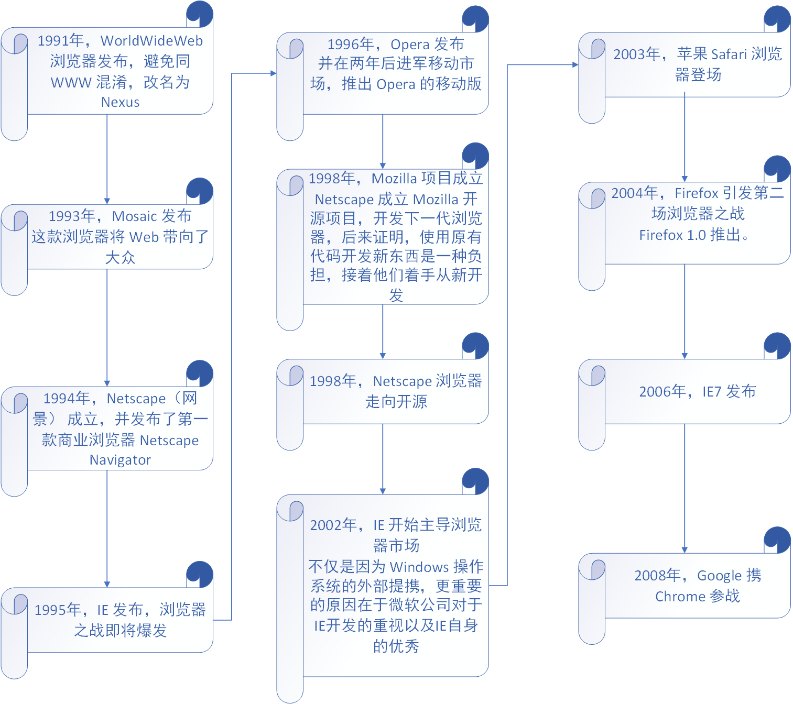
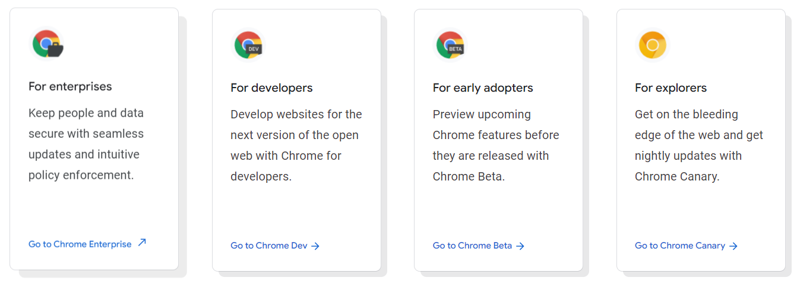
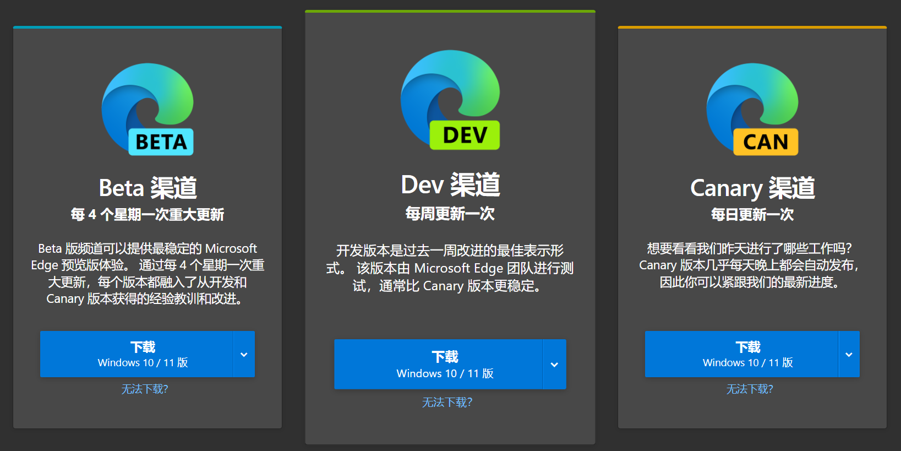
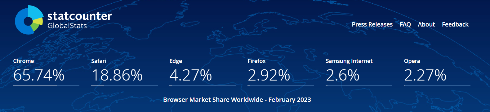

## 一、什么是浏览器
### 1.1 浏览器的定义
浏览器是一个用于访问和浏览互联网上网页的应用程序。它将HTML、CSS和JavaScript代码转换为用户可以交互的网页。

### 1.2 浏览器的基本工作流程

浏览器的基本工作流程如下:
1. 输入网址(URL)
2. DNS解析
3. 与服务器建立连接 
4. 请求页面资源
5. 接收服务器响应
6. 解析和渲染页面
7. 展示给用户

## 二、浏览器的发展历史
### 2.1 重要时间节点
- 1990: WorldWideWeb - 第一个网页浏览器
- 1995: Internet Explorer 发布
- 2003: Safari 发布
- 2004: Firefox 发布  
- 2008: Chrome 发布
- 2015: Microsoft Edge 发布

### 2.2 浏览器大战

浏览器市场经历了几个重要阶段:
1. IE 统治时期(1995-2005)
2. Firefox 崛起时期(2004-2008)
3. Chrome 主导时期(2008-至今)

## 三、主流浏览器介绍
### 3.1 Google Chrome

- 内核: Blink(基于WebKit)
- 特点: 
  - 快速且稳定
  - 强大的开发者工具
  - 丰富的扩展程序
  - 跨平台支持

### 3.2 Microsoft Edge

- 内核: Chromium(2020年后)
- 特点:
  - IE模式兼容
  - 集成AI功能
  - 性能优化
  - Windows系统深度整合

### 3.3 Mozilla Firefox

- 内核: Gecko
- 特点:
  - 开源
  - 注重隐私
  - 高度可定制
  - Web标准支持

## 四、浏览器市场份额
### 4.1 最新市场数据(2024年)

当前浏览器市场份额:
- Chrome: 65%
- Safari: 19%
- Edge: 5%
- Firefox: 3%
- 其他: 8%

### 4.2 市场趋势分析
- Chrome持续领先
- 移动端浏览器份额上升
- 新Edge逐步取代IE
- 浏览器同质化趋势

## 五、浏览器开发者工具
### 5.1 Chrome DevTools
- Elements: 检查和修改DOM
- Console: 查看日志和执行JavaScript
- Network: 分析网络请求
- Performance: 性能分析
- Application: 存储和缓存

### 5.2 调试技巧
- 元素检查
- 断点调试
- 网络分析
- 性能优化
- 移动端调试

## 实践练习
1. 对比不同浏览器打开同一网页的效果
2. 使用Chrome开发者工具分析一个网站
3. 尝试使用不同浏览器的特色功能

## 常见问题
Q: 为什么有些网站只能在特定浏览器中访问？

A: 这通常是因为网站使用了特定浏览器独有的特性或旧版本的技术标准。

Q: 不同浏览器的兼容性如何处理？

A: 通过使用标准化的Web技术、CSS前缀、特性检测和polyfill等方式处理。

## 本节小结
- 了解了浏览器的基本概念和工作原理
- 掌握了主流浏览器的特点和市场现状
- 学习了浏览器开发者工具的基本使用
- 认识到浏览器兼容性的重要性

## 下节预告
下一节我们将深入探讨浏览器的工作原理，包括渲染引擎、JavaScript引擎等核心概念。

## 参考资源
- [Chrome开发者工具官方文档](https://developers.google.com/web/tools/chrome-devtools)
- [StatCounter全球浏览器统计](https://gs.statcounter.com/)
- [Can I Use - 浏览器兼容性查询](https://caniuse.com/)

## 关于我
* 一个推崇全栈开发的前端开发人员
* 如果你想找我聊聊，可以添加我的 - 微信: itrzzh

* 如果你想及时订阅我的发布文章或者获取资料，可以关注我的 - 公众号：全栈道

* 如果你想让我帮忙改简历、获取知识手册、学习面试资料、学习路线等，请加入我的 - 知识星球：全栈道

* 个人网站：https://www.iotzzh.com
* B站：https://space.bilibili.com/285025688
* 抖音/快手：全栈道
* github：https://github.com/iotzzh
* gitee: https://gitee.com/iotzzh

## 捐赠鼓励
开源不易，如果《全栈道》对你有些帮助，可以请作者喝杯咖啡，算是对开源做出的一点点鼓励吧！

