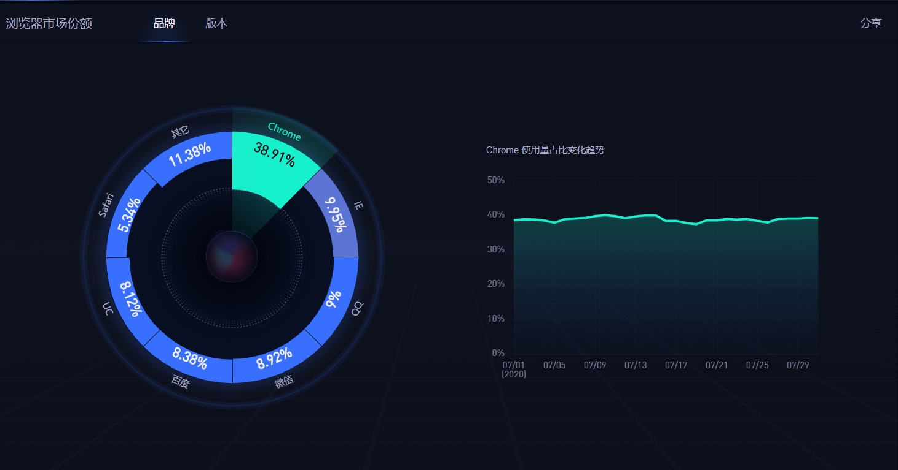

## 前言

在平时使用电脑时，我们经常会用到浏览器，可以供我们阅读，娱乐，工作等。上图展示了一个浏览器简单的工作过程，输入网址到页面展示的过程如下：
> 输入网址 -> dns解析 -> 与服务器创建连接 -> 请求返回页面-> 断开连接-> 展示网页。

## 那么浏览器是什么呢？哪里来的？
一个新的电脑里面，我们会发现win10自带的浏览器Edge，就是下面这个样子：

它实际上就是一个桌面应用软件，这个软件是微软开发的，预安装在windows里面。不知道你们有没有遇到过，在有些时候，我们需要使用一些特定的网站时，需要使用特定的浏览器。例如学校网站的个别功能，老师会说，需要下载谷歌浏览器，或者IE8以上的浏览器才可以提交表格，有些网站只可以用UC浏览器打开等等这些场景。所以，浏览器种类有很多，并不都是一样的。不同的浏览器是由不同的厂家生产的，同一厂家也会生产出多个不同版本的浏览器，也会不断的升级。

chrome: https://www.google.com/chrome/?platform=win64

edge：https://www.microsoftedgeinsider.com/zh-cn/download/

firefox:https://www.mozilla.org/zh-CN/firefox/developer/

## 浏览器的历史
[知乎: 浏览器发展](https://zhuanlan.zhihu.com/p/93235164)

虽然目前浏览器是百家齐放的时代，但是也在趋于一统。它们也会遵循W3C的web标准(HTML/CSS/JS)。不过在统一标准的前提下，各个浏览器也会有各自的发展。可能某个浏览器对标准实现的快一些，可能某个浏览器在标准的基础上进行了其他方向的扩展等等。
但是，对于前端开发者来说，浏览器很多自然不是什么好事，但是只能期待早日一统。在平时的开发中，尽可能使用标准内的，且大多数主流浏览器已经实现的标准。

#### 各浏览器当前市场份额(2020.8.16)

[百度统计]

#### 注:百度统计目前已被关闭，请转到：https://gs.statcounter.com/
（2023.3.1）

从图里可以看出，火狐浏览器已经被归类到其他里面了，没想到谷歌浏览器成了最终的霸主。

从某些方面也告诉我们，当下若还没有成就的时候，不要急，不要慌，好好沉淀自己，用发展的眼光去提升自己，谁主沉浮未可知！

总结： 浏览器就是一个客户端程序，基于这个客户端，再加上一张张网页使生活生产更加便捷与丰富。

## 关于我
* 一个推崇全栈开发的前端开发人员
* 微信: itrzzh

* 公众号：全栈道

* 个人网站：https://www.iotzzh.com

* 知识星球：全栈道

* B站：https://space.bilibili.com/285025688
* 抖音：全栈道
* github：https://github.com/iotzzh
* gitee: https://gitee.com/iotzzh

## 捐赠鼓励
开源不易，如果《全栈道》对你有些帮助，可以请作者喝杯咖啡，算是对开源做出的一点点鼓励吧！

