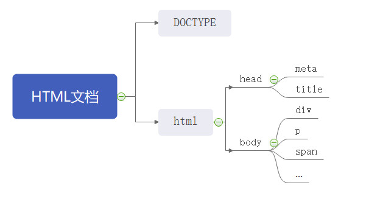
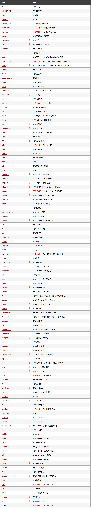
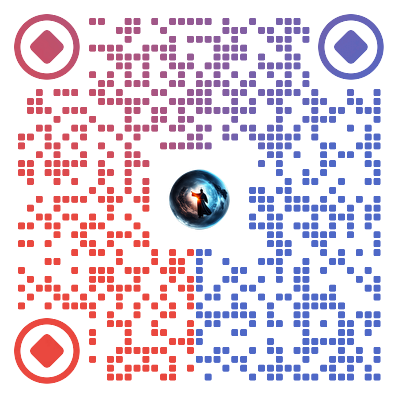

<div style="text-align: center"></div>
由前面两个章节了解到，浏览器如同一个加工厂，在这个加工厂里面，有HTML、CSS、JS三大零件，然后浏览器将这些零件组装成一张张美丽的网页。

HTML负责骨架，CSS负责样式，JS负责行为。

## 那么HTML是什么呢？
HTML是Hyper Text Markup Language（超文本标记语言）的简写，**是一种标记语言，而不是一种编程语言**，是网页制作所必备的。超文本，本质也是文本。

自HTML3.2之后，由W3C推荐标准，定义了多种类型的元素（div，p...）和众多类型的属性值(id,name...)。

### HTML基础语法
双标签: `<标签名 属性名1="属性值" 属性名2="属性值">内容</标签名>`

单标签: `<标签名 属性名1="属性值" 属性名2="属性值">`

### HTML文档基本结构
<div style="text-align: center"></div>

###### HTML文档基本结构示例
```html
<!DOCTYPE html>
<html lang="en">
<head>
    <meta charset="UTF-8">
    <meta name="viewport" content="width=device-width, initial-scale=1.0">
    <title>Document</title>
</head>
<body>
    <div>Hello World</div>
</body>
</html>
```

### 文件类型描述(DOCTYPE)
为了说明文档使用的超文本标记语言标准，所有超文本标记语言文档应该以“****文件类型声明****”（外语全称加缩写<!DOCTYPE>）开头，引用一个文件类型描述或者必要情况下自定义一个文件类型描述。举例来说：
html5:
```html
<!DOCTYPE　HTML>
```

html4:
```html
<!DOCTYPE HTML PUBLIC "-//W3C//DTD HTML 4.01//EN"
            "http://www.w3.org/TR/html4/strict.dtd">
```

注：现在都用HTML5，基本上不再使用其他版本。

### 根标签（html）
html文档的最高节点标签。
### 元数据（meta）
* 元数据（Metadata）是数据的数据信息。
* <meta> 标签提供了 HTML 文档的元数据。元数据不会显示在客户端，但是会被浏览器解析。
* META元素通常用于指定网页的描述，关键词，文件的最后修改时间，作者及其他元数据。
* 元数据可以被使用浏览器（如何显示内容或重新加载页面），搜索引擎（关键词），或其他 Web 服务调用。

### 网页标题（title）
title是网页的标题元素包含在head中例如：```<title>百度一下你就知道</title>```在网页上方的标签中显示:百度一下你就知道，相当于一个关键字搜索引擎可以通过关键字查找到此页面。

### 主体部分（body）
body元素是网页的主体部分，网页的内容都写在里面，包括文本，图像，表单，音频，视频等其他内容。

我们编写网页的头部在head里编写，主体是在body内编写。在head里面可编写的内容大多是固定的，而在主体中的标签却是繁多且灵活组合使用的。

带5标识的，是HTML5新增的标签：
https://www.w3school.com.cn/tags/index.asp
<div style="text-align: center"></div>

## 标签的分类
如此多的标签，看得眼花缭乱，可以适当的将它们分分类。例如单标签/双标签，块级元素/内联元素，或者根据功能分类。

### 单标签/双标签
单标签：
```
<br><hr><input><param><meta><link>
```
双标签：
除去以上的单标签都是双标签

### 块级元素/内联元素
#### 块级元素定义
* 总是在新行上开始；
* 高度，行高以及外边距和内边距都可控制；
* 宽度缺省是它的容器的100%，除非设定一个宽度。
* 它可以容纳内联元素和其他块元素

#### 内联元素定义
* 和其他元素都在一行上；
* 高，行高及外边距和内边距不可改变；
* 宽度就是它的文字或图片的宽度，不可改变
* 内联元素只能容纳文本或者其他内联元素

### 块级元素有哪些
```
 <address>//定义地址 
 <caption>//定义表格标题 
 <dd>    //定义列表中定义条目 
 <div>     //定义文档中的分区或节 
 <dl>    //定义列表 
 <dt>     //定义列表中的项目 
 <fieldset> //定义一个框架集 
 <form> //创建 HTML 表单 
 <h1>    //定义最大的标题
 <h2>    // 定义副标题
 <h3>     //定义标题
 <h4>     //定义标题
 <h5>     //定义标题
 <h6>     //定义最小的标题
 <hr>     //创建一条水平线
 <legend>    //元素为 fieldset 元素定义标题
 <li>     //标签定义列表项目
 <noframes>    //为那些不支持框架的浏览器显示文本，于 frameset 元素内部
 <noscript>    //定义在脚本未被执行时的替代内容
 <ol>     //定义有序列表
 <ul>    //定义无序列表
 <p>     //标签定义段落
 <pre>     //定义预格式化的文本
 <table>     //标签定义 HTML 表格
 <tbody>     //标签表格主体（正文）
 <td>    //表格中的标准单元格
 <tfoot>     //定义表格的页脚（脚注或表注）
 <th>    //定义表头单元格
 <thead>    //标签定义表格的表头
 <tr>     //定义表格中的行
```

### 内联元素有哪些
```
 <a>     //标签可定义锚 
 <abbr>     //表示一个缩写形式 
 <acronym>     //定义只取首字母缩写 
 <b>     //字体加粗 
 <bdo>     //可覆盖默认的文本方向 
 <big>     //大号字体加粗 
 <br>     //换行 
 <cite>     //引用进行定义 
 <code>    // 定义计算机代码文本
 <dfn>     //定义一个定义项目
 <em>     //定义为强调的内容
 <i>     //斜体文本效果
      //向网页中嵌入一幅图像
 <input>     //输入框
 <kbd>     //定义键盘文本
 <label>     //标签为 input 元素定义标注（标记）
 <q>     //定义短的引用
 <samp>     //定义样本文本
 <select> // 创建单选或多选菜单
 <small>     //呈现小号字体效果
 <span>     //组合文档中的行内元素
 <strong> //加粗
 <sub>     //定义下标文本
 <sup>     //定义上标文本
 <textarea>     //多行的文本输入控件
 <tt>     //打字机或者等宽的文本效果
 <var>    // 定义变量
```

根据块级元素/内联元素分类的话，还有一些元素根据内容才能判断元素类型，例如：
```
<button>     //按钮
<del>    // 定义文档中已被删除的文本
<iframe>     //创建包含另外一个文档的内联框架（即行内框架）
<ins>     //标签定义已经被插入文档中的文本
<map>     //客户端图像映射（即热区）
<object>     //object对象
<script>     //客户端脚本
```
### 我们可以通过css的display属性对块级元素、行内元素进行转换，也可以设置行内块元素。
### 行内块元素
1、和其他元素都在一行上；
2、元素的高度、宽度、行高以及顶和底边距都可设置


## 关于我
* 一个推崇全栈开发的前端开发人员
* 微信: itrzzh

* 公众号：全栈道

* 个人网站：https://www.iotzzh.com

* 知识星球：全栈道

* B站：https://space.bilibili.com/285025688
* 抖音：全栈道
* github：https://github.com/iotzzh
* gitee: https://gitee.com/iotzzh

## 捐赠鼓励
开源不易，如果《全栈道》对你有些帮助，可以请作者喝杯咖啡，算是对开源做出的一点点鼓励吧！
