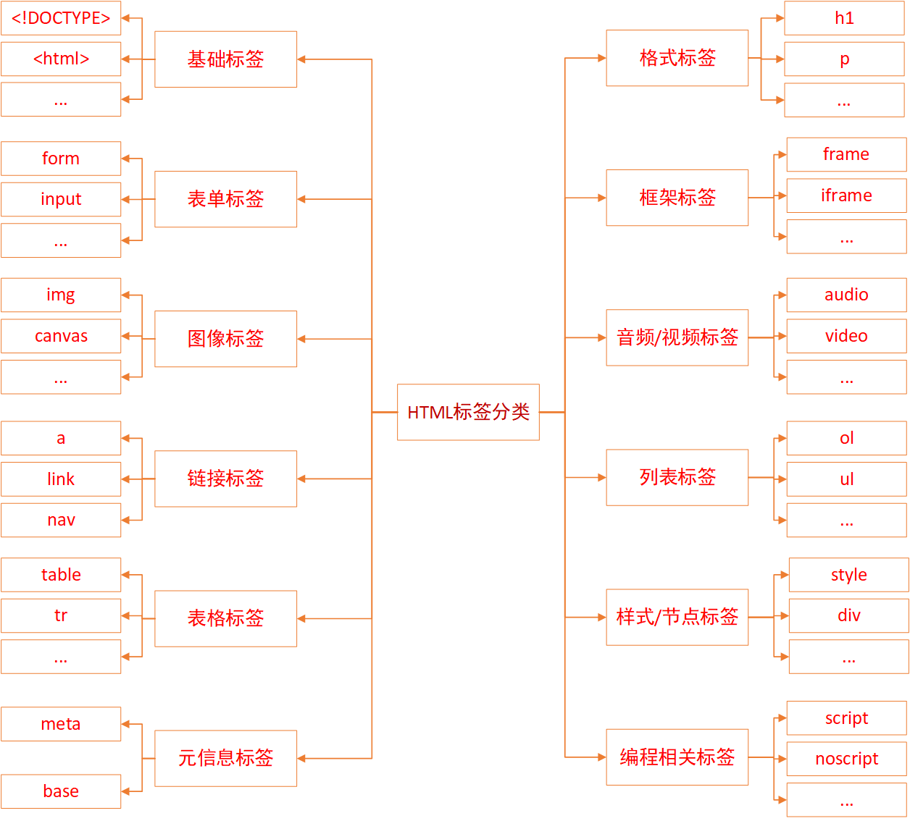
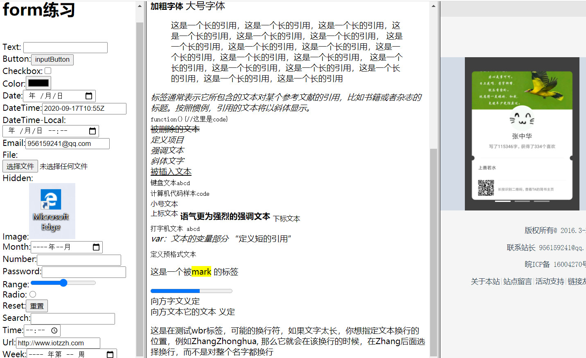
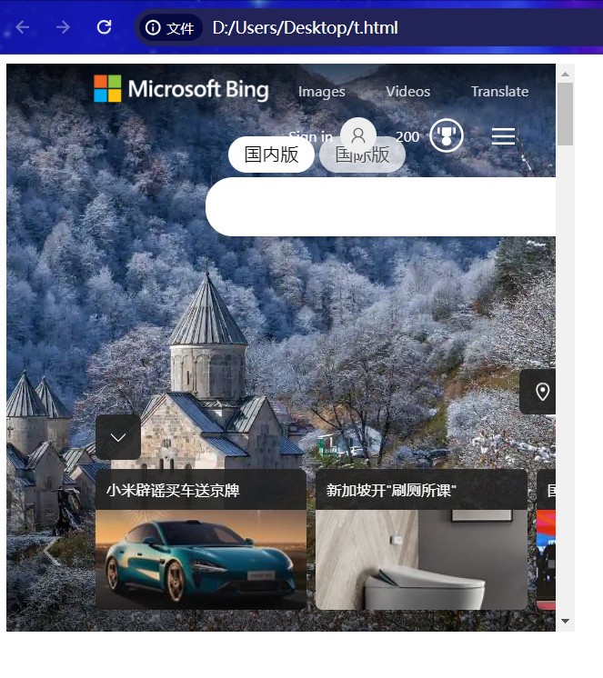
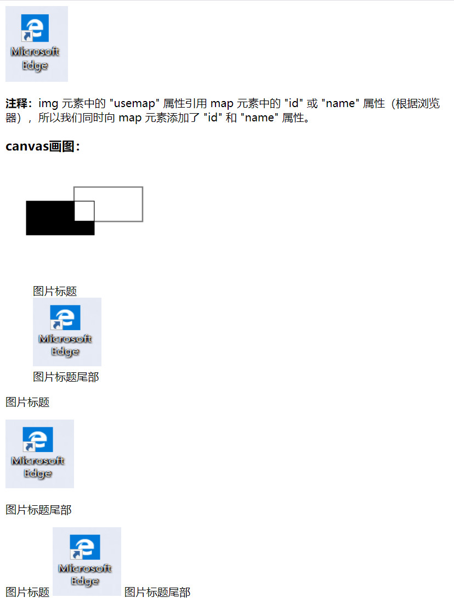
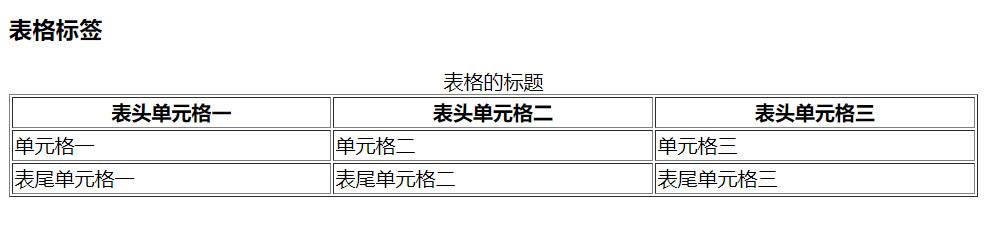

<div style="text-align: center"></div>

通过上一节的了解，我们知道html标签是构建网页结构的关键，而且它的种类繁多。为了更好的了解和使用它们，本章节将在功能上对它们进行分类，了解这些标签的功能。如果有分类不太精准的地方，还望不吝指正。
当然这些标签并不是都需要记住，最初只需要记住常用的即可。随着不断的使用，慢慢就会熟悉大部分标签的。

## 文档基础标签
`<!DOCTYPE>` 	定义文档类型。
`<html>`	定义 HTML 文档。
`<head>`	定义关于文档的信息。
`<title>`	定义文档的标题。
`<body>`	定义文档的主体。
`<!--...-->`	定义注释。

示例：
```html
<!DOCTYPE html>
<html lang="en">
<head>
    <meta charset="UTF-8">
    <meta name="viewport" content="width=device-width, initial-scale=1.0">
    <title>文档标题</title>
</head>
<body>
    <!-- 注释内容 -->
</body>
</html>
```

#### 格式标签
`<h1> to <h6>`	定义 HTML 标题。

`<p>`	定义段落。

`<br>`	定义简单的折行。

`<hr>`	定义水平线。

`<acronym>`: 定义只取首字母的缩写。

`<abbr>`: 定义缩写。

`<address>`	定义文档作者或拥有者的联系信息。

`<b>`	定义粗体文本。

`<bdo>`	定义文字方向。

`<big>`	定义大号文本。

`<blockquote>`	定义长的引用。

`<center>`	不赞成使用。定义居中文本。

`<cite>`	定义引用(citation)。

`<code>`	定义计算机代码文本。

`<del>`	定义被删除文本。

`<dfn>`	定义定义项目。

`<em>`	定义强调文本。

`<font>`	不赞成使用。定义文本的字体、尺寸和颜色

`<i>`	定义斜体文本。

`<ins>`	定义被插入文本。

`<kbd>`	定义键盘文本。

`<s>`	不赞成使用。定义加删除线的文本。

`<samp>`	定义计算机代码样本。

`<small>`	定义小号文本。

`<strike>`	不赞成使用。定义加删除线文本。

`<strong>`	定义语气更为强烈的强调文本。

`<sup>`	定义上标文本。

`<sub>`	定义下标文本。

`<tt>`	定义打字机文本。

`<u>`	不赞成使用。定义下划线文本。

`<var>`	定义文本的变量部分。

`<q>`定义短的引用。

`<pre>`	定义预格式文本。

`<time>[HTML5]`	定义日期/时间。目前所有主流浏览器都不支持 `<time>` 标签

`<mark>[HTML5]`	定义有记号的文本。

`<meter>[HTML5]`	定义预定义范围内的度量。

`<progress>[HTML5]`	定义任何类型的任务的进度。

`<rp>[HTML5]`	定义若浏览器不支持 ruby 元素显示的内容。

`<rt>[HTML5]`	定义 ruby 注释的解释。

`<ruby>[HTML5]`	定义 ruby 注释。

`<bdi>[HTML5]`	定义文本的文本方向，使其脱离其周围文本的方向设置。

`<wbr>[HTML5]`	定义可能的换行符。

示例：
```html
<!DOCTYPE html>
<html lang="en">

<head>
    <meta charset="UTF-8">
    <meta name="viewport" content="width=device-width, initial-scale=1.0">
    <title>Document</title>
</head>

<body>
    <!-- h1 to h6 定义标题 -->
    <h1>h1标题</h1>
    <h2>h2标题</h2>
    <h3>h3标题</h3>
    <h4>h4标题</h4>
    <h5>h5标题</h5>
    <h6>h6标题</h6>

    <!-- p定义段落 -->
    <p>p标签：这是一个段落内容</p>
    <!-- <br> 定义简单的折行。 -->
    <br>
    <p>p标签：这是另一个段落内容,上面使用了br折行，下面有一个水平线</p>
    <hr>
    <!-- <acronym>: 定义只取首字母的缩写， abbr： 定义缩写，鼠标移入，会显示title内容 -->
    <acronym title="World Wide Web">WWW</acronym>
    <abbr title="etcetera">etc.</abbr>

    <!-- <address> 定义文档作者或拥有者的联系信息。 -->
    <address>
        地址 <a href="https://www.bing.com">www.iotzzh.com</a>.<br>
    </address>

    <b>加粗字体</b>

    <big>大号字体</big>
    <blockquote>
        这是一个长的引用，这是一个长的引用，这是一个长的引用，这是一个长的引用，这是一个长的引用，这是一个长的引用，
        这是一个长的引用，这是一个长的引用，这是一个长的引用，这是一个长的引用，这是一个长的引用，这是一个长的引用，
        这是一个长的引用，这是一个长的引用，这是一个长的引用，这是一个长的引用，这是一个长的引用，这是一个长的引用
    </blockquote>

    <cite>标签通常表示它所包含的文本对某个参考文献的引用，比如书籍或者杂志的标题。按照惯例，引用的文本将以斜体显示。</cite>
    <br>
    <code>function(){//这里是code}</code>
    <br>
    <del>被删除的文本</del>
    <br>
    <dfn>定义项目</dfn><br>
    <em>强调文本</em><br>
    <i>斜体文字</i><br>
    <ins>被插入文本</ins><br>
    <kbd>键盘文本abcd</kbd><br>
    <samp>计算机代码样本code</samp><br>
    <small>小号文本</small><br>
    <sup>上标文本</sup>
    <strong>语气更为强烈的强调文本</strong>
    <sub>下标文本</sub><br>
    <tt>打字机文本 abcd</tt><br>
    <var>var：文本的变量部分</var>
    <q>定义短的引用</q>
    <pre>定义预格式文本</pre>
    <p>这是一个被<mark>mark</mark> 的标签</p>
    <progress value="60" max="100"></progress>
<br>
    <!-- <bdo> 定义文字方向:ltr,rtl -->
    <bdo dir="rtl">定义文字方向</bdo><br>
    <!-- <bdi> 定义文本方向:ltr,rtl，auto -->
    <bdo dir="rtl">定义 <bdi dir="ltr">文本它的文本</bdi>方向</bdo>

    <p>这是在测试wbr标签，可能的换行符，如果文字太长，你想指定文本换行的位置，例如Zhang<wbr>Zhonghua, 那么它就会在该换行的时候，在Zhang后面选择换行，而不是对整个名字都换行</wbr></p>
</body>

</html>

```

<div style="text-align: center">运行结果</div>

#### 表单标签
`<form>`	定义供用户输入的 HTML 表单。

`<input>`	定义输入控件。

`<textarea>`	定义多行的文本输入控件。

`<button>`	定义按钮。

`<select>`	定义选择列表（下拉列表）。

`<optgroup>`	定义选择列表中相关选项的组合。

`<option>`	定义选择列表中的选项。

`<label>`	定义 input 元素的标注。

`<fieldset>`	定义围绕表单中元素的边框。

`<legend>`	定义 fieldset 元素的标题。

`<isindex>`	不赞成使用。定义与文档相关的可搜索索引。

`<datalist>[HTML5]`	定义下拉列表。

`<keygen>[HTML5]`	定义生成密钥。

`<output>[HTML5]`	定义输出的一些类型。

示例：
```html
<!DOCTYPE html>
<html lang="en">
<head>
    <meta charset="UTF-8">
    <meta name="viewport" content="width=device-width, initial-scale=1.0">
    <title>Document</title>
</head>
<body>
    <h1>form练习</h1>
    <form action="">
        <br><label for=""></label>Text:</label> <input type="text">
        <br><label for="">Button:</label><input type="button" value="inputButton">
        <br><label for="">Checkbox:</label><input type="checkbox">
        <br><label for="">Color:</label><input type="color">
        <br><label for="">Date:</label><input type="date">
        <br><label for="">DateTime:</label><input type="datetime" value="2020-09-17T10:55Z">
        <br><label for="">DateTime-Local:</label><input type="datetime-local">
        <br><label for="">Email:</label><input type="email" value="956159241@qq.com">
        <br><label for="">File:</label><input type="file">
        <br><label for="">Hidden:</label><input type="hidden">
        <br><label for="">Image:</label><input type="image" src='../.././img/pic1.png'>
        <br><label for="">Month:</label><input type="month">
        <br><label for="">Number:</label><input type="number">
        <br><label for="">Password:</label><input type="password">
        <br><label for="">Range:</label><input type="range">
        <br><label for="">Radio:</label><input type="radio">
        <br><label for="">Reset:</label><input type="reset">
        <br><label for="">Search:</label><input type="search">
        <br><label for="">Time:</label><input type="time">
        <br><label for="">Url:</label><input type="url" value="https://www.bing.com">
        <br><label for="">Week:</label><input type="week">
    </form>
</body>
</html>
```
<div style="text-align: center">运行结果</div>

#### 框架标签
`<frame>`	定义框架集的窗口或框架。

`<frameset>`	定义框架集。

`<noframes>`	定义针对不支持框架的用户的替代内容。

`<iframe>`	定义内联框架。

frameset示例：
```html
<!DOCTYPE html>
<html lang="en">
<head>
    <meta charset="UTF-8">
    <meta name="viewport" content="width=device-width, initial-scale=1.0">
    <title>Document</title>
</head>
<frameset cols="25%,50%,25%">
    <frame src="./表单标签.html" />
    <frame src="./格式标签.html" />
    <frame src="https://www.bing.com" />
</frameset>
</html>
```
<div style="text-align: center">运行结果</div>

iframe示例：
```html
<!DOCTYPE html>
<html lang="en">
<head>
    <meta charset="UTF-8">
    <meta name="viewport" content="width=device-width, initial-scale=1.0">
    <title>Document</title>
</head>
<body>
    <iframe src="https://www.bing.com" width="500px" height="500px" frameborder="0"></iframe>
</body>
</html>
```
<div style="text-align: center">运行结果</div>

#### 图像标签
``	定义图像。

`<map>`	定义图像映射。

`<area>`	定义图像地图内部的区域。

`<canvas>[HTML5]`	定义图形。

`<figcaption>[HTML5]`	定义 figure 元素的标题。

`<figure>[HTML5]`	定义媒介内容的分组，以及它们的标题。

示例：
```html
<!DOCTYPE html>
<html lang="en">

<head>
    <meta charset="UTF-8">
    <meta name="viewport" content="width=device-width, initial-scale=1.0">
    <title>Document</title>
</head>

<body>
    
    <!-- map：带有可点击区域的图像映射 -->
    <map name="planetmap" id="planetmap">
        <!-- shap:default\rect\circ\poly -->
        <area shape="circle" coords="60,60,10" href="https://www.bing.com" target="_blank" alt="text1" />

        <area shape="circle" coords="50,50,10" href="https://www.bing.com" target="_blank" alt="text2" />

        <area shape="rect" coords="0,0,50,50" href="https://www.bing.com" target="_blank" alt="text3" />
    </map>

    <p><b>注释：</b>img 元素中的 "usemap" 属性引用 map 元素中的 "id" 或 "name" 属性（根据浏览器），所以我们同时向 map 元素添加了 "id" 和 "name" 属性。</p>

    <!-- canvas -->
    <h3>canvas画图：</h3>
    <canvas id="c2d" width="300" height="150">浏览器不支持canvas</canvas>
    <script>      
        const canvas2d = document.querySelector('#c2d');
        const ctx2d = canvas2d.getContext('2d');
        // 绘制矩形
        ctx2d.fillRect(30,50,100,50);
        ctx2d.strokeRect(100,30,100,50);
        ctx2d.clearRect(101,51,28,28);
    </script>

<!-- figure的使用，与p或者span进行对边  -->
  <figure>
    <figcaption>图片标题</figcaption>
    
    <figcaption>图片标题尾部</figcaption>
  </figure>
  <p>图片标题</p>
  
  <p>图片标题尾部</p>

  <span>图片标题</span>
  
  <span>图片标题尾部</span>

</body>

</html>
```
<div style="text-align: center">运行结果</div>

#### 音频/视频标签
`<audio>[HTML5]`	定义声音内容。

`<source>[HTML5]`	定义媒介源。

`<track>[HTML5]`	定义用在媒体播放器中的文本轨道。

`<video>[HTML5]`	定义视频。

示例：
```html
<!DOCTYPE html>
<html lang="en">

<head>
    <meta charset="UTF-8">
    <meta name="viewport" content="width=device-width, initial-scale=1.0">
    <title>Document</title>
</head>

<body>
    <audio controls>
        <source src="../../asset/4.mp3" type="audio/mpeg">
      Your browser does not support the audio element.
     </audio> 

     <video src="../../asset/4.mp4" width="320" height="240" controls="controls">
        Your browser does not support the video tag.
        </video>
</body>

</html>
```
<div style="text-align: center">运行结果</div>

#### 链接标签
`<a>`	定义锚。

`<link>`	定义文档与外部资源的关系。

`<nav>[HTML5]`	定义导航链接。

示例：
```html
<!DOCTYPE html>
<html lang="en">
<head>
    <meta charset="UTF-8">
    <meta name="viewport" content="width=device-width, initial-scale=1.0">
    <title>Document</title>
    <link rel="stylesheet" href="https://cdn.bootcdn.net/ajax/libs/bootstrap-table/1.1.4/bootstrap-table.min.css">
</head>
<body>
    <a href="https://www.bing.com">Home</a>
    <nav>
        <a href="https://www.bing.com">Home</a>
        <a href="https://www.bing.com">Previous</a>
        <a href="https://www.bing.com">Next</a>
    </nav>
</body>
</html>
```

#### 列表标签
`<ul>`	定义无序列表。

`<ol>`	定义有序列表。

`<li>`	定义列表的项目。

`<dir>`	不赞成使用。定义目录列表。

`<dl>`	定义定义列表。

`<dt>`	定义定义列表中的项目。

`<dd>`	定义定义列表中项目的描述。

`<menu>`	定义命令的菜单/列表。

`<menuitem>`	定义用户可以从弹出菜单调用的命令/菜单项目。

`<command>[HTML5]`	定义命令按钮。
示例：
```html
<!DOCTYPE html>
<html lang="en">
<head>
    <meta charset="UTF-8">
    <meta name="viewport" content="width=device-width, initial-scale=1.0">
    <title>Document</title>
</head>
<body>
    <h3>定义无序列表</h3>
    <ul>
        <li>无序项目一</li>
        <li>无序项目二</li>
        <li>无序项目三</li>
    </ul>
    <h3>定义有序列表</h3>
    <ol>
        <li>有序项目一</li>
        <li>有序项目二</li>
        <li>有序项目三</li>
    </ol>
    <h3>定义定义列表</h3>
    <dl>
        <dt>数学</dt>
        <dd>使人聪慧</dd>
        <dt>哲学</dt>
        <dd>使人深刻</dd></dd>
    </dl>
    <h3>menu/menuitem/command只在火狐浏览器下起作用，不做演示</h3>
</body>
</html>
```
<div style="text-align: center">运行结果</div>

#### 表格标签
`<table>`	定义表格

`<caption>`	定义表格标题。

`<th>`	定义表格中的表头单元格。

`<tr>`	定义表格中的行。

`<td>`	定义表格中的单元。

`<thead>`	定义表格中的表头内容。

`<tbody>`	定义表格中的主体内容。

`<tfoot>`	定义表格中的表注内容（脚注）。

`<col>`	定义表格中一个或多个列的属性值。

`<colgroup>`	定义表格中供格式化的列组。

示例：
```html
<!DOCTYPE html>
<html lang="en">

<head>
    <meta charset="UTF-8">
    <meta name="viewport" content="width=device-width, initial-scale=1.0">
    <title>Document</title>
</head>

<body>
    <h3>表格标签</h3>
    <table width="100%" border="1">
        <col align="left" />
        <col align="left" />
        <col align="right" />
        <caption>表格的标题</caption>
        <thead>
            <tr>
                <th>表头单元格一</th>
                <th>表头单元格二</th>
                <th>表头单元格三</th>
            </tr>
        </thead>

        <tbody>
            <tr>
                <td>单元格一</td>
                <td>单元格二</td>
                <td>单元格三</td>
            </tr>
        </tbody>

        <tfoot>
            <tr>
                <td>表尾单元格一</td>
                <td>表尾单元格二</td>
                <td>表尾单元格三</td>
            </tr>
        </tfoot>

    </table>
</body>

</html>
```
<div style="text-align: center">运行结果</div>

#### 样式/节点标签
`<style>`	定义文档的样式信息。

`<div>`	定义文档中块级节点。

`<span>`	定义文档中行内元素节点。

`<header>[HTML5]`	定义 section 或 page 的页眉。

`<footer>[HTML5]`	定义 section 或 page 的页脚。

`<section>[HTML5]`	定义 section。

`<article>[HTML5]`	定义文章。

`<aside>[HTML5]`	定义页面内容之外的内容。

`<details>[HTML5]`	定义元素的细节。

`<dialog>[HTML5]`	定义对话框或窗口。

`<summary>[HTML5]`	为 `<details>` 元素定义可见的标题。

示例：
```html
<!DOCTYPE html>
<html lang="en">
<head>
    <meta charset="UTF-8">
    <meta name="viewport" content="width=device-width, initial-scale=1.0">
    <title>Document</title>
    <style>
        div{
            width: 100px;
            height: 100px;
            background-color: blueviolet;
        }
        span {
            width: 100px;
            height: 100px;
            background-color: yellow;
        }
    </style>
</head>
<body>
    <div>块级元素</div>
    <div>块级元素</div>
    <span>行内元素</span>
    <span>行内元素</span>
    <section>
        <header>页眉</header>
        <article>文章</article>
        <aside>定义页面内容之外的内容</aside>
        <footer>页脚</footer>
    </section>

    <details>
        <summary>为 details 元素定义可见的标题。</summary>
        定义元素的细节
    </details>

    <dialog>定义对话框或窗口</dialog>
</body>
</html>
```
<div style="text-align: center">运行结果</div>

#### 元信息标签
`<meta>`	定义关于 HTML 文档的元信息。

`<base>`	定义页面中所有链接的默认地址或默认目标。

`<basefont>`	不赞成使用。定义页面中文本的默认字体、颜色或尺寸。

示例：
```html
<!DOCTYPE html>
<html lang="en">
<head>
    <meta charset="UTF-8">
    <meta name="viewport" content="width=device-width, initial-scale=1.0">
    <meta name="小张微站" content="HTML,ASP,PHP,SQL">
    <title>小张微站</title>
    <base href="https://www.bing.com" />
    <base target="_blank" />
</head>
<body>
    <h3>meta的定义和用法</h3>
    <h6>
        <meta> 元素可提供有关页面的元信息（meta-information），比如针对搜索引擎和更新频度的描述和关键词。
<br>
        <meta> 标签位于文档的头部，不包含任何内容。<meta> 标签的属性定义了与文档相关联的名称/值对。
    </h6>

    <a href="">已定义跳转链接，且使用_blank方式跳转到http://www.iotzzh.com</a>
</body>
</html>
```
<div style="text-align: center">运行结果</div>

#### 编程相关标签

`<script>`	定义客户端脚本。

`<noscript>`	定义针对不支持客户端脚本的用户的替代内容。

`<applet>`	不赞成使用。定义嵌入的 applet。

`<embed>[HTML5]`	为外部应用程序（非 HTML）定义容器。

`<object>`	定义嵌入的对象。

`<param>`定义对象的参数。

示例：
```html
<!DOCTYPE html>
<html lang="en">
<head>
    <meta charset="UTF-8">
    <meta name="viewport" content="width=device-width, initial-scale=1.0">
    <title>Document</title>
    <noscript></noscript>
</head>
<body>
    <div>盒子</div>
    <script>
        const box = document.querySelector('div');
        box.style.width = '100px';
        box.style.height = '100px';
        box.style.backgroundColor = 'red';
    </script>
    <noscript>Your browser does not support JavaScript!</noscript>
</body>
</html>
```

<div style="text-align: center"><div>运行结果</div></div>

个别标签没有展示示例，有些是不推荐使用的，有些是未被各大浏览器采用的标签。除此之外，以上便是目前可使用的全部标签了，虽然很多时候div,span就足以完成你想要的界面，但是如果能让标签更具语义化，标签自身自带样式，省去你写不必要的css，这样子岂不是更好？

以上便是HTML标签的一个基本的分类和使用了，当然不同的标签内还有一些独有的属性在这就不一一详尽说明了。这里的实践这是对每个标签有个基本的认知，若想知道的更多，可以参考W3C School:https://www.w3school.com.cn/html/index.asp

## 关于我
* 一个推崇全栈开发的前端开发人员
* 微信: itrzzh
<div style="text-align: center"></div>

* 公众号：全栈道
<div style="text-align: center"></div>

* 个人网站：https://www.iotzzh.com
<div style="text-align: center"></div>

* 知识星球：全栈道
<div style="text-align: center"></div>

* B站：https://space.bilibili.com/285025688
* 抖音：全栈道
* github：https://github.com/iotzzh
* gitee: https://gitee.com/iotzzh

## 捐赠鼓励
开源不易，如果《全栈道》对你有些帮助，可以请作者喝杯咖啡，算是对开源做出的一点点鼓励吧！
<div style="text-align: center"></div>