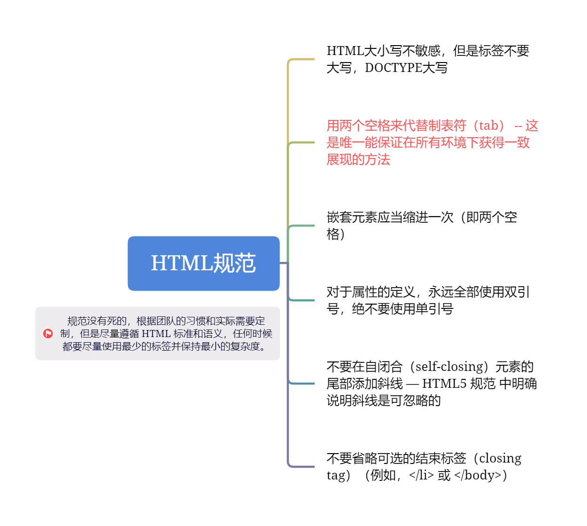

<div style="text-align: center"></div>
通过前面的四节，我们对HTML已经有了一个基本的认识和使用。可是，当我们写了很多的HTML时，我们会发现即使一样的展示效果，可是我们却写得全然不同。
例如：
```html
<body>
    <span style="background-color: red;">这是span</span>
    <p style="background-color: red; display: inline;">这是p</p>
</body>
```
<div style="text-align: center"></div>
通过上面的例子我们会发现，元素的样式，是可以通过css去改变的，所以变得非常灵活。*可是在真正得开发中，我们希望不同人开发的出来的代码都是尽可能一样的，包括标签的选取使用，属性的顺序等等*。

以下的规范是参考：https://codeguide.bootcss.com/ 选取的关于HTML的编码规范，之后可能会根据自身需要进行修改成符合自身的规范。

## 语法
* HTML大小写不敏感，但是标签不要大写，DOCTYPE大写。
* 用两个空格来代替制表符（tab） -- 这是唯一能保证在所有环境下获得一致展现的方法。
* 嵌套元素应当缩进一次（即两个空格）。
* 对于属性的定义，永远全部使用双引号，绝不要使用单引号。
* 不要在自闭合（self-closing）元素的尾部添加斜线 — HTML5 规范 中明确说明斜线是可忽略的。
* 不要省略可选的结束标签（closing tag）（例如，`</li>` 或 `</body>`）。

示例：
```html
<!DOCTYPE html>
<html lang="en">
<head>
    <meta charset="UTF-8">
    <meta name="viewport" content="width=device-width, initial-scale=1.0">
    <title>Document</title>
</head>
<body>
    <!-- HTML大小写不敏感，但是标签不要大写，DOCTYPE大写 -->
    <!-- good -->
    <p>Hello World</p>
    <!-- not good -->
    <P>Hello World</P>

    <!-- 用两个空格来代替制表符（tab） -->
    <!-- good -->
    <div>  前面有两个空格</div>
    <!-- not good -->
    <div>   前面有一个tab</div>

    <!-- 嵌套元素应当缩进一次（即两个空格）。 -->
    <!-- good -->
    <div>
        parent
        <div>
            child
        </div>
    </div>
    <!-- not good -->
    <div>
        parent
    <div>
        child
    </div>
    </div>

    <!-- 对于属性的定义，永远全部使用双引号，绝不要使用单引号 -->
    <!-- good -->
    
    <!-- not good -->
    

    <!-- 不要在自闭合（self-closing）元素的尾部添加斜线  -->
    <!-- good -->
    <br>
    <!-- not good -->
    <br />

    <!-- 不要省略可选的结束标签 -->
    <!-- good -->
    <ul>
        <li>Hello</li>
        <li>World</li>
    </ul>
    <!-- not good -->
    <ul>
        <li>Hello
        <li>World
    </ul>
</body>
</html>
```

## 属性顺序
HTML 属性应当按照以下给出的顺序依次排列，确保代码的易读性。
* class
* id,name
* data-*
* scr,for,type,href,value
* title,alt
* role,aria-*
class 用于标识高度可复用组件，因此应该排在首位。id 用于标识具体组件，应当谨慎使用（例如，页面内的书签），因此排在第二位。
示例：
```html
<a class="..." id="..." data-toggle="modal" href="#">
  Example link
</a>

<input class="form-control" type="text">


```

## 其他
* 布尔型属性不用赋值
元素的布尔型属性如果有值，就是 true，如果没有值，就是 false。
* 减少标签的数量
编写 HTML 代码时，尽量避免多余的父元素。很多时候，这需要迭代和重构来实现。
* 尽量避免JavsScript生成的标签

示例：
```html
<!DOCTYPE html>
<html lang="en">

<head>
    <meta charset="UTF-8">
    <meta name="viewport" content="width=device-width, initial-scale=1.0">
    <title>Document</title>
</head>

<body>
    <!-- 布尔型属性不用赋值 -->
    <!-- good -->
    <input type="checkbox" checked>
    <!-- not good  -->
    <input type="checkbox" checked=true>

    <!-- 减少标签的数量 -->
    <!-- good -->
    
    <!-- not good -->
    <span class="avatar">
        
    </span>

    <!-- 尽量避免JavsScript生成的标签 -->
    <!-- goood -->
    <div id="append"><p>i'm child.</p></div>
    <!-- not good -->
    <div id="append"></div>
    <script>
        const element = document.querySelector('#append');
        const child = document.createElement('p');
        child.textContent = 'i\'m child.';
        element.appendChild(child);
    </script>

</body>

</html>
```

## 最后
尽量遵循 HTML 标准和语义，但是不要以牺牲实用性为代价。任何时候都要尽量使用最少的标签并保持最小的复杂度。

## 关于我
* 一个推崇全栈开发的前端开发人员
* 微信: itrzzh
<div style="text-align: center"></div>

* 公众号：全栈道
<div style="text-align: center"></div>

* 个人网站：https://www.iotzzh.com
<div style="text-align: center"></div>

* 知识星球：全栈道
<div style="text-align: center"></div>

* B站：https://space.bilibili.com/285025688
* 抖音：全栈道
* github：https://github.com/iotzzh
* gitee: https://gitee.com/iotzzh

## 捐赠鼓励
开源不易，如果《全栈道》对你有些帮助，可以请作者喝杯咖啡，算是对开源做出的一点点鼓励吧！
<div style="text-align: center"></div>


## 关于我
* 一个推崇全栈开发的前端开发人员
* 微信: itrzzh
<div style="text-align: center"></div>

* 公众号：全栈道
<div style="text-align: center"></div>

* 个人网站：https://www.iotzzh.com
<div style="text-align: center"></div>

* 知识星球：全栈道
<div style="text-align: center"></div>

* B站：https://space.bilibili.com/285025688
* 抖音：全栈道
* github：https://github.com/iotzzh
* gitee: https://gitee.com/iotzzh

## 捐赠鼓励
开源不易，如果《全栈道》对你有些帮助，可以请作者喝杯咖啡，算是对开源做出的一点点鼓励吧！
<div style="text-align: center"></div>