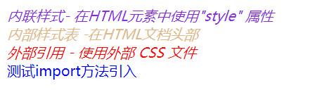

在学习一门新的知识之前，我们需要先知道，它是什么，为什么使用，和怎么使用，也就是常说的3W（what， why，how）。

## CSS是什么？
CSS全称为Cascading Style Sheets，中文翻译为“层叠样式表”，简称CSS样式表，是一种用来表现HTML或XML等文件样式的计算机语言，是一种标准的样式表语言，用于描述网页的表示，即布局和格式。

由于网页是由HTML结构组成的，所以通过"是什么"我们可以猜测到"为什么"，即CSS与HTML的关系。

## 为什么使用CSS？
在《图解HTML》的学习中让我们知道，HTML可以搭建出网页的骨架，虽然也具有一些样式的属性，但都是极其简单的。如果我们想画出一张漂亮的网页，那么我们就离不开CSS的配合。它具有对网页的布局、颜色、背景、宽度、高度、字体进行控制，让网页按您的美工设计布局的更加美观漂亮。
对比如下：
<div style="text-align: center"></div>

## CSS如何使用
在使用前，我们需要了解下CSS使用的使用规则，即语法。
### 语法
```HTML
选择器 { 属性1：属性值； 属性2：属性值}
```

既然已经知道了CSS的基础语法，我们看看它的如何配合HTML或者说HTML是如何使用CSS让自身变得更加美丽动人的。

### 使用方式
CSS可以通过四种方式添加到HTML中
* 内联样式：在HTML元素中使用`style`属性
* 内部样式表： 在HTML文档头部`<head>`区域使用`<style>`元素来包含CSS
* 外部引用：使用外部CSS文件
* @import url():使用@import指令（一种at规则）（要注意的是，@import指令必须出现在样式表中其他样式之前，否则@import引用的样式表不会被加载）

### 举个例子
index.html
```html
<!DOCTYPE html>
<html lang="en">
<head>
    <meta charset="UTF-8">
    <meta name="viewport" content="width=device-width, initial-scale=1.0">
    <title>Document</title>
    <style>
        @import url("./import.css");
    </style>
    <link rel="stylesheet" href="./index.css">
    <style>
        .internal-style {
            font-style: italic; color:burlywood;
        }
    </style>
</head>
<body>
    <div style="font-style: italic; color: blueviolet;">内联样式- 在HTML元素中使用"style" 属性</div>
    <div class="internal-style">内部样式表 -在HTML文档头部</div>
    <div class="external-style">外部引用 - 使用外部 CSS 文件</div>
    <div class="import">测试import方法引入</div>
</body>
</html>
```

import.css

```css
.import{ color: blue; }
```

index.css

```css
.external-style { 
    font-style: italic; 
    color: red;
}
```
<div style="text-align: center"></div>

由上，我们已经对CSS的3w有了一个简单的认知。显然，CSS并不仅此，接下来，文章会从选择器、字体、框模型、背景与边框、定位等逐步了解CSS的工作原理及提供的API。


## 学习之前
在正式学习css知识之前，需要了解CSS的一些基本概念，例如，继承、层叠、数字值、颜色值。这里介绍下简单的概念，方便之后的学习理解，并不做深层次的讲解。

### 继承
CSS中的祖先元素会把CSS属性的值传递给子元素，例如body设置了字体为‘宋体’，那么便会将该CSS属性应用的body的所有子孙元素。

CSS有很多可继承的属性：例如文本相关的颜色、字体、字号等

CSS也有很多不可继承属性，比如边框、外边距、内边距、等。

### 层叠
层叠就是层叠样式表中的层叠，是一种样式在文档层次中逐层叠加的过程，目的是让浏览器面对某个标签特定属性值的多个来源，确定最终使用哪个值。

层叠优先级：
> 行内样式 > 嵌入样式 > 链接样式 > 默认样式

### 数字值
数字值主要分两类：绝对值和相对值
#### 绝对值及示例
|  绝对值   | 单位缩写  |   示例    |
|  ----  | ----  | --- |
| 英寸  | in |   height:6in   |
| 厘米  | cm |   height:6cm   |
| 毫米  | mm |   height:6mm   |
| 点  | pt |   height:6ipt  |
| 皮卡  | pc |   height:6pc   |
| 像素  | px|   height:6px  |

#### 相对值及示例
|  相对对值   | 单位缩写  |   示例    |
|  ----  | ----  | --- |
| Em  | em |   height:1.2em   |
| Ex  | ex |   height:6ex   |
| 百分比  | % |   height:10%   |

em和ex都是字体大小的单位，em表示一种字体中字母M的宽度；ex等于给定字体中字母x的高度。

#### 常用：px，em，%

### 颜色值
* 颜色名：如red
* 十六进制颜色：如#RRGGBB或#RGB
* RGB颜色的值（R，G，B）：如rgb(25,25,25)
* RGB百分比值（R%,G%,B%）:如rgb(1%，2%，80%)
* HSL（色相，饱和度%，亮度）：格式：HSL(0%,0%,0%)
* Alpha通道：RGB和HSL都支持Alpha，相应的格式分别叫RGBA和HSLA

## 关于我
* 一个推崇全栈开发的前端开发人员
* 如果你想找我聊聊，可以添加我的 - 微信: itrzzh
<div style="text-align: center"></div>

* 如果你想及时订阅我的发布文章或者获取资料，可以关注我的 - 公众号：全栈道
<div style="text-align: center"></div>

* 如果你想让我帮忙改简历、获取知识手册、学习面试资料、学习路线等，请加入我的 - 知识星球：全栈道
<div style="text-align: center"></div>

* 个人网站：https://www.iotzzh.com
* B站：https://space.bilibili.com/285025688
* 抖音/快手：全栈道
* github：https://github.com/iotzzh
* gitee: https://gitee.com/iotzzh

## 捐赠鼓励
开源不易，如果《全栈道》对你有些帮助，可以请作者喝杯咖啡，算是对开源做出的一点点鼓励吧！
<div style="text-align: center"></div>
