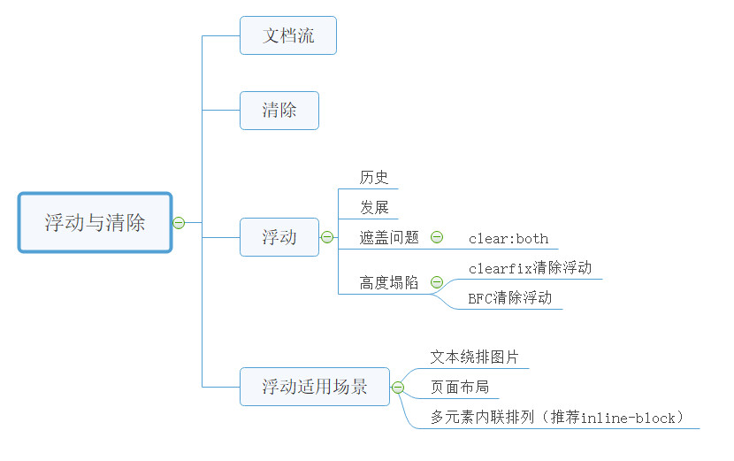
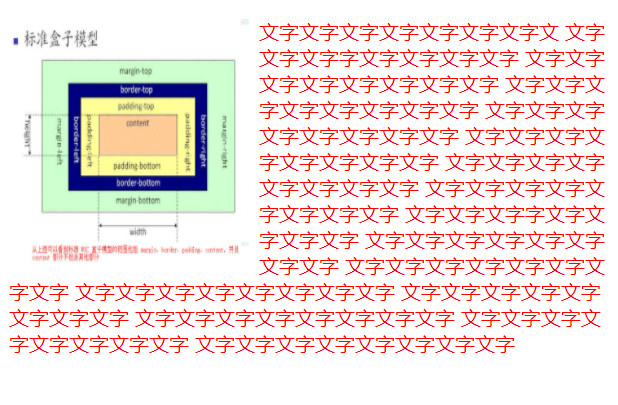
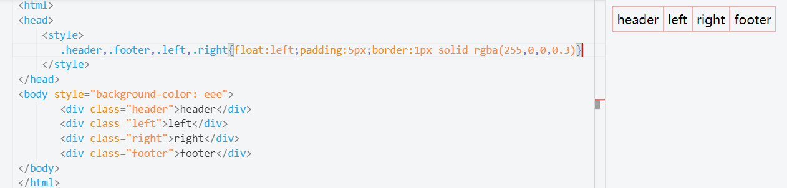

 <div style="text-align: center"></div>

## 文档流
css中的块级元素在页面中是独占一行的，自上而下排列，也就是我们所说的流，通常我们称之为文档流或标准流。
示例：
```html
<!DOCTYPE html>
<html lang="en">
<head>
    <meta charset="UTF-8">
    <meta name="viewport" content="width=device-width, initial-scale=1.0">
    <title>Document</title>
</head>
<body>
 <html>
 <head>
     <style>
         div {width:100px;height:100px;}
     </style>
 </head>
 <body style="background-color: eee">
     <div style="background-color:red">div1</div>
     <div style="background-color:green">div2</div>
     <div style="background-color:blue">div3</div>
 </body>
 </html>
</body>
</html>
```
<div style="text-align: center"></div>

#### 清除(clear)
###### 语法
```css
   clear : none | left | right | both

   取值
   none  :  默认值。允许两边都可以有浮动对象
   left   :  不允许左边有浮动对象
   right  :  不允许右边有浮动对象
   both  :  不允许有浮动对象
```
###### 定义
clear 属性规定元素的哪一侧不允许其他浮动元素。

#### 浮动（float）
###### 语法：
```css
float: left; // 元素向左浮动。
float: right; // 元素向右浮动。
float: none; // 默认值。元素不浮动，并会显示在其在文本中出现的位置。
float: inherit; // 规定应该从父元素继承 float 属性的值。
```
###### 定义：
**浮动元素脱离文档流，按照指定的方向（左或右发生移动），直到它的外边缘碰到父元素或者另一个浮动元素为止。**

###### 历史：
起初，W3C规定出来的浮动（float）属性的主要目的，是为了实现文本绕排图片的效果,如下示例：

```html
<!DOCTYPE html>
<html lang="en">
<head>
    <meta charset="UTF-8">
    <meta name="viewport" content="width=device-width, initial-scale=1.0">
    <title>Document</title>
    <style>
        img {
            width: 200px;
            height: 200px;
            display: inline;
            float: left;
        }
        p {
            color: red;
        }
    </style>
</head>
<body>
    

    <p>文字文字文字文字文字文字文字文
        文字文字文字字文字文字文字文字
        文字文字文字文字文字文字文字文字
        文字文字文字文字文字文字文字文字
        文字文字文字文字文字文字文字文字
        文字文字文字文字文字文字文字文字
        文字文字文字文字文字文字文字文字
        文字文字文字文字文字文字文字文字
        文字文字文字字文字文字文字文字
        文字文字文字文字文字文字文字文字
        文字文字文字文字文字文字文字文字
        文字文字文字文字文字文字文字文字
        文字文字文字文字文字文字文字文字
        文字文字文字文字文字文字文字文字
        文字文字文字文字文字文字文字文字
        文字文字文字文字文字文字文字文字</p>
</body>
</html>
```
不添加图片浮动的效果：
<div style="text-align: center"></div>

添加浮动的效果：
<div style="text-align: center"></div>

###### 发展：
后来有人用它来做布局，发现不错，这个属性也成了创建多栏布局最简单的方式。
示例：
```html
<!DOCTYPE html>
<html lang="en">
<head>
    <meta charset="UTF-8">
    <meta name="viewport" content="width=device-width, initial-scale=1.0">
    <title>Document</title>
</head>
<body>
 <html>
 <head>
     <style>
         div {width:100px;height:100px;}
     </style>
 </head>
 <body style="background-color: eee">
     <div style="background-color:red; float:left;">div1</div>
     <div style="background-color:green; float:left;">div2</div>
     <div style="background-color:blue;float:right;">div3</div>
 </body>
 </html>
</body>
</html>
```
<div style="text-align: center"></div>


###### 浮动元素脱离了常规的文档流之后，原来紧跟其后的元素就会在空间允许的情况下，向上提升到与浮动元素平齐平坐。

 **问题一：遮盖问题**：向上提升的元素会被浮动的元素盖住，因为浮动的元素已经脱离了标准流，浮动的元素已经和标准流不在同一层次上了。如下实例：
```html
<!DOCTYPE html>
<html lang="en">
<head>
    <meta charset="UTF-8">
    <meta name="viewport" content="width=device-width, initial-scale=1.0">
    <title>Document</title>
</head>
<body>
 <html>
 <head>
     <style>
         div {width:100px;height:100px;}
     </style>
 </head>
 <body style="background-color: eee">
     <div style="background-color:red; float:left;">div1</div>
     <div style="background-color:green;">div2</div>
     <div style="background-color:blue;">div3</div>
 </body>
 </html>
</body>
</html>
```
<div style="text-align: center"></div>

由上图我们可以看出，第二个div会被第一个div给盖住，但是里面文字会被挤到下一行，而且**好像**是第二个div隐形存在于下一行。

**解决办法**
利用clear属性，清除浮动造成的影响，注意，clear使用在非浮动元素上，而非浮动元素上面。
**clear属性不允许被清除浮动的元素的左边/右边挨着浮动元素，底层原理是在被清除浮动的元素上边或者下边添加足够的清除空间。**
实例：
<div style="text-align: center"></div>

 **问题二：父元素高度塌陷问题**：由于浮动元素脱离的文档流，其父元素感知不到子元素的存在，高度便会消失。如下实例：
 <div style="text-align: center"></div>

**解决办法一：BFC清除浮动**
在父元素添加overflow:auto或overflow:hidden
父元素的这个属性设置为auto或者是hidden，父元素就会扩展包含浮动，这个方法有着比较好的语义性，因为它不需要额外的元素，但是，要记住一点，overflow属性不是为了清除浮动而定义的，要小心不要覆盖住内容或者触发了不需要的滚动条。
 <div style="text-align: center"></div>

**解决办法二：clearfix**
clearfix的方式清除浮动
 <div style="text-align: center"></div>

通用方案：

```css
// 现代浏览器clearfix方案，不支持IE6/7
.clearfix:after {
    display: table;
    content: " ";
    clear: both;
}

// 全浏览器通用的clearfix方案
// 引入了zoom以支持IE6/7
.clearfix:after {
    display: table;
    content: " ";
    clear: both;
}
.clearfix{
    *zoom: 1;
}

// 全浏览器通用的clearfix方案【推荐】
// 引入了zoom以支持IE6/7
// 同时加入:before以解决现代浏览器上边距折叠的问题
.clearfix:before,
.clearfix:after {
    display: table;
    content: " ";
}
.clearfix:after {
    clear: both;
}
.clearfix{
    *zoom: 1;
}
```

#### 浮动使用场景
###### 1. 文本绕排图片
 <div style="text-align: center"></div>
###### 2.页面布局
 <div style="text-align: center"></div>

###### 3.多元素内联排列（推荐inline-block）
 <div style="text-align: center"></div>

参考地址：

https://www.cnblogs.com/guanghe/p/10070574.html

https://www.jianshu.com/p/09bd5873bed4

https://blog.csdn.net/qq_39406353/article/details/104455345

http://www.imooc.com/learn/121

https://www.w3school.com.cn/cssref/pr_class_float.asp

https://zhuanlan.zhihu.com/p/81091987

https://www.imooc.com/article/283829

https://blog.csdn.net/chenxi_li/article/details/95192904

## 关于我
* 一个推崇全栈开发的前端开发人员
* 如果你想找我聊聊，可以添加我的 - 微信: itrzzh
<div style="text-align: center"></div>

* 如果你想及时订阅我的发布文章或者获取资料，可以关注我的 - 公众号：全栈道
<div style="text-align: center"></div>

* 如果你想让我帮忙改简历、获取知识手册、学习面试资料、学习路线等，请加入我的 - 知识星球：全栈道
<div style="text-align: center"></div>

* 个人网站：https://www.iotzzh.com
* B站：https://space.bilibili.com/285025688
* 抖音/快手：全栈道
* github：https://github.com/iotzzh
* gitee: https://gitee.com/iotzzh

## 捐赠鼓励
开源不易，如果《全栈道》对你有些帮助，可以请作者喝杯咖啡，算是对开源做出的一点点鼓励吧！
<div style="text-align: center"></div>

