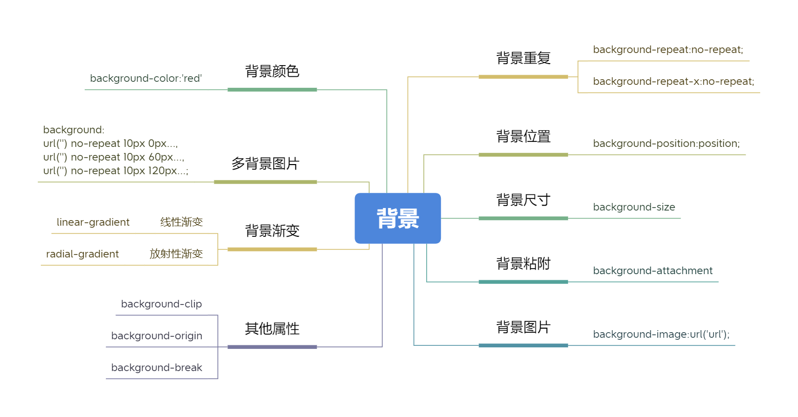
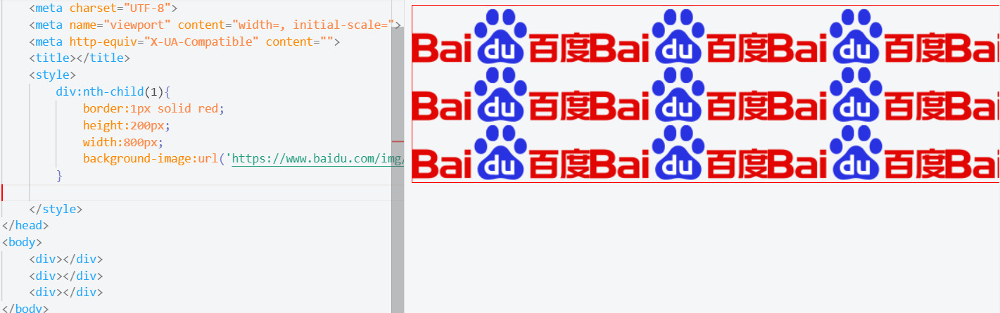
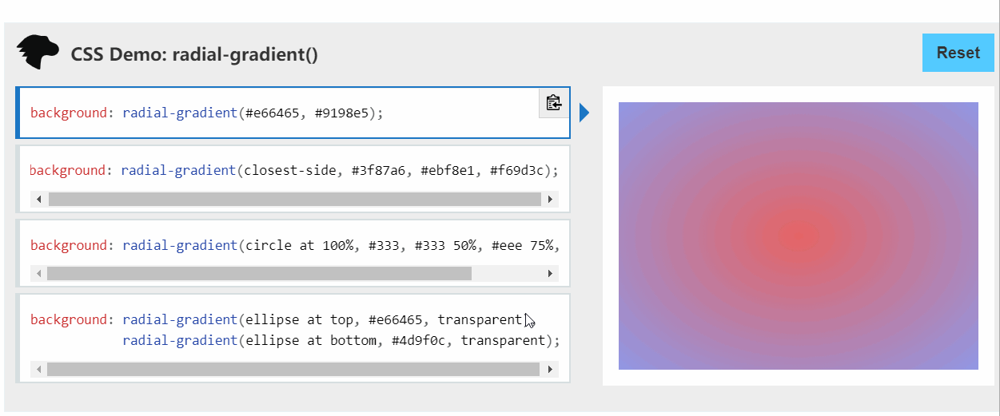

<div style="text-align: center"></div>

CSS的背景可以为元素添加背景颜色（background-color）和背景图片(backgroud-image), CSS3也提供了背景使用多张图片和渐变色的功能。

## CSS背景属性
* background-color：设置元素的背景颜色。
* background-image：把图像设置为背景。
* background-repeat：设置背景图像是否及如何重复。
* backgroud-position：设置背景图像的起始位置。
* background-size：设置背景图片大小。
* background-attachment：背景图像是否固定或者随着页面的其余部分滚动。
* background：(简写属性)作用是将背景属性设置在一个声明中。
* background-clip, background-origin,background-break(目前尚未得到广泛支持)

<div style="text-align: center"></div>
更多可参考MSDN：https://developer.mozilla.org/zh-CN/docs/Web/CSS/Reference


## 背景颜色
语法：
```css
div{background-color:'red'}
div{background-color:rgb(255,0,0)}
div{background-color:rgba(255,0,0,0.5)}
```
至于颜色的的可选值可以参看《CSS简介》颜色值一节。

示例：

<div style="text-align: center"></div>

## 背景图片
语法：
```css
background-image:url('url');
```
示例：
background-image:url('https://www.baidu.com/img/flexible/logo/pc/result.png');

<div style="text-align: center"></div>
从示例中可以看出，默认是水平垂直重复，那么如何控制背景重复呢？

## 背景重复
语法：
```css
background-repeat:no-repeat;
background-repeat-x:no-repeat;
background-repeat-y:no-repeat;
```
示例：
<div style="text-align: center"></div>

## 背景位置
除此之外，还可以设置背景的起始位置。
语法：
```css
background-position:position;
```
background-position 属性有5个关键字值，分别是top 、 left 、 bottom 、 right 和 center，这些关键字中的任意两个组合起来都可以作为该属性的值。
<div style="text-align: center"></div>

## 背景尺寸
语法：
```css
background-size:50%;
background-size:100px 50px; // 宽100，高50
background-size:cover; // 拉大图片，完全填满，保持宽高比
background-size:contain; // 缩放图片，使其恰好适合背景区，保持宽高比
```
示例：
<div style="text-align: center"></div>

#### 背景粘附
background-attachment 属性控制滚动元素内的背景图片是否随元素滚动而移动。这个属性的默认值是scroll ，即背景图片随元素移动。如果把它的值改为 fixed ，那么背景图片不会随元素滚动而移动。

示例：
<div style="text-align: center"></div>

## 背景简写
background 简写属性在一个声明中设置所有的背景属性。
可以设置如下属性：
* background-color
* background-position
* background-size
* background-repeat
* background-origin
* background-clip
* background-attachment
* background-image
示例：
```css
background:url('https://www.baidu.com/img/flexible/logo/pc/result.png') no-repeat center ;
```

## 多背景图片
语法：
```css
background:
url('') no-repeat 10px 0px...,
url('') no-repeat 10px 60px...,
url('') no-repeat 10px 120px...;
```
<div style="text-align: center"></div>

## 背景渐变
渐变分两种，一种线性渐变，一种放射性渐变。线性渐变从元素的一端延伸到另一
端，放射性渐变则从元素内一点向四周发散。
###### 线性渐变语法:
```css
/* 渐变轴为45度，从蓝色渐变到红色 */
linear-gradient(45deg, blue, red);

/* 从右下到左上、从蓝色渐变到红色 */
linear-gradient(to left top, blue, red);

/* 从下到上，从蓝色开始渐变、到高度40%位置是绿色渐变开始、最后以红色结束 */
linear-gradient(0deg, blue, green 40%, red);
```
<div style="text-align: center"></div>
更多可参考：https://developer.mozilla.org/zh-CN/docs/Web/CSS/linear-gradient()

### 放射性渐变语法：
```css
background: radial-gradient(#e66465, #9198e5);

background: radial-gradient(closest-side, #3f87a6, #ebf8e1, #f69d3c);

background: radial-gradient(circle at 100%, #333, #333 50%, #eee 75%, #333 75%);

background: radial-gradient(ellipse at top, #e66465, transparent),
            radial-gradient(ellipse at bottom, #4d9f0c, transparent);
```
<div style="text-align: center"></div>
更多可参考：https://developer.mozilla.org/en-US/docs/Web/CSS/radial-gradient()

## 其他属性
* background-clip 。控制背景绘制区域的范围，比如可以让背景颜色和背景图片只出现在内容区，而不出现在内边距区域。默认情况下，背景绘制区域是扩展到边框外边界的。
* background-origin 。控制背景定位区域的原点，可以设定为元素盒子左上角以外的位置。比如，可以设定以内容区左上角作为原点。
* background-break 。 控制分离元素（比如跨越多行的行内盒子）的显示效果。


## 关于我
* 一个推崇全栈开发的前端开发人员
* 如果你想找我聊聊，可以添加我的 - 微信: itrzzh
<div style="text-align: center"></div>

* 如果你想及时订阅我的发布文章或者获取资料，可以关注我的 - 公众号：全栈道
<div style="text-align: center"></div>

* 如果你想让我帮忙改简历、获取知识手册、学习面试资料、学习路线等，请加入我的 - 知识星球：全栈道
<div style="text-align: center"></div>

* 个人网站：https://www.iotzzh.com
* B站：https://space.bilibili.com/285025688
* 抖音/快手：全栈道
* github：https://github.com/iotzzh
* gitee: https://gitee.com/iotzzh

## 捐赠鼓励
开源不易，如果《全栈道》对你有些帮助，可以请作者喝杯咖啡，算是对开源做出的一点点鼓励吧！
<div style="text-align: center"></div>


