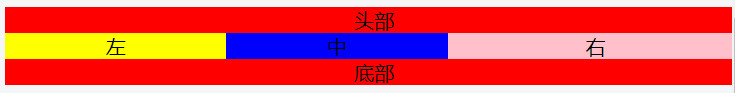
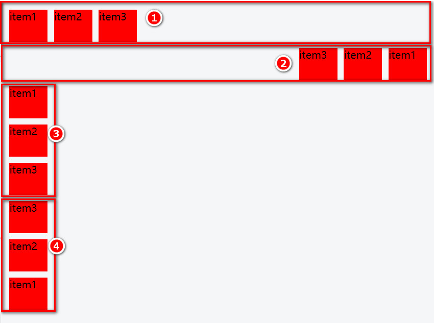

<div style="text-align: center"></div>

## 何为布局
此处说的布局是对HTML界面元素的布局，也就是对网页中的元素进行位置上的安排。
那么我们为什么需要布局和如何布局呢？

## 为什么需要布局
我们在设计网页时,一般都是自顶向下，自左向右，可能存在很多不同的小模块。假设我们不懂布局，那么网页会是什么样？
可能是只有自顶向下，一个接着一个堆砌下去，如下图：

也可能有人会利用行内元素不会换行的特点，做出一个左右的布局。

但是了解HTML朋友应该知道，行内元素无法设置宽和高，一般情况下，行内元素只能包含数据和行内元素，不能包含块级元素。而且当文字过长时还是会换行的，左右布局也就不成立了。

但是在实际开发中，我们需要设计出各种各样的网页，自然就缺少不了布局的参与，有了好的布局，网页的模块划分才会更加清楚，才会更加赏心悦目。

## 如何布局
我们可以利用HTML的Table进行布局，我们也可以利用CSS进行布局。
table布局相对容易，但是在开发中并不常用，一方面标签书写过多，占用过多的资源，其次是会阻挡浏览器渲染引擎的渲染顺序，造成页面生成的速度延迟等缺点。
利用CSS布局又可分为**传统布局方式、flex布局和grid布局**。

接下来，我们一起了解下各个布局~

## table布局
利用table可以进行布局，但是使用table布局有些得不偿失，更多的还是使用table进行表格的设计。为什么说得不偿失呢？我们来看看table的优缺点：
### tables的缺点
* Table要比其它html标记占更多的字节。(延迟下载时间，占用服务器更多的流量资源。)
* Tablle会阻挡浏览器渲染引擎的渲染顺序。(会延迟页面的生成速度，让用户等待更久的时间。)
* Table里显示图片时需要你把单个、有逻辑性的图片切成多个图。(增加设计的复杂度，增加页面加载时间，增加HTTP会话数。)
* 在某些浏览器中Table里的文字的拷贝会出现问题。(这会让用户不悦。)
* Table会影响其内部的某些布局属性的生效(比如<td>里的元素的height:100%)(这会限制你页面设计的自由性。)
* 一旦学了CSS知识，你会发现使用table做页面布局会变得更麻烦。(先花时间学一些CSS知识，会省去你以后大量的时间。)
* table对对于页面布局来说，从语义上看是不正确的。(它描述的是表现，而不是内容。)
* table代码会让阅读者抓狂。(不但无法利用CSS，而且会你不知所云)
* table一旦设计完成就变成死的，很难通过CSS让它展现新的面貌。

### Tables的优点
在某些场合，使用Table是100%的适合、恰当和正确。比如，用table做表格是完全正确的。

虽然不推荐，但是还是使用table做个布局看看~
示例：

```html
<!DOCTYPE html>
<html lang="en">
<head>
	<meta charset="UTF-8">
	<meta name="viewport" content="width=, initial-scale=">
	<meta http-equiv="X-UA-Compatible" content="">
	<title></title>
    <style>
        table{
            width:100%;
        }
        tr:first-child{
            background-color:red;
        }
        tr:last-child{
            background-color:blue;
        }

        td{
            text-align:center;
        }
    </style>
</head>
<body>
	<table  border="0" cellspacing="0">
        <tr>
            <td colspan="2">头部</td>
        </tr>
        <tr>
            <td>左边</td>
            <td>右边</td>
        </tr>
        <tr>
            <td colspan="2">底部</td>
        </tr>
    </table>
</body>
</html>
```


## 传统布局
传统布局是基于盒状模型，依赖 display 属性 + position属性 + float属性。它对于那些特殊布局非常不方便，比如，垂直居中就不容易实现。

float知识点可参考《CSS浮动与清除》一节。float布局是布局中常见的一种方式，但是需要注意高度塌陷的问题。

示例：

```html
<!DOCTYPE html>
<html lang="en">
<head>
	<meta charset="UTF-8">
	<meta name="viewport" content="width=, initial-scale=">
	<meta http-equiv="X-UA-Compatible" content="">
	<title></title>
    <style>
        div{text-align:center;}
        .header{background-color:red;}
        .content{display:relative;}
        .left{float:left; background-color:yellow; width:30%;}
        .center{float:left; background-color: blue; width:30%;}
        .right{background-color:pink;}
        .footer{background-color:red;}
    </style>
</head>
<body>
    <div class="container">
        <div class="header">头部</div>
        <div class="content">
            <div class="left">左</div>
            <div class="center">中</div>
            <div class="right">右</div>
        </div>
        <div class="footer">底部</div>
    </div>
</body>
</html>
```



## flex布局
参考地址：

http://www.ruanyifeng.com/blog/2015/07/flex-grammar.html

https://www.runoob.com/w3cnote/flex-grammar.html

https://developer.mozilla.org/zh-CN/docs/Web/CSS/CSS_Flexible_Box_Layout/Basic_Concepts_of_Flexbox

2009年，W3C提出了一种新的方案—-Flex布局，可以简便、完整、响应式地实现各种页面布局。目前，它已经得到了所有浏览器的支持，这意味着，现在就能很安全地使用这项功能。

### flex布局是什么
Flex 是 Flexible Box 的缩写，意为"弹性布局"，用来为盒状模型提供最大的灵活性。
任何一个容器都可以指定为 Flex 布局:
```css
.box{
  display: flex;
}
```
行内元素也可以使用 Flex 布局:
```css
.box{
  display: inline-flex;
}
```
Webkit 内核的浏览器，必须加上-webkit前缀:
```css
.box{
  display: -webkit-flex; /* Safari */
  display: flex;
}
```

**注意，设为 Flex 布局以后，子元素的float、clear和vertical-align属性将失效。**

### 基本概念
采用 Flex 布局的元素，称为 Flex 容器（flex container），简称"容器"。它的所有子元素自动成为容器成员，称为 Flex 项目（flex item），简称"项目"。

容器默认存在两根轴：水平的主轴（main axis）和垂直的交叉轴（cross axis）。主轴的开始位置（与边框的交叉点）叫做main start，结束位置叫做main end；交叉轴的开始位置叫做cross start，结束位置叫做cross end。
项目默认沿主轴排列。单个项目占据的主轴空间叫做main size，占据的交叉轴空间叫做cross size。

#### flex属性
###### flex-direction：属性决定主轴的方向（即项目的排列方向）
  * row（默认值）：主轴为水平方向，起点在左端。 
  * row-reverse：主轴为水平方向，起点在右端。
  * column：主轴为垂直方向，起点在上沿。
  * column-reverse：主轴为垂直方向，起点在下沿。

示例：
```html
<!DOCTYPE html>
<html lang="en">
<head>
	<meta charset="UTF-8">
	<meta name="viewport" content="width=, initial-scale=">
	<meta http-equiv="X-UA-Compatible" content="">
	<title></title>
    <style>
        .container { display: flex; }
        .container1 { flex-direction:row; }
        .container2 { flex-direction:row-reverse; }
        .container3 { flex-direction:column; }
        .container4 { flex-direction:column-reverse; }

        .item {
            width:60px;
            height:50px;
            background-color:red; 
            margin:5px;
        }
    </style>
</head>
<body>
	<div class="container container1">
        <div class="item">item1</div>
        <div class="item">item2</div>
        <div class="item">item3</div>
    </div>
    <div class="container container2">
        <div class="item">item1</div>
        <div class="item">item2</div>
        <div class="item">item3</div>
    </div>
    <div class="container container3">
        <div class="item">item1</div>
        <div class="item">item2</div>
        <div class="item">item3</div>
    </div>
    <div class="container container4">
        <div class="item">item1</div>
        <div class="item">item2</div>
        <div class="item">item3</div>
    </div>
</body>
</html>
  ```


###### flex-wrap
默认情况下，项目都排在一条线（又称"轴线"）上。flex-wrap属性定义，如果一条轴线排不下，如何换行。
  * nowrap（默认）：不换行。
  * wrap：换行，第一行在上方。
  * wrap-reverse：换行，第一行在下方。

示例：
```html
<!DOCTYPE html>
<html lang="en">
<head>
	<meta charset="UTF-8">
	<meta name="viewport" content="width=, initial-scale=">
	<meta http-equiv="X-UA-Compatible" content="">
	<title></title>
    <style>
        .container { display: flex; border:1px solid black; margin:5px;}
        .container1 { flex-wrap:nowarp; }
        .container2 { flex-wrap:wrap; }
        .container3 { flex-wrap:wrap-reverse; }

        .item {
            width:200px;
            height:50px;
            background-color:red; 
            margin:5px;
        }
    </style>
</head>
<body>
	<div class="container container1">
        <div class="item">item1</div>
        <div class="item">item2</div>
        <div class="item">item3</div>
    </div>
    <div class="container container2">
        <div class="item">item1</div>
        <div class="item">item2</div>
        <div class="item">item3</div>
    </div>
    <div class="container container3">
        <div class="item">item1</div>
        <div class="item">item2</div>
        <div class="item">item3</div>
    </div>
</body>
</html>
```


###### flex-flow
属性是flex-direction属性和flex-wrap属性的简写形式，默认值为row nowrap
  * ```<flex-direction>``` || ```<flex-wrap>```
* justify-content: 定义了项目在主轴上的对齐方式。
  * flex-start（默认值）：左对齐
  * flex-end：右对齐
  * center： 居中
  * space-between：两端对齐，项目之间的间隔都相等。
  * space-around：每个项目两侧的间隔相等。所以，项目之间的间隔比项目与边框的间隔大一倍。

示例：
```html
<!DOCTYPE html>
<html lang="en">
<head>
	<meta charset="UTF-8">
	<meta name="viewport" content="width=, initial-scale=">
	<meta http-equiv="X-UA-Compatible" content="">
	<title></title>
    <style>
        .container { display: flex; border:1px solid black; margin:5px;}
        .container1 { justify-content: flex-start; }
        .container2 { justify-content: flex-end; }
        .container3 { justify-content: center; }
        .container4 { justify-content: space-between; }
        .container5 { justify-content: space-around; }

        .item {
            width:50px;
            height:50px;
            background-color:red; 
            margin:5px;
        }
    </style>
</head>
<body>
	<div class="container container1">
        <div class="item">item1</div>
        <div class="item">item2</div>
        <div class="item">item3</div>
    </div>
    <div class="container container2">
        <div class="item">item1</div>
        <div class="item">item2</div>
        <div class="item">item3</div>
    </div>
    <div class="container container3">
        <div class="item">item1</div>
        <div class="item">item2</div>
        <div class="item">item3</div>
    </div>
    <div class="container container4">
        <div class="item">item1</div>
        <div class="item">item2</div>
        <div class="item">item3</div>
    </div>
    <div class="container container5">
        <div class="item">item1</div>
        <div class="item">item2</div>
        <div class="item">item3</div>
    </div>
</body>
</html>
```


###### align-items
定义项目在交叉轴上如何对齐。
  * flex-start：交叉轴的起点对齐。
  * flex-end：交叉轴的终点对齐。 
  * center：交叉轴的中点对齐。 
  * baseline: 项目的第一行文字的基线对齐。 
  * stretch（默认值）：如果项目未设置高度或设为auto，将占满整个容器的高度。

示例：
```html
<!DOCTYPE html>
<html lang="en">
<head>
	<meta charset="UTF-8">
	<meta name="viewport" content="width=, initial-scale=">
	<meta http-equiv="X-UA-Compatible" content="">
	<title></title>
    <style>
        .container { display: flex; border:1px solid black; margin:5px;}
        .item { background-color:red; margin:5px;}
        
        .container1 { align-items: stretch; height: 50px; }
        .container2 { align-items: flex-start; }
        .container3 { align-items: flex-end; height: 50px;}
        .container4 { align-items: center; height: 50px; }
        .container5 { align-items: baseline; height: 50px; }
        .container5 .item:nth-child(2) { font-size: 30px;}
    </style>
</head>
<body>
	<div class="container container1">
        <div class="item">item1</div>
        <div class="item">item2</div>
        <div class="item">item3</div>
    </div>
    <div class="container container2">
        <div class="item">item1</div>
        <div class="item">item2</div>
        <div class="item">item3</div>
    </div>
    <div class="container container3">
        <div class="item">item1</div>
        <div class="item">item2</div>
        <div class="item">item3</div>
    </div>
    <div class="container container4">
        <div class="item">item1</div>
        <div class="item">item2</div>
        <div class="item">item3</div>
    </div>
    <div class="container container5">
        <div class="item">item1</div>
        <div class="item">item2</div>
        <div class="item">item3</div>
    </div>
</body>
</html>
```


###### align-content
定义了多根轴线的对齐方式。如果项目只有一根轴线，该属性不起作用。 
  * flex-start：与交叉轴的起点对齐。
  * flex-end：与交叉轴的终点对齐。
  * center：与交叉轴的中点对齐。
  * space-between：与交叉轴两端对齐，轴线之间的间隔平均分布。
  * space-around：每根轴线两侧的间隔都相等。所以，轴线之间的间隔比轴线与边框的间隔大一倍。
  * stretch（默认值）：轴线占满整个交叉轴。

示例：
```html
<!DOCTYPE html>
<html lang="en">
<head>
	<meta charset="UTF-8">
	<meta name="viewport" content="width=, initial-scale=">
	<meta http-equiv="X-UA-Compatible" content="">
	<title></title>
    <style>
        .container { display: flex; border:1px solid black; 
            margin:5px; flex-wrap: wrap; height: 250px;}
        .container1 { align-content: flex-start; }
        .container2 { align-content: flex-end; }
        .container3 { align-content: center; }
        .container4 { align-content: space-between; }
        .container5 { align-content: space-around; }

        .item {
            width:50px;
            height:50px;
            background-color:red; 
            margin:5px;
        }
    </style>
</head>
<body>
	<div class="container container1">
        <div class="item">item1</div>
        <div class="item">item2</div>
        <div class="item">item3</div>
        <div class="item">item3</div>
        <div class="item">item3</div>
        <div class="item">item3</div>
        <div class="item">item3</div>
        <div class="item">item3</div>
        <div class="item">item3</div>
        <div class="item">item3</div>
        <div class="item">item3</div>
    </div>
    <div class="container container2">
        <div class="item">item1</div>
        <div class="item">item2</div>
        <div class="item">item3</div>
        <div class="item">item3</div>
        <div class="item">item3</div>
        <div class="item">item3</div>
        <div class="item">item3</div>
        <div class="item">item3</div>
        <div class="item">item3</div>
        <div class="item">item3</div>
        <div class="item">item3</div>
    </div>
    <div class="container container3">
        <div class="item">item1</div>
        <div class="item">item2</div>
        <div class="item">item3</div>
        <div class="item">item3</div>
        <div class="item">item3</div>
        <div class="item">item3</div>
        <div class="item">item3</div>
        <div class="item">item3</div>
        <div class="item">item3</div>
        <div class="item">item3</div>
        <div class="item">item3</div>
    </div>
    <div class="container container4">
        <div class="item">item1</div>
        <div class="item">item2</div>
        <div class="item">item3</div>
        <div class="item">item3</div>
        <div class="item">item3</div>
        <div class="item">item3</div>
        <div class="item">item3</div>
        <div class="item">item3</div>
        <div class="item">item3</div>
        <div class="item">item3</div>
        <div class="item">item3</div>
    </div>
    <div class="container container5">
        <div class="item">item1</div>
        <div class="item">item2</div>
        <div class="item">item3</div>
        <div class="item">item3</div>
        <div class="item">item3</div>
        <div class="item">item3</div>
        <div class="item">item3</div>
        <div class="item">item3</div>
        <div class="item">item3</div>
        <div class="item">item3</div>
        <div class="item">item3</div>
    </div>
</body>
</html>
```


###### 项目属性
###### order
定义项目的排列顺序。数值越小，排列越靠前，默认为0。
  *  ```<integer>```
###### flex-grow
定义项目的放大比例，默认为0，即如果存在剩余空间，也不放大。
  * ```<number>```; /* default 0 */
###### flex-shrink
定义了项目的缩小比例，默认为1，即如果空间不足，该项目将缩小。
  * ```<number>```; /* default 1 */
###### flex-basis
定义了在分配多余空间之前，项目占据的主轴空间（main size）。浏览器根据这个属性，计算主轴是否有多余空间。它的默认值为auto，即项目的本来大小。
  * ```<length> | auto```; /* default auto */
###### flex
flex是flex-grow, flex-shrink 和 flex-basis的简写，默认值为0 1 auto。后两个属性可选。
  * ```none | [ <'flex-grow'> <'flex-shrink'>? || <'flex-basis'> ]```
###### align-self
允许单个项目有与其他项目不一样的对齐方式，可覆盖align-items属性。默认值为auto，表示继承父元素的align-items属性，如果没有父元素，则等同于stretch。
  * ```auto | flex-start | flex-end | center | baseline | stretch;```

## Grid布局
参考网址：
https://developer.mozilla.org/zh-CN/docs/Web/CSS/CSS_Grid_Layout

http://www.ruanyifeng.com/blog/2019/03/grid-layout-tutorial.html

https://www.html.cn/archives/8510

https://www.w3cschool.cn/lugfe/lugfe-ckg225zp.html

https://www.jianshu.com/p/d183265a8dad

### 有了flex布局，为什么还需要grid布局呢？
Grid 布局与 Flex 布局有一定的相似性，都可以指定容器内部多个项目的位置。但是，它们也存在重大区别。
Flex 布局是轴线布局，只能指定"项目"针对轴线的位置，可以看作是一维布局。Grid 布局则是将容器划分成"行"和"列"，产生单元格，然后指定"项目所在"的单元格，可以看作是二维布局。

### 概述
它将网页划分成一个个网格，可以任意组合不同的网格，做出各种各样的布局。以前，只能通过复杂的 CSS 框架达到的效果，现在浏览器内置了。

### 基本概念
* 容器和项目
采用网格布局的区域，称为"容器"（container）。容器内部采用网格定位的子元素，称为"项目"（item）。
* 行和列
容器里面的水平区域称为"行"（row），垂直区域称为"列"（column）。
* 单元格
行和列的交叉区域，称为"单元格"（cell）。
正常情况下，n行和m列会产生n x m个单元格。比如，3行3列会产生9个单元格。
* 网格线
划分网格的线，称为"网格线"（grid line）。水平网格线划分出行，垂直网格线划分出列。
正常情况下，n行有n + 1根水平网格线，m列有m + 1根垂直网格线，比如三行就有四根水平网格线。

### 容器属性
#### display
display: grid | inline-grid;
注意，设为网格布局以后，容器子元素（项目）的float、display: inline-block、display: table-cell、vertical-align和column-*等设置都将失效。

#### grid-template-columns,grid-template-rows 
容器指定了网格布局以后，接着就要划分行和列。grid-template-columns属性定义每一列的列宽，grid-template-rows属性定义每一行的行高。
```html
.container {
  display: grid;
  grid-template-columns: 100px 100px 100px;
  grid-template-rows: 100px 100px 100px;
}
```
除了使用绝对单位，也可以使用百分比。

* repeat()
有时候，重复写同样的值非常麻烦，尤其网格很多时。这时，可以使用repeat()函数，简化重复的值。上面的代码用repeat()改写如下。
```css
.container {
  display: grid;
  grid-template-columns: repeat(3, 33.33%);
  grid-template-rows: repeat(3, 33.33%);
}
```
repeat()接受两个参数，第一个参数是重复的次数（上例是3），第二个参数是所要重复的值。
repeat()重复某种模式也是可以的。

* auto-fill 关键字
有时，单元格的大小是固定的，但是容器的大小不确定。如果希望每一行（或每一列）容纳尽可能多的单元格，这时可以使用auto-fill关键字表示自动填充。
```css
.container {
  display: grid;
  grid-template-columns: repeat(auto-fill, 100px);
}
```
* fr 关键字
为了方便表示比例关系，网格布局提供了fr关键字（fraction 的缩写，意为"片段"）。如果两列的宽度分别为1fr和2fr，就表示后者是前者的两倍。
```css
.container {
  display: grid;
  grid-template-columns: 1fr 1fr;
}
```
* minmax()
minmax()函数产生一个长度范围，表示长度就在这个范围之中。它接受两个参数，分别为最小值和最大值。
```css
grid-template-columns: 1fr 1fr minmax(100px, 1fr);
```
* auto 关键字
auto关键字表示由浏览器自己决定长度。
```css
grid-template-columns: 100px auto 100px;
```
上面代码中，第二列的宽度，基本上等于该列单元格的最大宽度，除非单元格内容设置了min-width，且这个值大于最大宽度。
* 网格线的名称
grid-template-columns属性和grid-template-rows属性里面，还可以使用方括号，指定每一根网格线的名字，方便以后的引用。
```css
.container {
  display: grid;
  grid-template-columns: [c1] 100px [c2] 100px [c3] auto [c4];
  grid-template-rows: [r1] 100px [r2] 100px [r3] auto [r4];
}
```

* 布局实例
grid-template-columns属性对于网页布局非常有用。两栏式布局只需要一行代码。
```css
.wrapper {
  display: grid;
  grid-template-columns: 70% 30%;
}
```
传统的十二网格布局，写起来也很容易。
```css
grid-template-columns: repeat(12, 1fr);
```

### 示例


```html
<!DOCTYPE html>
<html lang="en">
<head>
	<meta charset="UTF-8">
	<meta name="viewport" content="width=, initial-scale=">
	<meta http-equiv="X-UA-Compatible" content="">
	<title></title>
    <style>
        .container1 { display: inline-grid;   
                    grid-template-columns: 50px 50px 50px;
                    grid-template-rows: 50px 50px 50px;
                   }
        .container1 .item { background-color:red; margin:5px;}

        .container2 { display: inline-grid;
        height:150px;width:150px;
        grid-template-columns: repeat(3, 33.33%);
        grid-template-rows: repeat(3, 33.33%);
                   }
        .container2 .item { background-color:blue; margin:5px;}

        .container3 { display: inline-grid;height:150px;width:150px;
        grid-template-columns: 1fr 2fr 3fr}
        .container3 .item { background-color:yellow; margin:5px;}
    </style>
</head>
<body>
	<div class="container1">
        <div class="item">1</div>
        <div class="item">2</div>
        <div class="item">3</div>
        <div class="item">4</div>
        <div class="item">5</div>
        <div class="item">6</div>
        <div class="item">7</div>
        <div class="item">8</div>
        <div class="item">9</div>
    </div>

    <div class="container2">
        <div class="item">1</div>
        <div class="item">2</div>
        <div class="item">3</div>
        <div class="item">4</div>
        <div class="item">5</div>
        <div class="item">6</div>
        <div class="item">7</div>
        <div class="item">8</div>
        <div class="item">9</div>
    </div>
    <div class="container3">
        <div class="item">1</div>
        <div class="item">2</div>
        <div class="item">3</div>
        <div class="item">4</div>
        <div class="item">5</div>
        <div class="item">6</div>
        <div class="item">7</div>
        <div class="item">8</div>
        <div class="item">9</div>
    </div>
</body>
</html>
```

* grid-row-gap 属性，grid-column-gap 属性,grid-gap 属性
grid-row-gap属性设置行与行的间隔（行间距），grid-column-gap属性设置列与列的间隔（列间距）。
```css
.container {
  grid-row-gap: 20px;
  grid-column-gap: 20px;
}
```
grid-gap属性是grid-column-gap和grid-row-gap的合并简写形式，语法如下。
```css
grid-gap: <grid-row-gap> <grid-column-gap>;
```

* grid-template-areas 属性
网格布局允许指定"区域"（area），一个区域由单个或多个单元格组成。grid-template-areas属性用于定义区域。
```css
.container {
  display: grid;
  grid-template-columns: 100px 100px 100px;
  grid-template-rows: 100px 100px 100px;
  grid-template-areas: 'a b c'
                       'd e f'
                       'g h i';
}
```
如果某些区域不需要利用，则使用"点"（.）表示。
```css
grid-template-areas: 'a . c'
                     'd . f'
                     'g . i';
```

* grid-auto-flow 属性
划分网格以后，容器的子元素会按照顺序，自动放置在每一个网格。默认的放置顺序是"先行后列"，即先填满第一行，再开始放入第二行。
grid-auto-flow属性除了设置成row和column，还可以设成row dense和column dense。这两个值主要用于，某些项目指定位置以后，剩下的项目怎么自动放置。

* justify-items 属性，align-items 属性，place-items 属性
justify-items属性设置单元格内容的水平位置（左中右），align-items属性设置单元格内容的垂直位置（上中下）。
```css
.container {
  justify-items: start | end | center | stretch;
  align-items: start | end | center | stretch;
}
```
place-items属性是align-items属性和justify-items属性的合并简写形式。
```css
place-items: <align-items> <justify-items>;
```
* justify-content 属性，align-content 属性，place-content 属性
justify-content属性是整个内容区域在容器里面的水平位置（左中右），align-content属性是整个内容区域的垂直位置（上中下）。
```css
.container {
  justify-content: start | end | center | stretch | space-around | space-between | space-evenly;
  align-content: start | end | center | stretch | space-around | space-between | space-evenly;  
}
```
place-content属性是align-content属性和justify-content属性的合并简写形式。
```css
place-content: <align-content> <justify-content>
```
* grid-auto-columns 属性，grid-auto-rows 属性
有时候，一些项目的指定位置，在现有网格的外部。比如网格只有3列，但是某一个项目指定在第5行。这时，浏览器会自动生成多余的网格，以便放置项目。
grid-auto-columns属性和grid-auto-rows属性用来设置，浏览器自动创建的多余网格的列宽和行高。它们的写法与grid-template-columns和grid-template-rows完全相同。如果不指定这两个属性，浏览器完全根据单元格内容的大小，决定新增网格的列宽和行高。

```css
.container {
  display: grid;
  grid-template-columns: 100px 100px 100px;
  grid-template-rows: 100px 100px 100px;
  grid-auto-rows: 50px; 
}
```

* grid-template 属性，grid 属性
grid-template属性是grid-template-columns、grid-template-rows和grid-template-areas这三个属性的合并简写形式。
grid属性是grid-template-rows、grid-template-columns、grid-template-areas、 grid-auto-rows、grid-auto-columns、grid-auto-flow这六个属性的合并简写形式。

### 项目属性
* grid-column-start 属性，grid-column-end 属性，grid-row-start 属性，grid-row-end 属性
项目的位置是可以指定的，具体方法就是指定项目的四个边框，分别定位在哪根网格线。
grid-column-start属性：左边框所在的垂直网格线
grid-column-end属性：右边框所在的垂直网格线
grid-row-start属性：上边框所在的水平网格线
grid-row-end属性：下边框所在的水平网格线

* grid-column 属性，grid-row 属性
grid-column属性是grid-column-start和grid-column-end的合并简写形式，grid-row属性是grid-row-start属性和grid-row-end的合并简写形式。

* grid-area 属性
grid-area属性指定项目放在哪一个区域。
grid-area属性还可用作grid-row-start、grid-column-start、grid-row-end、grid-column-end的合并简写形式，直接指定项目的位置。

* justify-self 属性，align-self 属性，place-self 属性
justify-self属性设置单元格内容的水平位置（左中右），跟justify-items属性的用法完全一致，但只作用于单个项目。
align-self属性设置单元格内容的垂直位置（上中下），跟align-items属性的用法完全一致，也是只作用于单个项目。
place-self属性是align-self属性和justify-self属性的合并简写形式。

## 关于我
* 一个推崇全栈开发的前端开发人员
* 如果你想找我聊聊，可以添加我的 - 微信: itrzzh
<div style="text-align: center"></div>

* 如果你想及时订阅我的发布文章或者获取资料，可以关注我的 - 公众号：全栈道
<div style="text-align: center"></div>

* 如果你想让我帮忙改简历、获取知识手册、学习面试资料、学习路线等，请加入我的 - 知识星球：全栈道
<div style="text-align: center"></div>

* 个人网站：https://www.iotzzh.com
* B站：https://space.bilibili.com/285025688
* 抖音/快手：全栈道
* github：https://github.com/iotzzh
* gitee: https://gitee.com/iotzzh

## 捐赠鼓励
开源不易，如果《全栈道》对你有些帮助，可以请作者喝杯咖啡，算是对开源做出的一点点鼓励吧！
<div style="text-align: center"></div>

