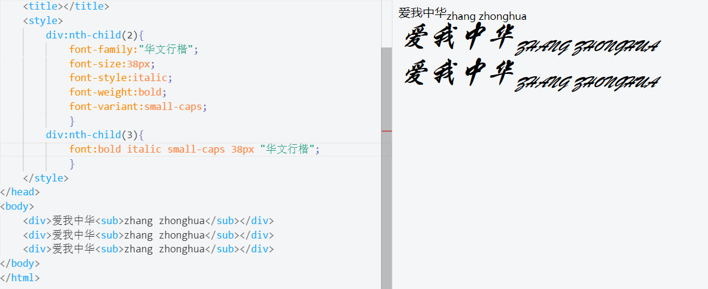
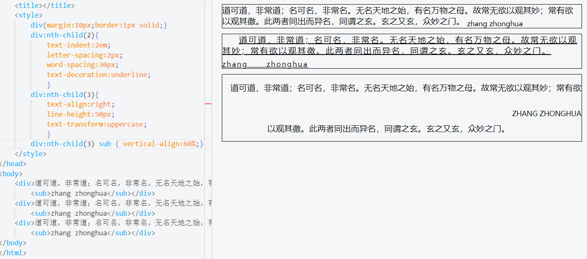

#### 字体与文本
* 字体是“文字的不同体式”或者“字的形体结构”，例如宋体/黑体/行楷等。
* 文本就是一组字或字符，比如章标题、段落正文等等，跟使用什么字体无关。
* CSS 为字体和文本分别定义了属性。字体属性主要描述一类字体的大小和外观。比如，使用什么字体族（是 Times，还是 Helvitica），多大字号，粗体还是斜体。文本属性描述对文本的处理方式。比如，行高或者字符间距多大，有没有下划线和缩进。

## 字体
网页中的字体有三个来源：
* 用户机器中安装的字体
* 保存在第三方网站上的字体。最常见的是 Typekit 和 Google，可以使用 link 标签把它们链接到你的页面上
* 保存在你的 Web 服务器上的字体。这些字体可以使用@font-face 规则随网页一起发送给浏览器

#### 字体的属性
* font-family
* font-size
* font-style
* font-weight
* font-variant
* font（简写属性）

#### 字体族
font-family：用于设定元素中的文本使用什么字体
注意: 如果字体系列的名称超过一个字，它必须用引号，如Font Family："宋体"。

#### 字体大小
font-size： 用于设置字体的大小
###### 绝对字体大小
使用像素（px），派卡（pica）或者英寸。
设定绝对字体大小时，也可以使用关键字值，比如 x-small、medium、x-large，等等。

###### 相对字体大小
使用百分比、em 或 rem（根元素的字体大小）设定字体大小。如果你给某个元素设定了相对字体大小，则该元素的字体大小要相对于最近的“被设定过字
体大小的”祖先元素来确定

#### 字体的样式
值：italic、oblique、normal。
示例：h2 {font-style:italic;}

#### 字体的粗细
可能的值：100、200……900，或者 lighter、normal、bold 和 bolder。
示例：a {font-weight:bold;}

#### 字体的变化
值：small-caps、normal。
示例：blockquote {font-variant:small-caps;}。
这个值会导致所有小写英文字母变成大写字母。

#### 简写字体属性
规则一：必须声明 font-size 和 font-family 的值。
规则二：所有值必须按如下顺序声明。 
1. font-weight、font-style、font-variant 不分先后；
2. 然后是 font-size；
3. 最后是 font-family。

示例
p {font: bold italic small-caps .9em helvetica, arial, sans-serif;}

###### 示例

## 文本
#### 文本属性
###### text-indent（文本缩进）
值：长度值（正、负均可）。
示例：p {text-indent:3em;}。

###### letter-spacing（字符间距）
值：任何长度值（正、负值均可）。
示例：p {letter-spacing:.2em;}。

###### word-spacing（单词间距）
值：任何长度值（正、负值均可）。
示例：p {word-spacing:.2em;}。

###### text-decoration（文本装饰）
值：underline、overline、line-through、blink、none。
示例：.retailprice {text-decoration:line-through;}。

###### text-align（文本对齐）
值：left、right、center、justify。
示例：p {text-align:right;}。

###### line-height（行高）
值：任何数字值（不用指定单位）。
示例：p {line-height:1.5;}

###### text-transform（文本转换）
值：none、uppercase、lowercase、capitalize。
示例：p {text-transform:capitalize;}。

###### vertical-align（垂直对齐）
值：任意长度值以及 sub、super、top、middle、bottom 等。
示例：span {vertical-align:60%;}。

###### 示例

