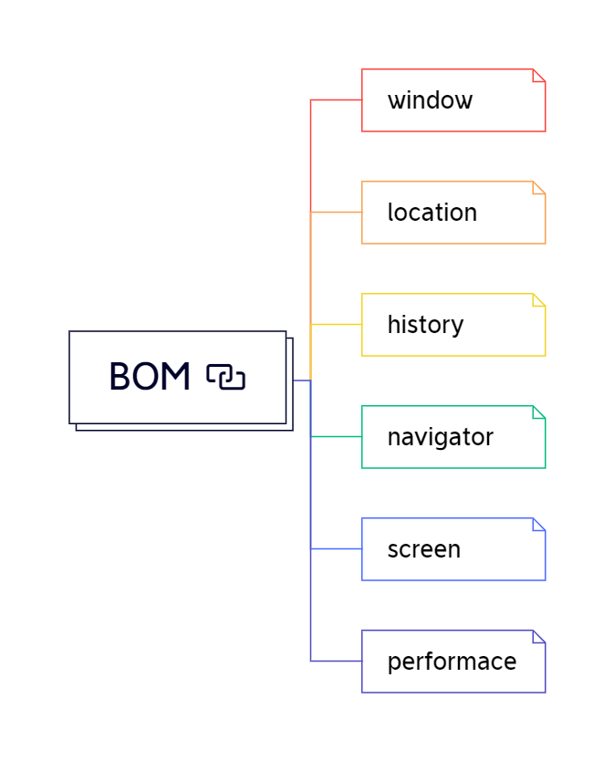

## window对象
BOM是Browser Object Mode的缩写，表示浏览器对象模型。ES是一种语言，跟具体环境没关系。DOM的作用是将文档转换为相应的对象，它跟具体环境也没有关系。而DOM则是一种将浏览器这个具体的环境对应为一种对象的模型，它提供了ES跟浏览器之间进行交互的桥梁。
因为DOM没有自己的标准，所以不同浏览器的实现细节并不相同，但是它们还是有很多统一的地方。
虽然BOM没有自己的标准，但是HTML5标准中对BOM中的对象都做了相应的规定。如果浏览器实现HTML5标准，那么BOM的结构也就有望趋向统一，这会使前端开发中令人无奈的浏览器兼容性问题得到一定改善。

window对象是浏览器中的顶层对象，其他所有的对象都直接或间接包含它下面，但是，通过window对象只能直接操作它自己直接包含的属性对象，而无法操作更深层次的对象。
###### window 对象的属性大致可以分为以下六大部分
> * 窗口、框架相关属性 
> * 窗口操作相关属性
> * 弹出窗口相关属性
> * 浏览器对象相关属性
> * 定时器相关属性
> * 其他属性

### 1. 窗口、框架相关属性
window对象中跟窗口、框架相关的属性有：window、self、frames、length、top、parent和frameElement 7个属性。
* 其中，前三个（window、self、frames）都是指向window对象自身，它们所代表的内容完全相同，知识所使用的场景不同。
* widow中的length属性指页面中所包含的框架数量
* top属性表示最顶层框架
* parent表示上层框架，对于本来就是最顶层的window对象来说，top和parent属性就是自身
* frameElement属性是框架窗口中用来获取（iframe）框架节点自身用的。
###### 1.1 frameElement
 frameElement属性是HTMLIFrameElement类型，这是在DOM的HTML子标准中定义的类型，它一共有10个可读写属性，每个均对应一个iframe标签的属性，另外还有一个只读属性（contentDocument:获取框架所包含的document对象）。
10个可读写属性如下：
* align： 排列方式，可以取left、right、top、middle、bottom等值，最好使用样式来设定，而不要使用align值
* frameBorder: 框架的边框
* src： 框架显示文档的地址
* height： 框架的高度
* width： 框架的宽度
* longDesc： 长描述，可以指定一个URL来存放iframe的描述信息
* marginHeight：框架的上、下边距
* marginWidth： 框架的左、右边距
* name： 框架的名称
* scrolling： 是否显示框架的滚动条

### 2. 窗口操作相关属性
* open（url, target, features, replace）: 打开窗口
* close（）： 关闭窗口
* stop（）： 停止加载
* focus（）： 获取焦点
* blur（）： 释放焦点

### 3. 弹出窗口相关属性
* alert（message）： 提示窗口
* confirm（message）: 确认窗口给
* prompt（message, defaule）: 输入窗口
* print(): 打印窗口

### 4. 浏览器对象相关属性
* document: 文档对象
* location： 位置对象
* history: 历史记录对象
* navigator: 存储浏览器信息
* applicationCache: 应用缓存对象
* locationbar: 地址栏对象
* menubar: 菜单栏对象
* personalbar: 个人栏对象
* scrollbars:滚动条对象
* statusbar: 状态栏对象
* toolbar: 工具栏对象

### 5. 定时器相关属性
* setTimeout(func, delay): 设置倒计时操作
* clearTimeout(timeoutID): 清除倒计时设置
* setInterval(func, delay): 设置定时操作
* clearInterval(intervalID): 清除定时设置

### 6. 其他属性
window对象除了上述属性外，还包含其他一些属性，这些属性主要包括三大类：ES中的全局属性、自定义属性（包括自定义的全局变量）和不同浏览器特有的属性。
因为window对象同时还是ES中的Global对象，所以它还会包含ES中的全局属性。例如，NaN、undefined,以及Function、String、Array等所有的内置性对象。

## localtion对象
localtion对象的作用是对当前窗口（或框架）的地址进行读写，主要包含8个读写属性和3个方法属性。

### 8个读写属性
* href: 超链接地址，页面的完整url地址内容
* protocol: 页面所使用的协议
* hostname: 主机名
* port： 端口号
* host: 主机地址，包括主机名和端口号
* pathname： 页面路径地址
* search: 查询内容
* hash: 锚点

###### localtion的8个属性中，href表示完整的url地址，其他7个属性都表示url地址中的一部分。

### 3个方法属性
* assign(url): 指定新地址，即转到新地址
* replace(url) ： 使用新地址内容替换当前窗口内容（不可后退）
* reload(): 重新加载界面

示例：
```javascript
// https://baike.baidu.com/item/%E4%B8%AD%E5%9B%BD%E5%8E%86%E5%8F%B2/152769#3_1
```


## 其他对象
### history对象
history对象用于保存window对象浏览过的历史记录，它一共包含3个方法属性和一个数值属性：
* go(num):跳转到指定页
* back(): 前一页
* forward():后一页
* length: 浏览过页面的个数

go方法可以跳转到浏览过的页面，当num大于0向后（新页面）跳，num小于0时向前（旧页面）跳。back = go(-1); forward = go(1)。

### navigator对象
navigator对象的属性保存了浏览器自身相关的信息，不同浏览器中，navigator对象所包含的属性也不尽相同，但HTML5中对其做出了规定，其中主要包含以下属性：
* appCodeName: 浏览器代码名，一般都返回Mozilla
* appName: 浏览器的名称
* appVersion: 浏览器版本信息
* platform： 浏览器所在平台，即操作系统
* produce： 产品名称，一般返回“Gecko”
* tainEnabled(): 是否允许数据污点，现在已不再使用，一般会返回false
* userAgent： 用户代理字符串
* language: 浏览器优先使用的语言
* cookieEnabled: Cookie是否可用
* plugins： 浏览器安装的插件数组
* mimeTypes: 浏览器中注册的MIME Type数组
* javaEnabled(): 浏览器是否可执行java脚本
* onLine： 浏览器是否在线

