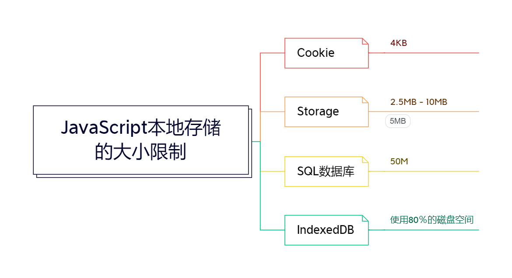

本地存储就是指在浏览器中存储数据，是相对于服务器中存储数据来说的。

## 1. 本地存储的分类
浏览器的本地存储主要包括4种方式： Cookie、Storage、SQL数据库和IndexedDB。

### Cookie
Cookie提出来得最早，其最初得设计目的只是为了保存用户得登录信息，所以并不适合保存大量数据。Cookie容量小，将保存得数据拼接成字符串得形式跟程序进行操作。没打开一个网址，浏览器都会将该网站下得所有Cookie数据全部传到服务器端，因为其最初得设计目的只是用来保护用户的登录信息（例如SessionId）。

### Storage
Sotrage是HTML5种用于存储本地数据的对象，因为其设计目的就是存储本地数据，所以其操作比Cookie灵活得多。Storage容量比Cookie大，可以直接按照键值对存储数据并使用健名获取数据。Storage分为sessionStorage和localStorage,前者在浏览器关闭后就会被清除，后者会一直存储在浏览器中，除非人为或代码清除。

### SQL数据库
SQL数据库在浏览器中封装了一个小型得SQLLite数据库，但是从前端架构上并不适合使用。例如：JS对象得属性随时都可能发生改变，可能增删，也可能修改数据类型，但是SQL数据库要求在对数据操作之前就先确定好数据的结构。

### IndexedDB
IndexedDB属于一种noSQL数据库，是非结构化的，它所保存的数据记录跟JS的对象一样可以随时变化属性（字段）。与Storage相比，它可以保存更多的数据，而且还可以使用数据库的索引、事务等相关概念，但是使用起来要比Storage复杂不少。

## 2. Storage存储
Storage是window对象的一个function类型的属性对象，但是这个function对象比较特别，它既不可以当作方法来执行，也不可以用来创建实例对象，JS引擎会默认为创建两个Storage的实例对象，直接调用就可以了。
JS引擎创建的两个Storage实例对象分别是sessionStorage和localStorage，前者用于暂时保存，浏览器关闭后数据就会丢失；后者用于长久保存，及时关闭浏览器数据也不会丢失。
Storage.prototype:

操作数据的方法有：
* getItem(key)
* setItem(key, value)
* removeItem(key)
* clear()

在控制台利用session storage setItem设置一个值后可以在Application的Session Storage查看：


localStorage与sessionStorage在方法上使用相同，不同之处就在存储后数据清除方式不同。

## 3. StorageEvent
Storage实例对象修改数据的时候会触发一个StorageEvent事件，这个事件有些特别，当事件触发后，消息会发送到打开的所有当前网站的其他页面中（当然要在同一个浏览器中），至于是否会发送给当前页面，不同的浏览器又不不同的处理方法。(个人测试以下几个浏览器行为均相同，不发送给当前页面：谷歌浏览器（85.0.4183.83）、（Microsoft Edge 44.18362.449.0）、Firefox（78.0.2 (64 位)）、双核浏览器（版本 1.0.4.2）)
StorageEvent.prototype:


代码示例：
```html
<!DOCTYPE html>
<html lang="en">
<head>
    <meta charset="UTF-8">
    <meta name="viewport" content="width=device-width, initial-scale=1.0">
    <title>Document</title>
</head>
<body>
    <input value="Test Storage" type="button" id='button'/>
    <script>
        const btn = document.querySelector('#button');
        btn.onclick = () => {
            localStorage.setItem('testKey', 'testValue1');   
        }


        window.addEventListener('storage', function(e){
            console.log(`key: ${e.key}`);
            console.log(`oldValue: ${e.oldValue}`);
            console.log(`newValue: ${e.newValue}`);
            console.log(`url: ${e.url}`);
            console.log(`is localStorage: ${e.storageArea === localStorage}`);
        });
    </script>
</body>
</html>
```


## 4. IndexedDB 数据库简介
IndexedDB数据库是一种noSQL数据库，但是其所用到的概念大部分跟SQL数据库类似，当然也存在不完全相同的地方。不同之处仅在于IndexedDB数据库不是将对象转换为记录，然后再保存到表里面，而是直接保存的对象，它是通过“ID->数据对象”这种模式来保存的。

### IndexedDB数据库操作
跟IndexedDB数据库相关的对象主要包括11个对象：IDBFactory、IDBDatabase、IDBObjectStore、IDBIndex、IDBKeyRange、IDBCursor、IDBCursorWithValue、IDBTransaction、IDBVersionChangeEvent、IDBOpenDBRequest和IDBRequest。
这11个对象都是window的function类型的属性对象，使用时都使用其示例，但不需要用户自己使用new来创建，在需要的时候就可以自动获取。11个对象可以分为4类：数据库和ObjecStore相关对象、数据相关对象、查询相关对象和辅助对象。气筒辅助对象包括IDBVersionChangeEvent、IDBOpenDBRequest和IDBRequest。

### 数据库和ObjectStore相关操作
1. 创建/打开数据库
IndexedDB数据库的操作是基于事件的，或者说是异步处理的。open方法返回的是一个IDBOpenDBRequest的实力对象，常用属性有onsuccess、onerror、onupgradeneeded，分别表示打开成功、打开失败和数据库版本升级。

语法：
```javascript
const db_worker = indexedDB.open('dbName', dbVersion);
```
示例:
```javascript
    <script>
        const workerDBRequest = indexedDB.open('database', 1);
        workerDBRequest.onerror = function(event) {
            console.log('打开数据库失败');
        }

        workerDBRequest.onsuccess = function(event) {
            db_worker = workerDBRequest.result; // 也可以使用event.target.result
            console.log('打开成功');
        }
    </script>
```


2. 创建ObjectStore
通过上图，我们可以看出， indexedDB.open（），返回的是一个IDBOpenDBRequest对象，IDBOpenDBRequest的result是一个IDBDatabase对象，有了这个对象，就可以创建ObjectStore了。这个result包含的属性方法如下：

createObjectStore、deleteObjectStore分别用于创建和删除ObjectStore。
###### 注意： createObjectStore、deleteObjectStore只能在onupgradeneeded方法中执行。
createObjectStore方法有两个参数，第一个参数是所要创建的ObjectSore的名字，第二个参数是一个对象，用于描述ID，该对象可以有两个属性：keyPath和autoIncrement，前者用来指定一个对象中的属性用作ID，后者若为true则会在保存数据时用Generator生成一个ID，但是这里需要自己创建一个Generator。
示例如下：
```javascript
 <script>
        const workerDBRequest = indexedDB.open('worker', 2);
        workerDBRequest.onerror = function(event) {
            console.log('打开数据库失败');
        }

        workerDBRequest.onsuccess = function(event) {
            db_worker = workerDBRequest.result; // 也可以使用event.target.result
            console.log('打开数据库成功');
        }

        workerDBRequest.onupgradeneeded = function(e) {
            var db = workerDBRequest.result;
            db.createObjectStore('category', {});
            console.log(`${db.name} 的版本号修改为了${db.version}`);
        }
    </script>
```

### 数据操作相关
数据相关操作除了前面介绍的之外，主要还要用到表示事务的IDBTransaction对象。
数据库（IDBDatabse的实例对象）的绝大多数操作都需要用事务来完成，数据库实例对象包含一个transaction方法属性（其实时IDBDatabase.prototype的属性），调用该属性方法就可以创建事务。transaction方法有两个参数，第一个参数用于指定要操作的ObjectStore，可以是一个，也可以是多个，多个采用数组传递；第二个参数指定事务的类型，可以是readonly(默认)或者readwrite，分别表示创建只读或读写事务。
###### IDBTransaction实例所包含的属性：
["objectStoreNames", "mode", "db", "error", "onabort", "oncomplete", "onerror", "objectStore", "commit", "abort", "durability", "constructor"]


###### IDBObjectStore实例包含的属性：
["name", "keyPath", "indexNames", "transaction", "autoIncrement", "put", "add", "delete", "clear", "get", "getKey", "getAll", "getAllKeys", "count", "openCursor", "openKeyCursor", "index", "createIndex", "deleteIndex", "constructor"]


### 增加数据
示例：
```javascript
<script>
        const workerDBRequest = indexedDB.open('worker', 3);
        workerDBRequest.onerror = function(event) {
            console.log('打开数据库失败');
        }

        workerDBRequest.onupgradeneeded = function(e) {
            var db = workerDBRequest.result;
            db.createObjectStore('category', {keyPath: 'id'});
            console.log(`${db.name} 的版本号修改为了${db.version}`);
        }

        workerDBRequest.onsuccess = function(event) {
            db_worker = workerDBRequest.result; // 也可以使用event.target.result
            console.log('打开数据库成功');
            workerDBOpenSuccess();
        }
        
        function workerDBOpenSuccess() {
            const tx_category = db_worker.transaction('category', 'readwrite');
            const store_category = tx_category.objectStore('category');

            const category1 = {'id':007, 'name':'zzh', 'age':18};

            const categoryAddRequest = store_category.add(category1);

            categoryAddRequest.onsuccess = function(event) {
                console.log('保存成功');
            }

            categoryAddRequest.onerror = function(evevt) {
                console.log('保存失败');
            }
        }
    </script>
```


### 查询数据
实例：
```javascript
    <script>
        const workerDBRequest = indexedDB.open('worker', 3);
        workerDBRequest.onerror = function(event) {
            console.log('打开数据库失败');
        }

        workerDBRequest.onupgradeneeded = function(e) {
            var db = workerDBRequest.result;
            db.createObjectStore('category', {keyPath: 'id'});
            console.log(`${db.name} 的版本号修改为了${db.version}`);
        }

        workerDBRequest.onsuccess = function(event) {
            db_worker = workerDBRequest.result; // 也可以使用event.target.result
            console.log('打开数据库成功');
            workerDBOpenSuccess();
        }
        
        function workerDBOpenSuccess() {
            const tx_category = db_worker.transaction('category', 'readwrite');
            const store_category = tx_category.objectStore('category');

            const categoryGetRequest = store_category.get(7);

            categoryGetRequest.onsuccess = function (event) {
                console.log(`查询成功： ${JSON.stringify(categoryGetRequest.result)}`);
            }
        }
    </script>
```

查询的方式还有很多种，就像关系型数据库一样，查询可以根据不同的条件筛选数据。

### 修改数据
```javascript
    <script>
        const workerDBRequest = indexedDB.open('worker', 3);
        workerDBRequest.onerror = function (event) {
            console.log('打开数据库失败');
        }

        workerDBRequest.onupgradeneeded = function (e) {
            var db = workerDBRequest.result;
            db.createObjectStore('category', {
                keyPath: 'id'
            });
            console.log(`${db.name} 的版本号修改为了${db.version}`);
        }

        workerDBRequest.onsuccess = function (event) {
            db_worker = workerDBRequest.result; // 也可以使用event.target.result
            console.log('打开数据库成功');
            workerDBOpenSuccess();
        }

        function workerDBOpenSuccess() {
            const tx_category = db_worker.transaction('category', 'readwrite');
            const store_category = tx_category.objectStore('category');

            const categoryGetRequest = store_category.get(7);

            categoryGetRequest.onsuccess = function (event) {
                console.log(`查询成功： ${JSON.stringify(categoryGetRequest.result)}`);

                let data = event.target.result;
                data.age = 19;

                const categoryPutRequest = store_category.put(data);

                categoryPutRequest.onsuccess = function (event) {
                    console.log('更新成功');
                }
            }

        }
    </script>
```

IndexedDB可能不会实时更新显示，有时需要刷新后查看，实际值已经修改。


### 删除数据
示例：
```javascript
<script>
        const workerDBRequest = indexedDB.open('worker', 3);
        workerDBRequest.onerror = function (event) {
            console.log('打开数据库失败');
        }

        workerDBRequest.onupgradeneeded = function (e) {
            var db = workerDBRequest.result;
            db.createObjectStore('category', {
                keyPath: 'id'
            });
            console.log(`${db.name} 的版本号修改为了${db.version}`);
        }

        workerDBRequest.onsuccess = function (event) {
            db_worker = workerDBRequest.result; // 也可以使用event.target.result
            console.log('打开数据库成功');
            workerDBOpenSuccess();
        }

        function workerDBOpenSuccess() {
            const tx_category = db_worker.transaction('category', 'readwrite');
            const store_category = tx_category.objectStore('category');
            const categoryDeleteRequest = store_category.delete(7); // 根据id删除
            categoryDeleteRequest.onsuccess = function(event) {
                console.log('删除成功');
            }
        }
    </script>
```
显示需要刷新后查看。


IndexedDB的操作还有很多，首先大概理解下noSQL的原理，然后再对这些对象，以及对象可进行的操作进行理解使用。感兴趣的也可以参看MDN详解：https://developer.mozilla.org/zh-CN/docs/Web/API/IndexedDB_API/Using_IndexedDB