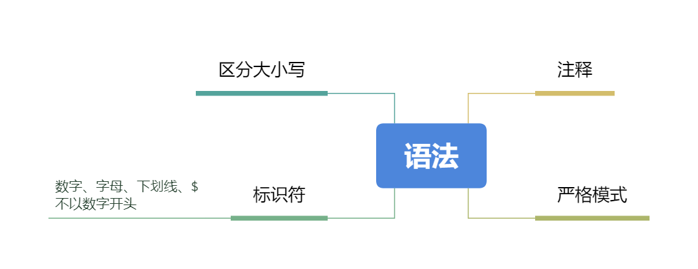
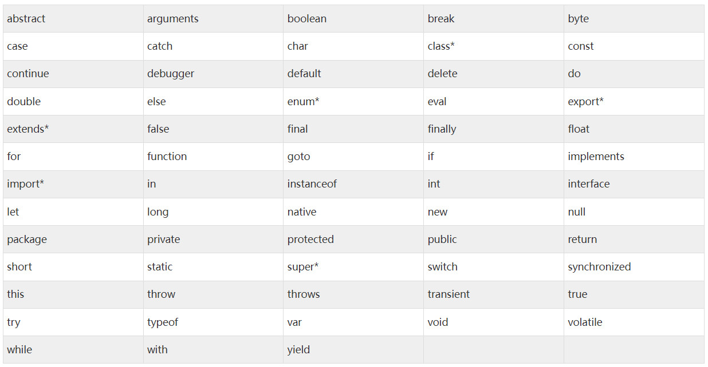
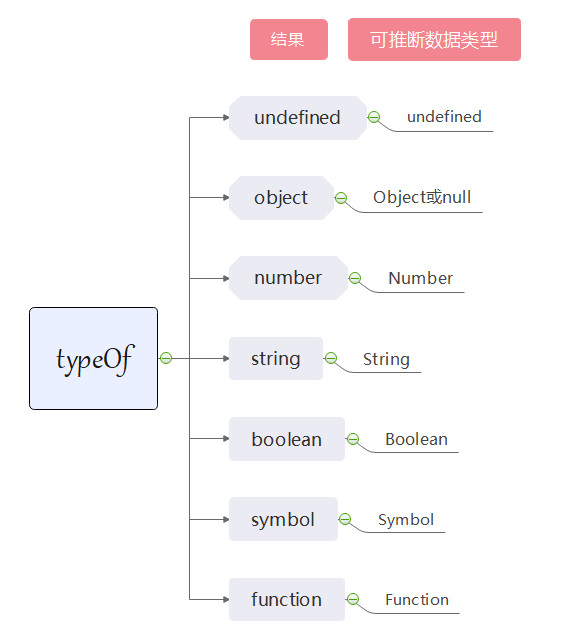

## 语法
<div style="text-align: center"></div>

### JS区分大小写

### 标识符
标识符就是变量、函数、属性或函数参数的名称。标识符由数字、字母、下划线、$组成，不以数字开头。推荐小驼峰命名规则。

> 注意：关键字、保留字、true、false和null不能作为标识符。

### 注释
```
// 单行注释

/* 单行注释 */

/*  多
*   行
*   注
*   释
*/
```

### 严格模式
ES5增加了严格模式的概念，通过使用严格模式，ES3的一些不规范的写法就会被处理，对于不安全的行为还会抛出错误。使用方式如下：
```javascript
function test() {
    "use strict";
    // 处理过程...
}
```


## 保留关键字
保留关键字就是有特殊用途的单词，或者未来可能有特殊用途的单词，反正你不能用。
<div style="text-align: center"></div>

由于关键字和保留字还挺多，就不在此罗列了，详情请参看下面的地址：
https://www.w3cschool.cn/javascript/js-reserved.html


## 定义变量

有三种定义变量的方式：var/let/const

var：是es6之前使用的方法，let/const是es6新加的定义变量的的方法。

### 那么有了var为什么还会出现let/const呢？
自然是var有问题啦~

### 相同之处
都可以定义变量

### 不同之处
* var存在变量提升；let/const不存在，在声明之前的执行瞬间被称为“暂时性死区”；
* var声明的是函数作用域；let/const声明的是块级作用域；
* let/const在全局作用域中声明的变量不会成为window对象的属性，而var声明的变量却会；
* const声明的变量不可重新声明。

### 总结
避免使用var定义变量，优先使用const，其次使用let。

## 数据类型

### 数据类型的分类

JS的数据类型分为两种，一种是原始类型，一种是引用类型。

### 原始类型
Undefined, Null, Number, String, Boolean, Symbol共6种。
### 引用类型
第一个是Object, Object作为基类，又衍生出了Array, Math, Regexp, Date常用的引用类型和Boolean，String，Number原始值的包装类型以及ES6新增的Map、WeakMap,Set、WeakSet管理集合的引用类型。
<div style="text-align: center"></div>

### 数据类型的判定
针对不同的数据类型，有不同的判断方式，最常见的方法有typeof 和instance。

#### typeof
<div style="text-align: center"></div>
一般原始类型可以使用typeof进行判断（除null），如下实例
试一试：http://jsrun.net/QPaKp/edit

```javascript
const u = undefined; // 这里其实不必要显示赋值为undefined,为了demo更加明显才赋值
const n = null;
const s = 'string';
const num = 100;
const bo = true;
const sy = Symbol('symbol');
const ob = new Object();
const arr = new Array();
const fun = () => {}

console.log(`u的数据类型：${typeof u}`);
console.log(`n的数据类型：${typeof n}`);
console.log(`s的数据类型：${typeof s}`);
console.log(`num的数据类型：${typeof num}`);
console.log(`bo的数据类型：${typeof bo}`);
console.log(`sy的数据类型：${typeof sy}`);
console.log(`ob的数据类型：${typeof ob}`);
console.log(`arr的数据类型：${typeof arr}`);
console.log(`fun的数据类型：${typeof fun}`);
```

结果:

```
> u的数据类型：undefined
> n的数据类型：object
> s的数据类型：string
> num的数据类型：number
> bo的数据类型：boolean
> sy的数据类型：symbol
> ob的数据类型：object
> arr的数据类型：object
> fun的数据类型：function
```
综上实例可以看出，利用typeof除null被判定为object类型外，其他的原始类型及函数均判断正确。在红宝书的解释是这样子的，特殊值null被认为是一个对空对象的引用。

#### instanceof

由于typeof无法判断null和Object对象的的类型，所以引入了一个instanceof方法来判断null和Object对象的类型。
试一试：http://jsrun.net/PPaKp/edit

```javascript

const obj = new Object();
const arr = new Array();
const date = new Date();
// const math = new Math(); // Uncaught TypeError: Math is not a constructor
const reg = new RegExp();
const map = new Map();
const weakMap = new WeakMap();
const set = new Set();
const weakSet = new WeakSet();

const str = new String('test');
const str1 = 'test';

const bo = new Boolean(1);
const num = new Number('5');

const nu = null;

console.log(`obj 是不是Objec的实例？ - ${obj instanceof Object}`); // true
console.log(`arr 是不是Array的实例？ - ${arr instanceof Array}`); // true
console.log(`date 是不是Date的实例？ - ${date instanceof Date}`); // true
console.log(`reg 是不是RegExp的实例？ - ${reg instanceof RegExp}`); // true
console.log(`map 是不是Mp的实例？ - ${map instanceof Map}`); // true
console.log(`weakMap 是不是WeakMap的实例？ - ${weakMap instanceof WeakMap}`); // true
console.log(`set 是不是Set的实例？ - ${set instanceof Set}`); // true
console.log(`weakSet 是不是WeakSet的实例？ - ${weakSet instanceof WeakSet}`); // true
console.log(`str 是不是String的实例？ - ${str instanceof String}`); // false
console.log(`str1 是不是String的实例？ - ${str1 instanceof String}`); // true
console.log(`bo 是不是Boolean的实例？ - ${bo instanceof Boolean}`); // true
console.log(`num 是不是Number的实例？ - ${num instanceof Number}`); // true

console.log(`arr 是不是Object的实例？ - ${arr instanceof Object}`); // true
console.log(`nu 是不是Object的实例？ - ${nu instanceof Object}`); // false

```
从上面的示例中可以看出，**null虽然被认为是对空对象的引用，但并不是Object的实例**。由此可以判断一个值是不是为null

```javascript
const nullValue = null;
typeof nullValue === object && !(nullValue instanceof Object)

// 或者
const nullValue = null;
nullValue === null;
```

参考：
typeof/instanceof实现原理：https://juejin.cn/post/6844903613584654344

## 操作符


## 语句


