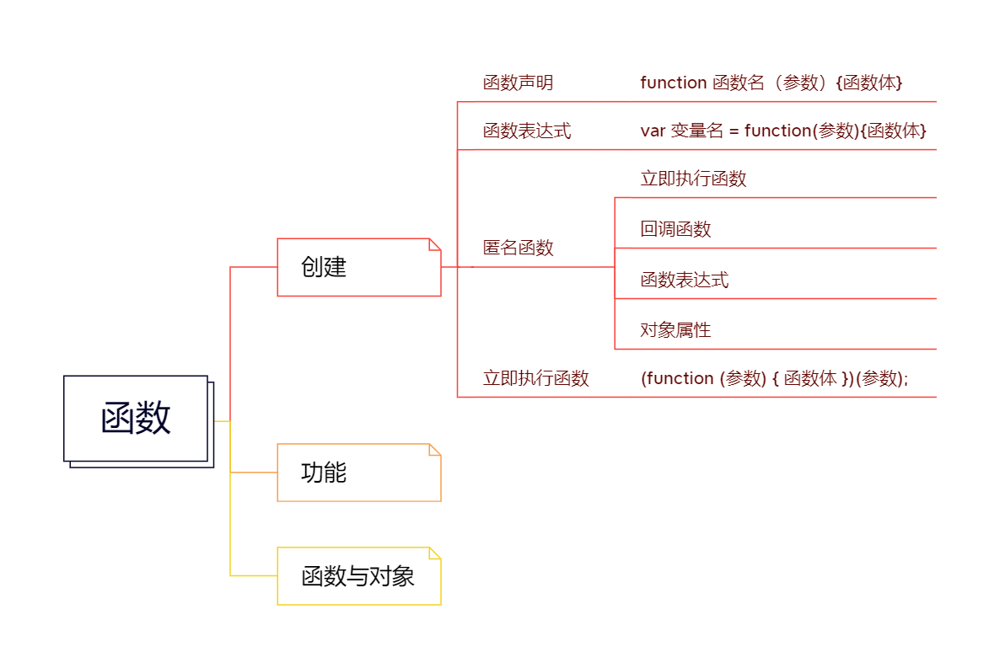

在JS中，function可以说是最核心的内容了。

**它本身是一种对象，另外，它还可以创建对象， 而且可以对对象操作**

## function的作用：
1. 作为对象来管理其中的属性
2. 作为方法处理具体业务
3. 创建对象

## 一、创建function
### 1. 函数声明， 结构如下：
```javascript
function 函数名（参数）{函数体}
```
举例：

```javascript
function say (what){console.log(`say ${what}`)}
say('hello'); // output:say hello
```
### 2.函数表达式， 结构如下：

```javascript
var 变量名 = function(参数){函数体}
```

举例：

```javascript
var say = function(what){console.log(`sya ${what}`);}
say('hello'); // output: say  hello
```

###### 其实，通过函数声明方式创建函数时，JS在背后自动帮用户做了这件事，它首先创建了函数对象，然后又创建了跟函数名同名的变量，并将创建出来的函数赋值给了这个变量。即：
```javascript
function F(a){}
var f = F;
```

###### 通过函数表达式来创建其实道理也差不多，不同之处在于它会创建一个匿名函数，然后再赋值给定义的变量。即：

```javascript
var anonymous = function (b) {}
var anony = anonymous;
```

## 二、用作对象
JS中的函数本身也还是对象，是对象就可以有自己的属性。
举例：
```javascript
function func() {};
func.val = 'go';
func.logVal = function(){
  console.log(this.val);
}

func.logVal(); // output: "go"
```

## 三、处理业务(功能)
通过一些列的语句指令，完成一个功能，示例如下：
```javascript
function testFunc () {
  try{
    var a = 'hello';
    if(typeof a === 'string'){
      console.log(a);
    }else{
      console.log('a is not string');
    }
  }catch(error){
    console.log(error.name);    console.log(error.name);
    console.log(error.message);
    
  }finally{
    console.log('final');
  }
}

testFunc(); // output: "hello" "final"
```

## 四、创建对象
对于一个function类型的对象，使用new便是对象，不使用便是函数。**一般是对象的话，首字母大写，方法首字母小写**。
举例：
```javascript
function F(){
  this.v = 1;
}
var obj = new F();
console.log(obj.v); // output: 1
```

###### 注意：
在使用function创建对象时需要注意一种特殊的情况，当function的函数体返回一个对象类型时，使用new关键字创建的对象就是返回的对象而不是function所对应的对象。
举例：
```javascript
function F() {}
function Car(color){
  this.color = color;
  return new F();
}

var car = new Car('red');
console.log(car.color); // undefined
console.log(car instanceof Car); // false
console.log(car instanceof F); // true
```

### prototype属性与继承
* 基于对象的ES语言根本没有类的概念，当然也就不存在基于类的那种继承方式，但是它可以通过prototype属性类达到类似与继承的效果。
* prototype是ES中function类型对象的一个特殊的属性。**每个function类型的对象都有prototype属性**，prototype属性的值是object类型的对象。
* function创建的实例对象在调用属性时，会首先在自己的属性中查找，如果找不到就会去function的prototype属性对象中查找。但是，创建的对象只是可以调用prototype中的属性。但是并不会实际拥有那些属性，也不可以对它们进行修改（修改操作会在实例对象中添加一个同名的属性）。当创建的实例对象定义了同名的属性后就会覆盖prototype中的属性，但是原来的prototype中的属性并不会发生变化，而且当创建出来的对象删除了添加的属性后，原来的prototype中的属性还可以继续调用。
举例：
```javascript
function Car(color){
  this.color = color;
}

Car.prototype.logColor = function(){
  console.log("prototype: " + this.color);
}
var car = new Car('red');
car.logColor(); //"prototype: red"

car.logColor = function(){
  console.log("property: " + this.color);
}

car.logColor(); // "property: red"

delete car.logColor;

car.logColor(); // "prototype: red"
```


## this的含义
使用记忆口诀：“谁直接调用方法，this就指向谁”。

代码示例：
```javascript
var color = 'red';

function Obj () {
	var color = 'balck';
}

Obj.color = 'green';
Obj.prototype.logColor = function () {
	console.log(this.color);
}

var o = new Obj();
o.color = 'blue';
o.logColor(); // blue
```
例子中一个有4个color， 一个是全局变量，一个是Obj的局部变量，一个是Obj的属性，还有一个是Obj创建的实例对象o的属性。logColor方法是Obj的prototype中的方法属性，其中打印了this.color的值。在调用o.logColor()时，这里使用使用对象o中的color属性，也就是blue,这是因为logColor方法是被o对象直接调用的。

### 关联方法后的this
代码示例：
```javascript
function logColor() {
	console.log(this.color);
}

function Obj () {}
var o = new Obj();

Obj.color = 'red';
o.color = 'blud';

Obj.logColor = logColor;
o.logColor = logColor;

Obj.logColor(); // red
o.logColor(); // blue
```
谁调用方法this就指向谁！！！

### 内部函数中的this
代码示例：
```javascript
var v = 1;
function Program () {
	var v = 2;
	this.v = 3;
}

Program.prototype.logV = function () {
	function innerLog () {
		console.log(this.v);
	}
	innerLog();
}

var pro = new Program();

pro.logV();  // 1
```
若希望打印出Program的this.v 即3， 有三种处理方法：
方法一：
```javascript
Program.prototype.logV = function () {
	var instance = this;
	function innerLog () {
		console.log(instance.v);
	}
	innerLog();
}
```
方法二：
```javascript
Program.prototype.logV = function () {
	function innerLog () {
		console.log(this.v);
	}
	this.innerLog = innerLog;
	this.innerLog();
}
```
方法三：
```javascript
Program.prototype.logV = function () {
	function innerLog (v) {
		console.log(v);
	}
	innerLog(this.v);
}
```

### 对象的属性不可以继承
属性不可以继承指的是，如果对象有多个层次，那么父子对象里的属性不可以相互继承和调用。
代码示例：
```javascript
function logV() {
	console.log(this.v);
}

var obj = {v: 1};
obj.sonObj = {};

obj.logV = logV;
obj.sonObj.logV = logV;

obj.logV(); // 1
obj.sonObj.logV(); // undefined
```
之所以为undefined, 也是this的一种应用，此时obj.sonObj并没有定义属性v且没有继承ovj的v，所以打印其结果为undefined. 


### 注意
**由于this问题很是麻烦，所以出现了箭头函数。箭头函数：在哪定义，this就是指向当前对象。所以当存在this问题时，尽可能的使用箭头的函数。**

