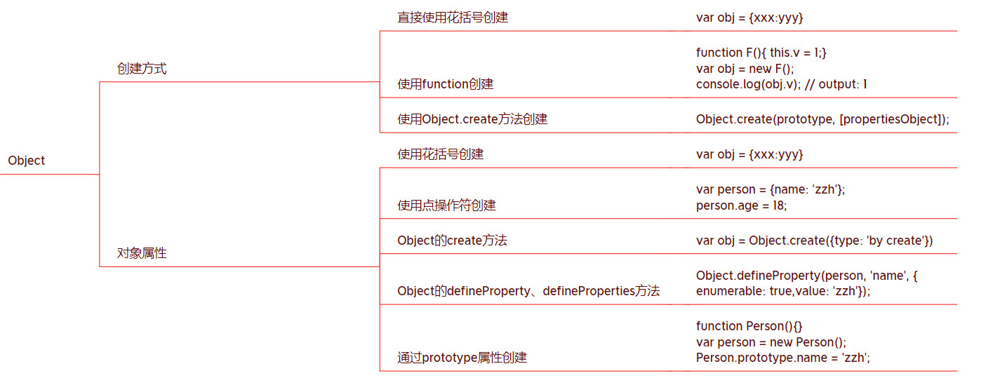

object类型对象时ES的基础，它主要通过属性使用。
## 创建object类型对象的三种方式
ES中object类型的对象大致由三种创建方式：
* 直接使用花括号创建
* 使用function创建
* 使用Object.create方法创建。

## 直接使用花括号创建
代码示例：
```javascript
var obj = {
	v: 6,
	innerObj: {
		v: 7,
	},
	logV: function() {
		console.log(this.v);
	}
};
console.log(obj.v); // 6
console.log(obj.innerObj.v); // 7
obj.logV(); // 6
```
## 使用function创建
对于一个function类型的对象，使用new便是对象，不使用便是函数。一般是对象的话，首字母大写，方法首字母小写。

举例：
```javascript
function F(){
  this.v = 1;
}
var obj = new F();
console.log(obj.v); // output: 1
```

## 使用Object.create方法创建
Object是ES中内置的一个function类型的对象，create是Object对象的一个属性方法，其作用是根据传入的参数创建object类型的对象。create方法的调用语法如下：
```Object.create(prototype,  [propertiesObject]);```
第一个参数prototype是创建的对象所对应的prototype,相当于使用function创建时中的prototype属性对象，创建出来的object对象实例可以直接调用。
第二个参数propertiesObject为属性描述对象，是可选参数，用于描述所创建对象的自身属性。属性描述对象是object类型对象，它里面的属性名会成为所创建对象的属性名，属性值为属性的描述对象。
```Object.getOwnPropertyNames(obj)```：获取obj自己所拥有的属性。
代码示例：
```javascript
var obj = Object.create(
	{
		type: 'by create'
	},
	{
		color:{
			value: 'red',
			enumerable: true,
		},
		size:{
			value: '37',
			enumerable: true,
		}
	}
);
console.log(obj.type); // by create
console.log(obj.color); // red
console.log(obj.size); // 37
console.log(Object.getOwnPropertyNames(obj)); // ['color', 'size']
```

## Object的prototype属性对象里面都有什么
Object的prototype属性对象在ES5.1和ES2015中都规定了constructor、toString（）、toLocaleString（）、valueOf()、哈sOwn Property（V）、isPrototypeOf（V）和propertyIsEnumerable（V）7个属性。
* toString： 可以将对象转换为字符串，不同类型的对象可能会重写自己的toString方法。
* toLocaleString： 会使用本地化格式来生成字符串，对于时间日期类型和数字类型的用处较大。
* valueOf： 会返回原始值。例如Date的valueOf就是相应的数字。
* hasOwnProperty： 判定是否包含指定属性。
* isPrototypeOf： 判断某个对象是否是另一个对象所对应的prototype对象。
* propertyIsEnumerable： 判断某个属性是否可以枚举。

标准中所规定的Object的prototype属性对象中的7个属性，但是不同的浏览器还会有自己的扩展。

## 对象的属性
对象是通过其属性发挥作用的，因此对象的属性是对象的核心。
## 三种属性类型
命名数据属性（named data properties）、命名访问器属性（named accessor properties）和内部属性（internal properties）。
## 命名数据属性
命名数据属性是我们平时使用最多的属性，由属性名和属性值组成。
代码示例：
```javascript
var obj = {
	v: 6,
	innerObj: {
		v: 7,
	},
	logV: function() {
		console.log(this.v);
	}
};
console.log(obj.v); // 6
console.log(obj.innerObj.v); // 7
obj.logV(); // 6
```

## 命名访问器属性（getter/setter）
getter和setter是对应的方法，setter方法用于给属性赋值，而getter方法用于获取属性的值。如果只有getter、setter其中之一，就只能进行单一操作，例如只有getter方法的属性就是只读属性，只有setter方法的属性就是只可以写入的属性。
代码示例：
```javascript
function log(msg){
	console.log(msg);
};

var car = {
	_color: 'red',
	_weight: 0,
	_age: 0,
	
	// color 可读，可写
	get color(){
		return this._color;
	},
	
	set color(col){
        log('color changed');
		this._color = col;
	},

	// weight只读不写
	get weight(){
		return this._weight;
	},

	// age 只写不读
	set age(age){
		this._age = age;
	},
};

car.color='blue';
log(car.color); // 'blue'

log(car.weight); // 0

car.age=10;
log(car.age); // undefined
```

## 内部属性
内部属性是对象的一种特殊的属性。它没有自己的名字，当然也就不可以像前两种属性那样直接访问了。正是因为内部属性没有名字所以前面两种属性才叫命名属性。内部属性使用两对方括号表示。例如， [[Extensible]]表示Extensible内部属性。
内部属性的作用是用来控制对象本身的行为。所有对象共有的内部属性共12个：[[ptototype]]、[[Class]]、[[Extensible]]、[[Get]]、[[GetOwnProperty]]、[[GetProperty]]、[[Put]]、[[CanPut]]、[[HasProperty]]、[[Delete]]、[[DefaultValue]]、[[DefineOwnProperty]]除了这12个之外，不同的对象可能还会有自己的内部属性。
下面简单介绍一种内部属性：[[Prototype]]
它就是使用function创建对象时function中的prototype属性。
注意使用Object.getPrototypeOf()方法来获取prototype.
代码示例：
```javascript
function Car(){}

Car.prototype = {color: 'red'};

var car = new Car();

console.log(typeof car.prototype); // undefined
console.log(Object.getPrototypeOf(car)); // 'red'
```

## 5种创建属性的方式
### 1. 使用花括号创建
代码示例:
```javascript
var obj = {
	v: 1, // 直接量属性
	
	// function 对象属性
	getV: function() {
		return this.v;
	},

	// 访问器属性（name）
	_name: 'object',
	get name() {
		return this._name;
	},
	set name(name){
		this._name = name;
	}
};

console.log(obj.v); // 1

console.log(obj.getV()); // 1

console.log(obj.name); // 'object'

obj.name = 'objChanged';
console.log(obj.name); // 'objChanged'
```

### 2. 使用点操作符创建
当使用点操作符给一个对象赋值时，如果对象存在此属性则会修改属性的值，否则会添加相应的属性并赋予相应的值。
代码示例：
```javascript
var person = {name: 'zzh'};
person.name = 'zh';
person.age = 18;

console.log(person); // { name: 'zh', age: 18 }
```

### 3. Object的create方法
第一个参数为创建对象的[[Prototype]]属性，第二个参数为属性描述对象。
代码示例：
```javascript
var obj = Object.create(
	{
		type: 'by create'
	},
	{
		color:{
			value: 'red',
			enumerable: true,
		},
		size:{
			value: '37',
			enumerable: true,
		}
	}
);
console.log(obj.type); // by create
console.log(obj.color); // red
console.log(obj.size); // 37
console.log(Object.getOwnPropertyNames(obj)); // ['color', 'size']
```

### 4.Object的defineProperty、defineProperties方法
使用Object的defineProperty和defineproperties方法给对象添加属性。defineProperty方法可添加单个属性，defineProperties方法可以添加多个属性。
代码示例：
```javascript
var person = {};
Object.defineProperty(person, 'name', {
	enumerable: true,
	value: 'zzh'
});

console.log(Object.getOwnPropertyNames(person)); // ['name']
console.log(person.name); // zzh

Object.defineProperties(person, {
	name: {
	enumerable: true,
	value: 'zzh'
	},
	age: {
	enumerable: true,
	value: 18
	}
});

console.log(Object.getOwnPropertyNames(person)); // ['name', 'age']
console.log(person.name); // zzh
console.log(person.age); // 18
```

### 5. 通过prototype属性创建
使用function创建的object实例对象可以使用function对象的prototype属性对象中的属性。
代码示例：
```javascript
function Person(){}

var person = new Person();

Person.prototype.name = 'zzh';

console.log(person.name); // zzh
```

## 属性的描述
属性的描述也可以称为属性的特征，类似于对象的内部属性，其主要作用就是描述属性自己的一些特征。
### 命名数据属性的4个特征
* [[Value]]： 表示属性的值
*  [[Writable]]： 表示属性值是否可以修改
*   [[Enumerable]]： 表示属性是否可枚举， 若为false则不会被for-in循环遍历到。
*  [[Configurable]]：表示属性是否可以被删除和属性的特性（除[[value]]外）是否可修改。

代码示例：
```javascript
var person = {};
Object.defineProperty(person, 'name', {
	enumerable: true,
	value: 'zzh',
	writable: false, // 不可修改
	configurable: true
});

console.log(Object.getOwnPropertyNames(person)); // ['name']
console.log(person.name); // zzh

person.name = 'zh'; // not work
console.log(person.name); // zzh
```

### 命名访问器属性的4个特征
* [[Get]]：getter方法
* [[Set]]： setter方法
* [[Enumerable]]：表示属性是否可枚举， 若为false则不会被for-in循环遍历到。
* [[Configurable]]：表示属性是否可以被删除和属性的特性（除[[value]]外）是否可修改。
代码示例：
```javascript
function log(msg){
	console.log(msg);
}
var person = {_name: '007'};
Object.defineProperty(person, 'name', {
	get: function(){
		log('getting name');
		return this._name;
	},
	
	set: function(newName){
		log('name is changed to ' + newName);
		this._name = newName;
	}
});

log(Object.getOwnPropertyDescriptor(person, 'name')); 
//{ get: [Function: get],set: [Function: set], enumerable: false,configurable: false }

console.log(person.name); // 007

person.name = 'zzh'; 
console.log(person.name); // zzh
```

## Global与Window对象
JS时面向对象的语言，或者说它本身就是一个大对象，就像一个大箱子里面装着很多大盒子，每个大盒子里面都装着小盒子....那么最顶层的箱子是什么呢？这个对象在ES标准中叫做Global对象。ES标准中规定Global对象要在进入执行环境前就已创建，它是所有对象的根对象，其他对下个你都是它的属性或者属性的属性。
**这里的Global是表示功能的词，不代表具体的对象名。**事实上并不一定存在Global对象，但是每个具体的宿主环境都需要有一个Global对象，例如，浏览器中的window对象就是Global对象，所有其他对象都是window对象的属性或其属性的属性。例如，Stirng，Number，Boolean，Array，RegExp等对象都是window的属性，就连Object和Function也是window的属性对象。
可利用：console.log(Object.getOwnPropertyNames(window));
查看widow包含的属性，亲测包含1102个，有些可能并没有什么意义，但是多为有意义的属性。


### Window对象的特殊性
浏览器的Global对象window是使用Window对象创建出来的，Window对象是function类型，window对象是obejct类型。用于创建window对象的Window对象跟我们自定义的function对象之间存在一些差别。
* 不可以创建对象：我们自己创建的function对象可以使用new关键字来创建相应的object类型实例对象，但是Window对象不可以用于创建对象。
* 不可以作为方法调用：Window也不可以作为方法来调用，也就是说，在程序中直接调用Window()也是不可以的，并且这种用法也没有实际意义。
* 变量就是属性：在最外层定义的变量也叫做全局变量，与在function中定义的其他变量存在很大的区别。在最外层定义的变量会自动称为window对象的属性，而在普通function中变量和实例对象的属性是完全没有关系的两类数据。
代码示例：

```javascript
var v = 1;

// 通过修改this的属性可以改变全局变量的值
this.v = 2;
console.log(v); // 2

// 通过修改全局变量的值也可以修改window对象同名属性的值
v = 3;
console.log(window.v); // 3

// 我们自定义方法中变量和实例对象的属性是相互独立的
function Obj(){
	var v = 2;
	this.v = 5;
	console.log(v);	// 2
	console.log(this.v); // 5
}

new Obj(); // 2
```

从上面的示例中可以看出，最外层定义的变量和this的属性及window的同名属性都是同一个，可以相互操作。但是，在我们自定义的function函数体内变量和属性之间存在严格区分，不可以相互调用。
### 另外，window对象本身也是自己的一个属性
可利用语句查看：console.log(Object.getOwnPropertyNames(window));
