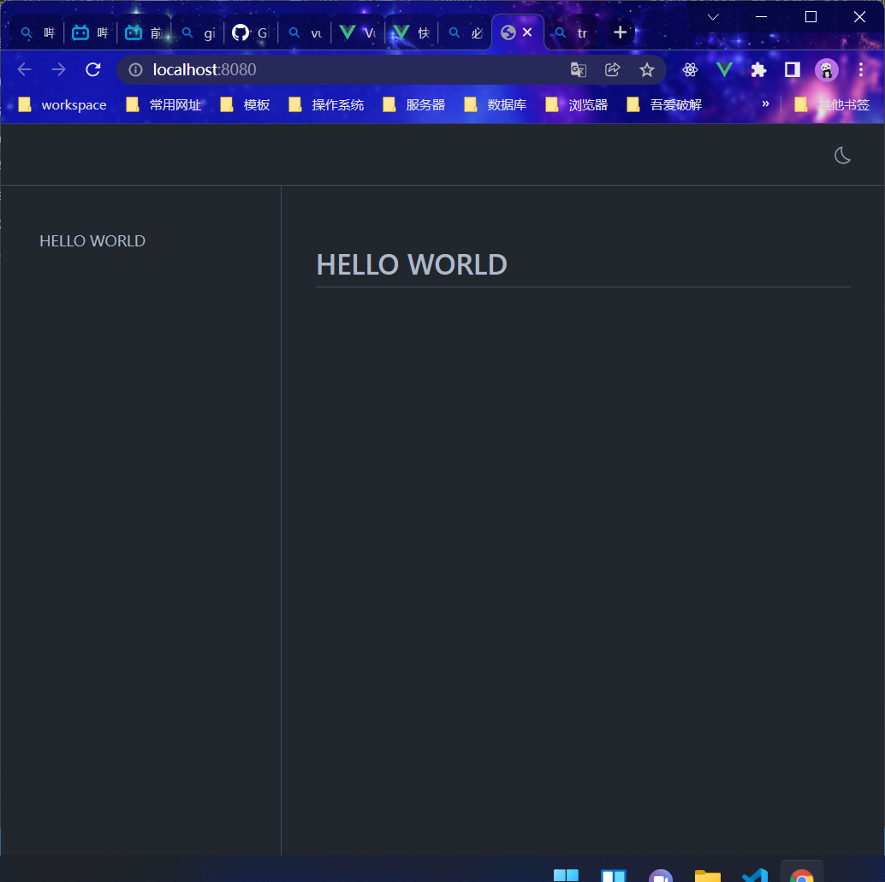

## 新建一个文件夹
```
mkdir zh-admin-doc
cd zh-admin-doc
```

## 初始化项目
```
git init
yarn init
```
## 安装VuePress
```
yarn add -D vuepress@next
```

## 在package.json中添加scripts
```json
"scripts": {
    "docs:dev": "vuepress dev docs",
    "docs:build": "vuepress build docs"
  }
```

## 在根目录新建文件夹docs，并且在该文件夹内新建文件README.md，目录结构如下


## 运行
```
yarn docs:dev
```


参考地址：
https://v2.vuepress.vuejs.org/zh/guide/getting-started.html