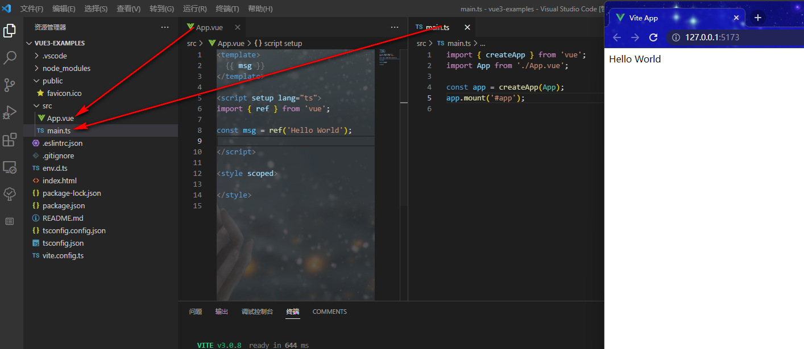

# Vue3初识
## vue.js是什么
vue是什么？官网首页就有答案：渐进式JavaScript框架。有灵活，易用，高效的特点。官网首页有详细的介绍:

v2: https://cn.vuejs.org/v2/guide/

V3：https://vuejs.org/

V3中文：https://cn.vuejs.org/

V3中文2: https://staging-cn.vuejs.org/

## 如何理解渐进式
个人理解：
* 易上手，可以逐渐深入学习
* 初创项目很简单，没有多余的东西，根据需要不断添加插件扩展项目。

相关功能有：解耦视图与数据，数据驱动，可复用的组件，前端路由，状态管理，虚拟DOM等。

与React，Angular一样，vue也是基于MVVM的一种架构模式。那么如何理解什么是MVVM呢？

## MVC->MVP(省略)->MVVM
### MVC
一般MVC的架构模式是前后端不分离，例如基于.net的ASP，基于java的JSP。那么为什么在MVC架构模式下开发的好好的，为什么还需要使用MVVM呢？我们用一张图来看看MVC模式做了什么。


这是MVC的一个模型图，model对应数据，view对应视图，controller对应控制器。看起来是一个很好的闭环，view->controller->model->view,逻辑清晰，易于维护，那这里面存在什么问题呢？
个人认为：
* 前后端不分离，增加学习成本，人员问题
* 规范的还不够严格，如果对MVC理解使用得不好可能会造成内部代码的混乱。例如多个controller对应多个model的情况，那样维护起来就有些麻烦。
* 随着多端（桌面，h5,小程序）应用的发展，controller慢慢的不再是控制路由和逻辑，而仅仅是逻辑，作为数据接口使用，而不需要view的参与。

### MVVM
那么MVVM就很好吗？它本质上就是MVC的改进版，目前来看是不错的选择。

MVVM（Model-View-ViewModel）框架的由来便是MVP（Model-View-Presenter）模式与WPF结合的应用方式时发展演变过来的一种新型架构框架。它立足于原有MVP框架并且把WPF的新特性糅合进去，以应对客户日益复杂的需求变化。

所以，MVVM的产生由来已久。其实很多前端的一些概念，在后端早已应用，只是前端领域目前正如旭日东升，接纳百家之长而已。之前由于很多条件的限制下（带宽/客户端等），前端领域发展并不是很迅速，只需要完成简单的功能即可。随着社会的进步，人们已经不仅限于对功能的要求，还需要很好的用户体验，所以迎来了前端的春天。
### 插个话题
这个就像计算机语言的不断封装优化一样：
>机器语言 -> 汇编-> C -> C++ -> 
基于c++ 封装： C#（2000）/java（20世纪90年代）
基于c++ 解释： javascript（1995）（由于浏览器多由c++编写）

### 言归正传
看看mvvm的架构模式：

MVVM通过ViewModel为纽带，当view变化时，利用data binding , ViewModel会自动变化，反之亦然。
再从网上盗两张图（个人觉得还是很清晰的）：


## 如何使用vue.js
* 在页面上以 CDN package 的形式导入。
* 使用 npm 安装它。
* 使用官方的 CLI 来构建一个项目，它为现代前端工作流程提供了功能齐备的构建设置 (例如，热重载、保存时的提示等等)。

常用的就是第一种和第三种，在之后的学习中都使用第三种使用方式。

## 项目搭建
准备环境: 
官网要求：node version >= 15
vs code

执行命令：
```cmd
npm init vue@latest
```

关于在新建时需要填写的选择项，在不清楚的情况下，先选择no，后期可以再添加，也可以增加印象。

初建的项目结构如下：


在刚开始的时候，只需要关注main.js，App.vue即可,所以这里把多余的文件给删除了。

注：
在项目刚创建的时候可能会因为ts, eslint等规范工具出现一些报错，解决方案如下：
https://www.jianshu.com/p/7a83c059bfc1

实例：
```javascript
<template>
  {{ msg }}
  <div>
    <h3>TO DO List</h3>
    <ul> <li v-for="item in list" :key="item">{{ item }}</li></ul>
    <input v-model="item" />
    <button @click="addItem">add</button>
    <button @click="deleteLast">delete last</button>
  </div>
</template>

<script setup lang="ts">
import { ref } from 'vue';

const msg = ref('Hello World');

const list = ref(['李白', '杜甫', '白居易']);
const item = ref('');

function addItem() {
  if (item.value) {
    list.value.push(item.value);
    item.value = '';
  }
}

const deleteLast = () => {
  list.value.length > 0 && list.value.pop();
};
</script>

<style scoped>
li {
  color: blueviolet;
}
</style>
```

