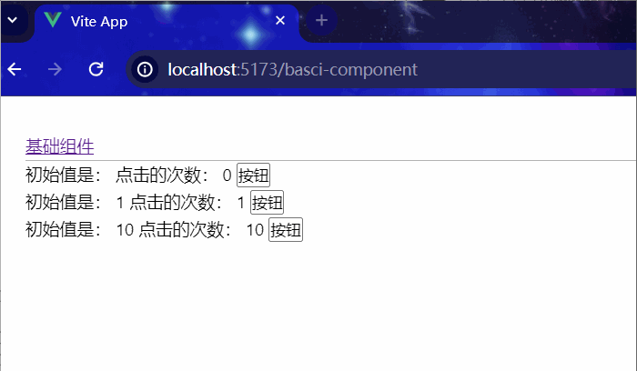

组件是vue中最推崇的，也是最强大的功能之一，就是为了提高重用性，减少重复性的开发。

## 如何使用原生HTML方法实现组件化
在使用原生HTML开发时，我们也会遇到一些常见的功能、模块，那么如何在原生HTML中使用组件化呢？其实最典型的代表就是JQuery了。常见的实现方式有两种，一种是利用class预定义某些特定的组件，另一种是使用JS初始化的方式，选择到某个DOM，然后生成对应的组件。

下面是一个简单的利用class生成按钮记录点击事件的组件：

```html
<!DOCTYPE html>
<html lang="en">
<head>
    <meta charset="UTF-8">
    <meta name="viewport" content="width=device-width, initial-scale=1.0">
    <title>Document</title>
</head>
<body>
    <div class="zh-button"></div>
    <div class="zh-button"></div>
    <div class="zh-button"></div>

    <script>
        window.onload = function() {
            const buttons = document.querySelectorAll('.zh-button');
            for (let button of buttons) {
                const spanDom = document.createElement('span');
                spanDom.innerHTML = '点击次数：'
                const timeDom = document.createElement('span');
                timeDom.innerHTML = '0';
                const buttonDom = document.createElement('button');
                buttonDom.textContent = '按钮';
                buttonDom.onclick = function() {
                    const timeDom = button.querySelectorAll('span')[1];
                    timeDom.innerHTML = ++timeDom.innerHTML;
                }

                button.appendChild(spanDom);
                button.appendChild(timeDom);
                button.appendChild(buttonDom);
            }
        }
    </script>
</body>
</html>
```

## 如何使用Vue3实现组件化
在vue中，**代码按照templeate、script、style的模块方式拆分**。我们创建一个名为Count的的vue组件，看看是怎么使用的。

## 示例


## vue组件代码(Count.vue)：
```html
<template>
    <div class="container">
        初始值是： {{ props.initCount }}
        点击的次数： {{ count }}
        <button @click="clickBtn">按钮</button>
    </div>
</template>

<script setup>
import { toRef, ref } from 'vue';

const props = defineProps(['initCount']);

const count = ref(props.initCount || 0);

const clickBtn = () => { count.value++; }
</script>

<style scoped>

</style>
```

## 调用方式：
```html
<template>
    <Count></Count>
    <Count :initCount="1"></Count>
    <Count :initCount="10"></Count>
</template>

<script setup>
import Count from '../components/Count.vue'; 
</script>

<style scoped></style>
```

Vue组件的组成：

* 模板（template）:模板声明了数据和最终展现给用户的DOM之间的映射关系。
* 样式：控制组件内的展示样式，记得添加scoped:```<style scoped>```
* 初始数据： 一个组件的初始数据状态。对于可复用的组件来说，通常是私有的状态。在setup中，直接使用ref/reactive定义即可。
* 外部参数（props）: 组件之间通过参数来进行数据的传递和共享，默认传递方向是自上而下的，但也可以显示声明为双向绑定。
* 方法（methods）: 一般为组件内部的私有方法。
* 生命周期钩子函数（lifecycle hooks）: 一个组件会触发多个生命周期钩子函数，比如created,destroyed等，在这次钩子函数中，可以封装一些自定义的逻辑。

。。。。。。

暂且对组件的认识到此为止，有了一个简单的了解之后，先看看vue提供的一些基础语法，数据绑定，指令，修饰符等。
