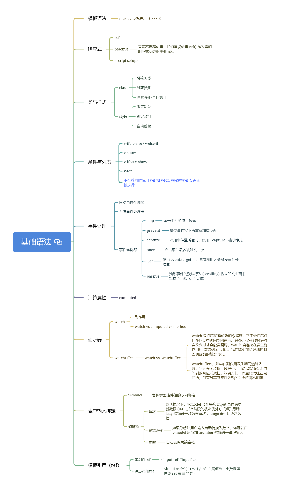
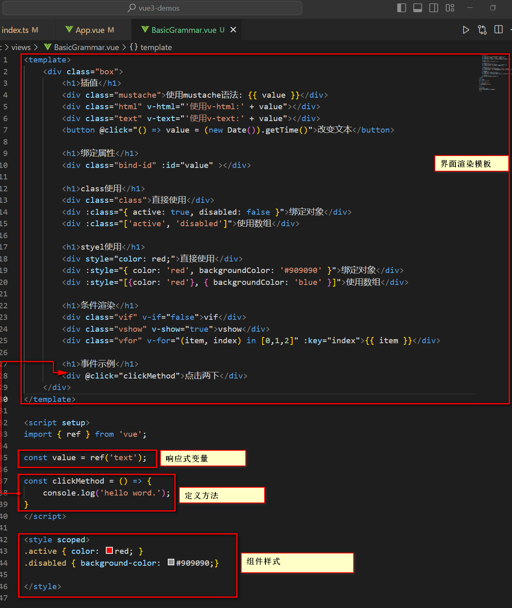

在这个章节中，简单的看下Vue3的基础语法，有了这些基础后，对写vue3单页也就没有什么问题了。

## 模板语法
在写html时，我们希望在某个节点绑定一个动态值时，是使用dom操作执行的，如下：
```html
<!DOCTYPE html>
<html lang="en">
<head>
    <meta charset="UTF-8">
    <meta name="viewport" content="width=device-width, initial-scale=1.0">
    <title>Document</title>
</head>
<body>
    <div class="zh-button"></div>
    <div class="zh-button"></div>
    <div class="zh-button"></div>

    <script>
        window.onload = function() {
            const buttons = document.querySelectorAll('.zh-button');
            for (let button of buttons) {
                const spanDom = document.createElement('span');
                spanDom.innerHTML = '点击次数：'
                const timeDom = document.createElement('span');
                timeDom.innerHTML = '0';
                const buttonDom = document.createElement('button');
                buttonDom.textContent = '按钮';
                buttonDom.onclick = function() {
                    const timeDom = button.querySelectorAll('span')[1];
                    timeDom.innerHTML = ++timeDom.innerHTML;
                }

                button.appendChild(spanDom);
                button.appendChild(timeDom);
                button.appendChild(buttonDom);
            }
        }
    </script>
</body>
</html>
```
例如这里在点击按钮，利用修改innerHTML的方式，修改展示内容：
```javascript
buttonDom.onclick = function() {
    const timeDom = button.querySelectorAll('span')[1];
    timeDom.innerHTML = ++timeDom.innerHTML;
}
```

那么如何在vue3中是如何实现的呢？
### 插值指令与Mustache语法
```v-html```、```v-text```、Mustache语法
```html
<template>
    <div class="box">
        <div class="mustache">使用mustache语法: {{ value }}</div>
        <div class="html" v-html="'使用v-html:' + value"></div>
        <div class="text" v-text="'使用v-text:' + value"></div>

        <button @click="() => value = (new Date()).getTime()">改变文本</button>
    </div>
</template>

<script setup>
import { ref } from 'vue';

const value = ref('text');

</script>

<style scoped>

</style>
```

## 响应式
这里正好也说下响应式的使用，使用```ref```就好了，至于```reactive```尽量就不要用了，这样子也不用区分是否需要使用```.value```了。

## 绑定属性
既然能动态绑定值，那么自然也能属性。
```html
        <div class="bind-id" :id="value" ></div>
```
语法呢，很简单，在属性前加上```:```就可以了，值使用变量填充。

## 类与样式
那么既然都能动态绑定属性值了，改如何写类与样式呢？这里vue3提供了不少的使用方式。
* class
	* 绑定对象
	* 绑定数组
	* 直接在组件上使用
* style
	* 绑定对象
	* 绑定数组
    * 直接在组件上使用
	* 自动前缀

```html
<template>
    <div class="box">
        <h1>class使用</h1>
        <div class="class">直接使用</div>
        <div :class="{ active: true, disabled: false }">绑定对象</div>
        <div :class="['active', 'disabled']">使用数组</div>

        <h1>styel使用</h1>
        <div style="color: red;">直接使用</div>
        <div :style="{ color: 'red', backgroundColor: '#909090' }">绑定对象</div>
        <div :style="[{color: 'red'}, { backgroundColor: 'blue' }]">使用数组</div>
    </div>
</template>

<script setup>
</script>

<style scoped>
.active { color: red; }
.disabled { background-color: #909090;}
</style>

```

## 常用的条件渲染指令
常用的条件渲染指令有v-if、v-show、v-for
v-if、v-show控制元素是否显示，v-for控制列表展示，示例如下：
```html
        <h1>条件渲染</h1>
        <div class="vif" v-if="false">vif</div>
        <div class="vshow" v-show="true">vshow</div>
        <div class="vfor" v-for="(item, index) in [0,1,2]" :key="index">{{ item }}</div>
```

## 绑定事件
官网的图是这样子的：

v-on可以简写成```@```
拿点击事件举例，示例如下：
```html
        <h1>事件示例</h1>
        <div @click="() => { console.log('hello world') }">点击两下</div>
```

计算属性和监听器就不放在这个模块说了，感觉放在生命周期一起比较好，下面再整体的来看看vue3的组件的基础构成，主要分为三个部分```template,script,style```,template主要负责提供渲染模板，script负责提供数据、交互方法等，style提供样式。vue3里面也提供了很多语法糖，让写vue3组件不像写原生那么复杂，没事的时候看看官网API，这些基础语法应该很快就能掌握。


