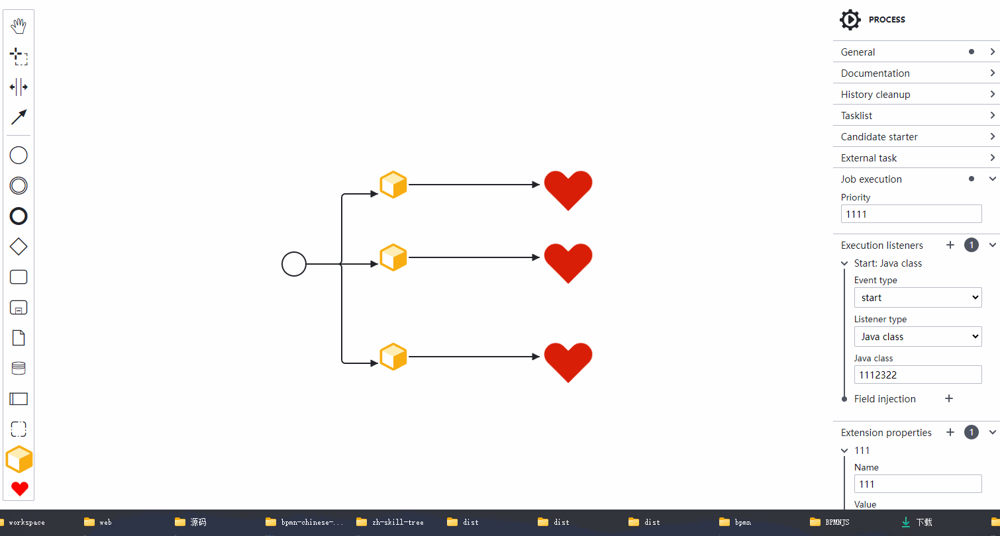
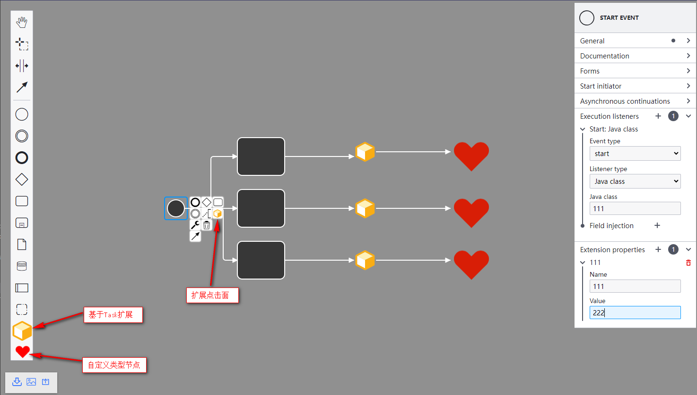

# BPMNJS 在HTML中的引入与使用

在网上看到的大多是基于vue使用BPMN的示例或者教程，竟然没有在HTML使用的示例，有也是很简单的介绍核心库的引入和使用，并没有涉及到扩展库。于是简单看了下，真的是一波三折，坎坎坷坷。不过结局还算是好的，最终也能在HTML中直接使用BPMNJS了。可能还有一些扩展没有涉及到，但是目前的功能应该已经基本符合需求了。

## 示例展示
<div style="text-align: center"></div>
<div style="text-align: center"></div>

## 示例代码
github：https://github.com/iotzzh/origin-examples/blob/main/%E6%B5%81%E7%A8%8B%E5%9B%BE/BPMNJS/index.html

### 引入步骤

#### 引入BPMNJS(针对某些扩展，需要改造源码)
* 下载：git clone https://github.com/bpmn-io/bpmn-js.git -b v13.2.0
* 安装依赖：npm i
* 打包：npm run distro
* 生成dist文件后，移动到自己的HTML文件夹中，引入js和css
  
**注意：三个模块的引入顺序**

#### 引入bpmn-js-properties-panel
* 下载：git clone https://github.com/bpmn-io/bpmn-js-properties-panel.git
* 安装依赖：npm i
* 打包：npm run distro
* 生成dist文件后，移动到自己的HTML文件夹中，引入js和css

**注意: css文件使用在线的：https://unpkg.com/bpmn-js-properties-panel@2.1.0/dist/assets/properties-panel.css**

#### 引入tiny-svg(后续扩展render会用到)
* 下载：git clone https://github.com/bpmn-io/tiny-svg.git
* 安装依赖：npm i
* 打包：npm run distro
* 生成dist文件后，移动到自己的HTML文件夹中，引入js和css


## 源码改造

### BPMNJS

#### Modeler.js改造

##### 引用
```javascript
// 抛出方法
import DiagramBaseRenderer from 'diagram-js/lib/draw/BaseRenderer';
import * as DiagramRenderUtil from 'diagram-js/lib/util/RenderUtil';
import ElementFactory from './features/modeling/ElementFactory';
import camundaModdleDescriptors from 'camunda-bpmn-moddle/resources/camunda';
```

##### 扩展
```javascript
Modeler.Viewer = Viewer;
Modeler.NavigatedViewer = NavigatedViewer;
Modeler.DiagramBaseRenderer = DiagramBaseRenderer;
Modeler.DiagramRenderUtil = DiagramRenderUtil;
Modeler.ElementFactory = ElementFactory;
Modeler.camundaModdleDescriptors = camundaModdleDescriptors;
```


## 参考地址
官网: https://bpmn.io/toolkit/bpmn-js

Bpmn.js自定义文件说明: https://blog.csdn.net/weixin_43359503/article/details/113915776

bpmn-js-properties-panel CDN地址：https://www.jsdelivr.com/package/npm/bpmn-js-properties-panel
