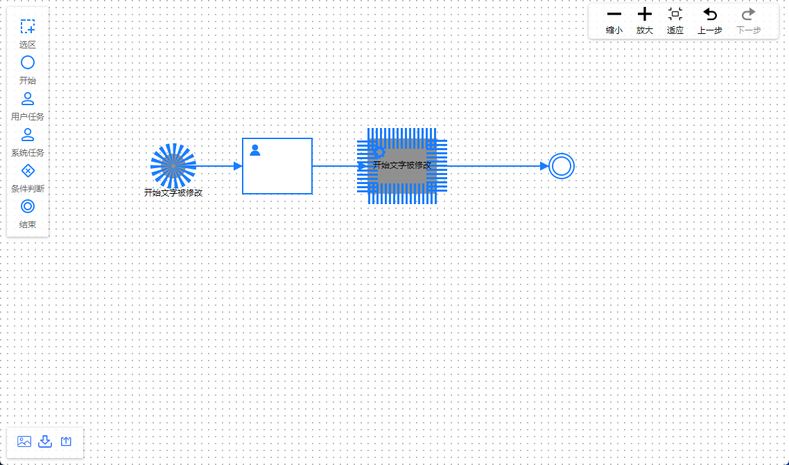

# LogicFlow 在HTML中的引入与使用

LogicFlow的引入与使用，相较于BPMNJS相对容易一些，更加灵活一些，但是扩展代码可能写得更多一些。

## 示例展示
<div style="text-align: center"></div>

## 示例代码
github: https://github.com/iotzzh/origin-examples/blob/main/%E6%B5%81%E7%A8%8B%E5%9B%BE/LogicFlow/logicflow.html

## 使用方式
这个的使用方式就简单很多了，利用cdn把js下载下来，引入到HTML文件中，直接使用就可以。这里就不详细说明其中的API使用了，看示例代码就可以了。

### 核心代码
```html
    <script src="./assets/js/logic-flow.js"></script>
    <link href="./assets/css/index.css" rel="stylesheet">


    <script src="./assets//js/BpmnElement.js"></script>
    <script src="./assets/js/BpmnAdapter.js"></script>
    <script src="./assets/js/Control.js"></script>
    <script src="./assets/js/Menu.js"></script>
    <script src="./assets/js/SelectionSelect.js"></script>
    <script src="./assets/js/DndPanel.js"></script>
    <script src="./assets/js/Snapshot.js"></script>
    <link href="./assets/css/extension.css" rel="stylesheet">


    <script src="./logicflow.js"></script>
    <link href="./logicflow.css" rel="stylesheet">

```

### html body
```html
 <div id="graph" class="viewport" style="width: 100%; height: 100%;"></div>
```

### 核心JS
```JS
const config = getConfig();
  LogicFlow.use(BpmnElement);
  LogicFlow.use(BpmnXmlAdapter);
  LogicFlow.use(Snapshot);
  LogicFlow.use(Control);
  LogicFlow.use(Menu);
  LogicFlow.use(SelectionSelect);
  LogicFlow.use(DndPanel);
  lf = new LogicFlow({
    ...config,
    container: document.querySelector("#graph"),
  });
  // 右击菜单：component-menu.md
  lf.extension.menu.addMenuConfig({
    nodeMenu: [
      {
        text: '分享',
        className: 'test-share',
        callback() {
          alert('分享成功！');
        }
      },
      {
        text: '属性',
        callback(node) {
          alert(`
            节点id：${node.id}
            节点类型：${node.type}
            节点坐标：(x: ${node.x}, y: ${node.y})`
          );
        },
      },
    ],
    edgeMenu: [
      {
        text: '属性',
        callback(edge) {
          alert(`
            边id：${edge.id}
            边类型：${edge.type}
            边坐标：(x: ${edge.x}, y: ${edge.y})
            源节点id：${edge.sourceNodeId}
            目标节点id：${edge.targetNodeId}`
          );
        },
      },
    ],
    graphMenu: [
      {
        text: '分享',
        callback() {
          alert('分享成功！');
        }
      },
    ],
  });
  lf.render();
```


## 参考链接
* extension links: https://cdn.jsdelivr.net/npm/@logicflow/extension@1.2.9/lib/
* logicfllw website: https://07.logic-flow.cn/guide/start.html
* logicflow github: https://github.com/didi/LogicFlow
* 示例：http://logic-flow.org/examples/#/basic/node

