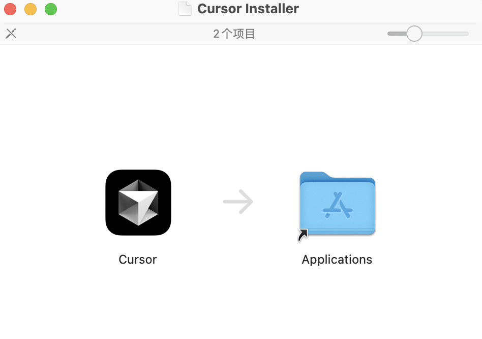
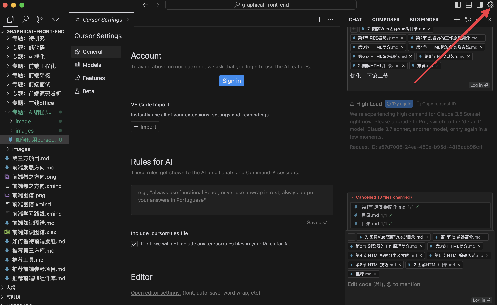
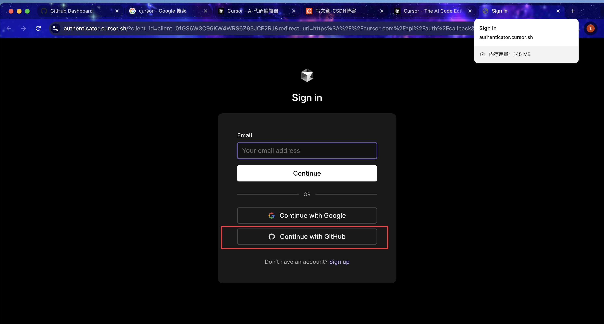
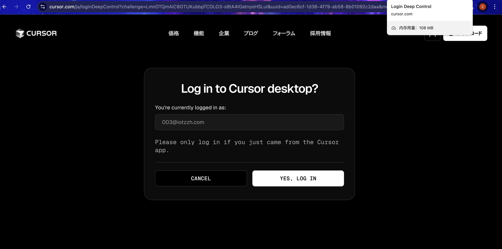

# 如何安装并登录Cursor

## Cursor简介

Cursor是一款革命性的AI辅助编程工具，它将强大的大语言模型与现代代码编辑器无缝集成。作为开发者，使用Cursor可以显著提升你的编程效率：

- **智能代码补全**：根据上下文自动生成代码片段和函数
- **AI对话**：直接在编辑器中与AI助手交流，解决编程问题
- **代码解释**：一键理解复杂代码的功能和逻辑
- **代码重构**：获取代码优化建议，提高代码质量
- **多语言支持**：支持几乎所有主流编程语言
- **VSCode兼容**：兼容大部分VSCode插件和主题

下面我们将一步步指导你如何安装并登录Cursor，开启你的AI辅助编程之旅。

## 第一步：下载Cursor

访问Cursor官方网站：[https://www.cursor.com](https://www.cursor.com)，点击下载按钮获取最新版本。

## 第二步：安装Cursor

下载完成后，运行安装程序并按照提示完成安装过程。安装过程简单直观，只需几分钟即可完成。

## 第三步：登录Cursor

### 3.1 注册并登录GitHub账号

Cursor使用GitHub账号进行身份验证。如果你还没有GitHub账号，需要先注册一个。

### 3.2 打开Cursor设置

启动Cursor后，点击右上角的设置图标，进入设置界面。

### 3.3 选择GitHub登录

在设置界面中，选择使用GitHub账号登录。

### 3.4 登录成功

完成授权后，你将看到登录成功的界面，现在你可以开始使用Cursor的所有功能了。

## 下一步

成功安装并登录Cursor后，你可以开始探索其强大的AI编程功能。在接下来的教程中，我们将详细介绍Cursor的界面布局和核心功能，帮助你充分利用这款强大的工具提升编程效率。

