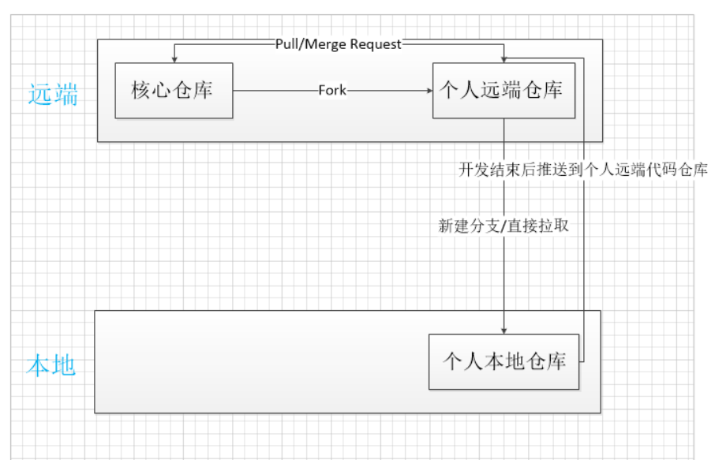
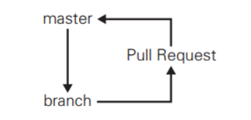

## 开源软件工作流
这个工作流适合开发维护开源软件，它依赖于github的Fork功能。

#### 开发流程
* 将 GitHub 开源Repo Fork 到 你的远程Repo
* 将你的远程仓库 clone 至本地开发环境
* 在本地环境中创建分支/也有直接开发，毕竟自己的仓库master也是有权限的
* 对代码修改并进行提交，push到远程仓库
* 在 GitHub 上对 Fork 来源仓库发送 Pull Request， GitLab发送Merge Request

#### 如何同步fork源代码的更新
* 配置上游地址(只需要一次)：git remote add upstream 上游项目的地址

* 获取上游更新： git fetch upstream

* 合并到本地分支： git merge upstream/master

* 提交推送： git push origin master

## 以部署为核心的工作流
该工作流适合每天存在多次部署的场景。在团队开发中，当团队人员少，且开发模块独立时，可以使用该工作流。该流程简单灵活，避免了一些不必要的工作流。

#### 开发流程
* 令 master 分支时常保持可以部署的状态
* 进行新的作业时要从 master 分支创建新分支，新分支名称要具有描述性
* 在新建的本地仓库分支中进行提交
* 在 GitHub 端仓库创建同名分支，定期 push
* 需要帮助或反馈时创建 Pull Request，以 Pull Request 进行交流
* 让其他开发者进行审查，确认作业完成后与 master 分支合并
与 master 分支合并后立刻部署

#### 注意：
节奏快，自然问题也就多。
###### 随时部署，没有发布的概念
没有进行过测试或者测试未通过的代码绝不可以合并到 master 分支。
###### 有描述性的名称
是指该名称能直观正确地表达这个分支的特性，比如：login-module

###### 修改代码
绝对不能进行与该分支工作内容无关的修改。
在这一阶段，开发者要在提交的粒度上多花心思。有意识地减小提交的规模，一方面便于清楚地表达目的，另一方面有助于其他开发者对Pull Request 进行审查。

###### Pull Request
不一定非要在与 master 分支合并时才使用。既然是团队开发，完全可以尽早创建 Pull Request 让其他开发者进行审查，一边听取反馈一边编写代码，没必要等到与 master 分支合并时再进行。

## 以发布为中心的工作流

#### 开发流程：
* 从开发版的分支（develop）创建工作分支（feature branches），进行功能的实现或修正
* 工作分支（feature branches）的修改结束后，与开发版的分支（develop）进行合并
重复上述❶和❷，不断实现功能直至可以发布
* 创建用于发布的分支（release branches），处理发布的各项工作
* 发布工作完成后与 master 分支合并，打上版本标签（Tag）进行发布
如果发布的软件出现 BUG，以打了标签的版本为基础进行修正（hotfixes）

#### 注意事项
#### master 
master分支时常保持着软件可以正常运行的状态。由于要维持这一状态，所以不允许开发者直接对 master 分支的代码进行修改和提交。其他分支的开发工作进展到可以发布的程度后，将会与 master 分支进行合并，而且这一合并只在发布成品时进行。发布时会附加包含版本编号的 Git 标签（Tag）。
#### hotfix 
hotfix分支并不是预期中计划出现的分支。它是一个紧急应对措施，只有当前发布的版本中出现 BUG 或漏洞，而且其严重程度要求开发方必须立刻处理，无法等到下一个版本发布时， hotfix 分支才会被创建。因此， hotfix 分支都是以发布版本的标签或 master 分支为起点。借助 hotfix 分支，可以在不影响 develop 分支正常开发的情况下，由其他开发者处理成品的修正工作。
#### release 
release分支在自己的branch内只允许进行bug修复commit。
#### develop 
develop分支是开发过程中的代码中心分支。与 master 分支一样，这个分支也不允许开发者直接进行修改和提交。程序员要以 develop 分支为起点新建 feature 分支，在 feature 分支中进行新功能的开发或者代码的修正。

## 参考
https://www.cnblogs.com/zbcry/p/9026321.html

https://blog.csdn.net/qq_16912257/article/details/52998295

http://www.360doc.com/content/18/0502/13/7377734_750469178.shtml

