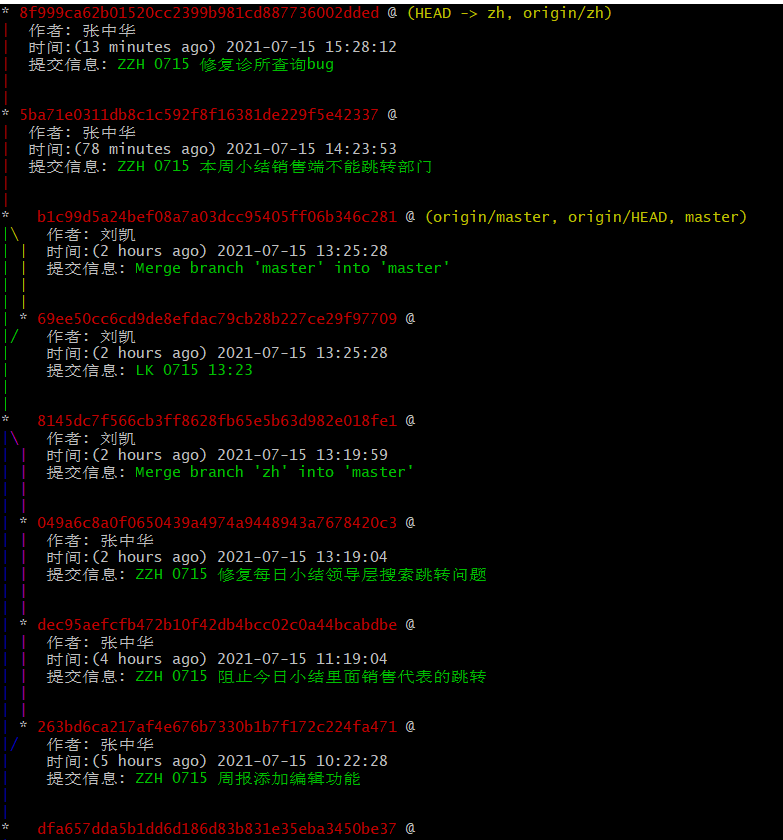

在使用git查看log的时候，可能觉得当下的log格式不好看或者希望看到一些别的信息，就可以利用别名，创建属于自己的log样式。

以下是我的设置方式：
```
git config --global alias.mylog "log --graph --pretty=format:'%Cred%H%Creset @%C(yellow)%d%Creset %n 作者: %cn %n 时间:(%cr) %cd%Creset %n 提交信息: %Cgreen%s%Creset %n%n' --date=format:'%Y-%m-%d %H:%M:%S'"
```
查询结果如下：



可以根据自己的喜好进行设置，简单明了，突出主要信息为主，可参考：

https://www.cnblogs.com/kubimiantiao/p/4226661.html

https://git-scm.com/book/zh/v2/Git-%E5%9F%BA%E7%A1%80-Git-%E5%88%AB%E5%90%8D

https://git-scm.com/docs/git-log
