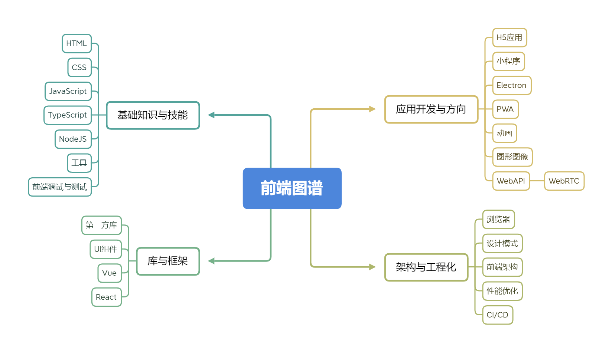
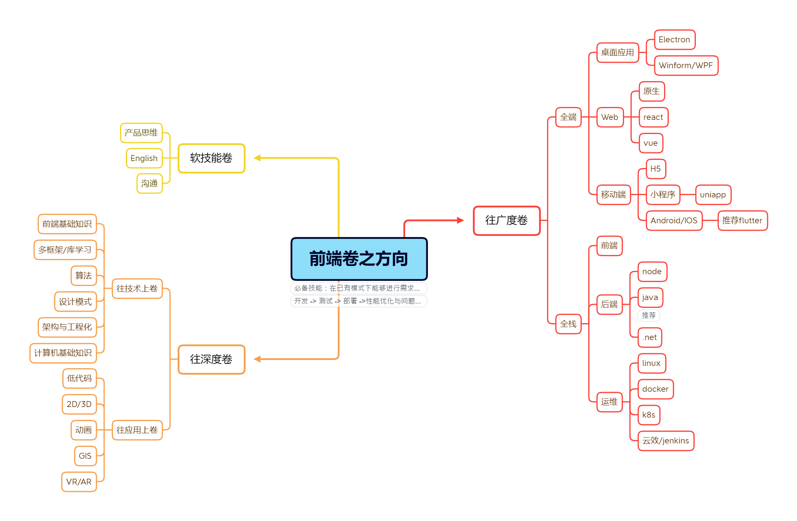

###### 1. 入口小程序化
###### 2. 全栈化，全端化
###### 3. 低代码化、人工智能化

## 前端选择方向
其实前端向上的选择方向并不是很多，除非你能在其他方面也有一定的能力，例如后端、管理（明显）、产品能力等。所以如果学历、经验都不是很优秀，就不要死磕在前端方向，不然到了一定的年龄或者一定的程度性价比就会很低了。
一下罗列了一些个人觉得可能会发展的方向：
* 技术方向：前端技术专家
* 管理方向：技术经理、技术总监
* 产品方向：产品经理
* 其他方向：教育、自媒体等

## 危机
35危机是目前存在的，不要畏惧，那么是什么原因造成的呢？
* 市场： 市场需要，35之后的性价比相对较低，且目前有大量的人员涌入，供大于求。
* 能力：你的能力与经验是否与年龄匹配。
* 期望：你的期望是否与自身的能力与经验匹配。
* 体力：虽然经验丰富了，但是你的体力还能不能跟上，编程其实也是一个体力活。 

## 自我突破
* 由前端到全栈（推荐java）
* 由前端到全端（web端、移动端、客户端）
* 提升开发效率（组件化/模块化/模板化/工具化）
* 知识复盘总结（笔记）
* 不断验证自己（推荐自媒体）

## 不同级别对应的学习技术
#### 1-2年（初级前端）
HTML（5）、CSS（3）、JavaScript、JQuery（了解）、前端框架（Vue、React、solidjs等，择其一即可，根据城市需要来）等。

#### 3-4年（中级前端）
node、自动化构建工具（WebPack、vite、glup等）、小程序、混合开发、了解至少一门后端语言等。

#### 5年以上（高级前端）
前端框架选型、架构设计、构建工具，到后端通信机制、设计与交互、网络和浏览器优化、后端/运维相关知识，产品思维等。

## 技术提升

### 基础知识
HTML, CSS, JavaScript

### 工作知识
ES6、Ajax、Node.js模块化、CSS预处理器（scss/less）、
MVVM架构、常见UI库（antd，element等）、小程序技术（uniapp）、跨平台技术（flutter）

### 进阶知识
TypeScript、自动化构建工具（jenkins）、版本控制工具（git）、可视化工具、框架源码（可以先挑简单的看，例如lodash）、数据结构+算法(巩固基础)

### 高阶知识
微前端、大前端、后端、人工智能、VR/AR

基础知识：对于前端工程师来说，虽然技术更新较快，但不要一味的追求新技术。基础一定要牢靠，HTML、CSS、JS这些技术一定要精通。

进阶知识：对于新技术框架的学习，不要只停留在技术的表面，要深入源代码，去理解它的运作原理和应用场景，提升体术的深度很重要。

全面发展：如果在工作中，有别的项目或者产品的学习机会，要主动去接触，前端工程师也可以全面发展。
