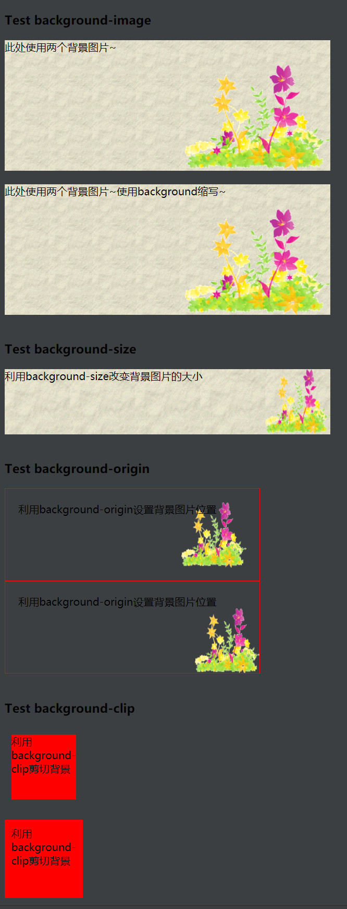
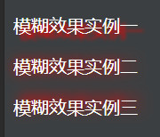
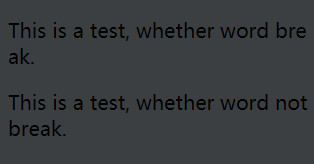
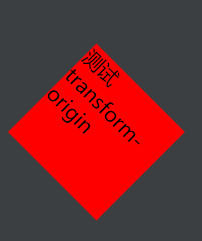
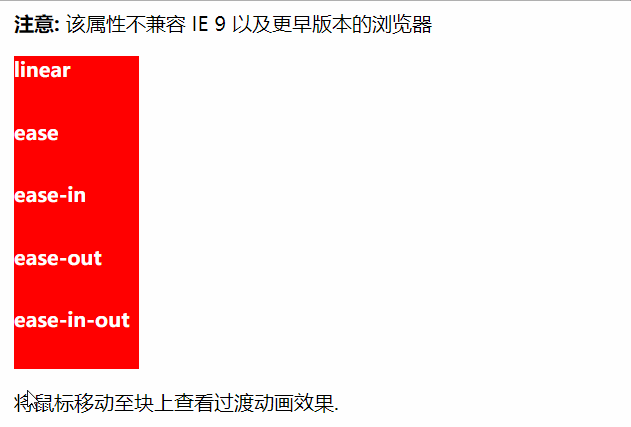
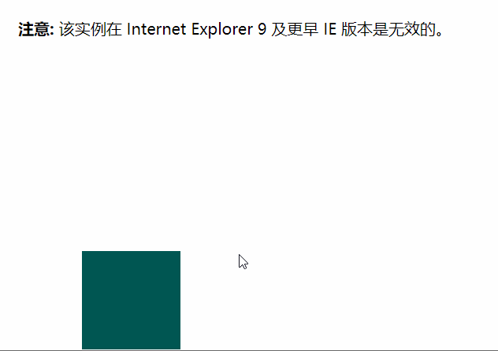

## 简介
继CSS2之后，CSS3增加了很多新的特性，虽然W3C仍在规范中，但是很多新的CSS3属性已经在很多现代浏览器中得到了支持。

<div style="text-align: center"></div>

## CSS3边框
在CSS3中，可以创建圆角边框，添加边框阴影，设置边框图片，利用到的属性有：
* border-radius（圆角）
* box-shadow（阴影）
* border-image（边框图片）

#### border-radius（圆角）
> 语法： border-radius: 1-4 length|% / 1-4 length|%

注意: 每个半径的四个值的顺序是：左上角，右上角，右下角，左下角。如果省略左下角，右上角是相同的。如果省略右下角，左上角是相同的。如果省略右上角，左上角是相同的。

#### box-shadow（阴影）
> 语法： box-shadow: h-shadow v-shadow blur spread color inset;

注意：boxShadow 属性把**一个或多个**下拉阴影添加到框上。该属性是一个用逗号分隔阴影的列表，每个阴影由 2-4 个长度值、一个可选的颜色值和一个可选的 inset 关键字来规定。省略长度的值是 0。

|  值   | 说明  |
|  ----  | ----  |
|h-shadow|必需的。水平阴影的位置。允许负值|
|v-shadow|必需的。垂直阴影的位置。允许负值|
|blur|可选。模糊距离|
|spread|可选。阴影的大小|
|color|可选。阴影的颜色。在CSS颜色值寻找颜色值的完整列表|
|inset|可选。从外层的阴影（开始时）改变阴影内侧阴影|


#### border-image（边框图片）
> 语法: border-image: source slice width outset repeat|initial|inherit;

|  值   | 说明  |
|  ----  | ----  |
|border-image-source|必用于指定要用于绘制边框的图像的位置|
|border-image-slice|图像边界向内偏移|
|border-image-width|图像边界的宽度|
|border-image-outset|用于指定在边框外部绘制 border-image-area 的量|
|border-image-repeat|用于设置图像边界是否应重复（repeat）、拉伸（stretch）或铺满（round）。|

###### 实例
<div style="text-align: center"></div>

试一试: [http://jsrun.net/q2aKp/edit](http://jsrun.net/q2aKp/edit)

## CSS3背景
CSS3 中包含几个新的背景属性，提供更大背景元素控制。
#### background-image(with multiple backgrounds)

####  background-size
> 语法：background-size: length|percentage|cover|contain;

 background-size指定背景图像的大小。CSS3以前，背景图像大小由图像的实际大小决定。
 CSS3中可以指定背景图片，让我们重新在不同的环境中指定背景图片的大小。您可以指定像素或百分比大小。
 你指定的大小是相对于父元素的宽度和高度的百分比的大小。
####  background-origin

> 语法: background-origin: padding-box|border-box|content-box;

background-origin 属性指定了背景图像的位置区域。
content-box, padding-box,和 border-box区域内可以放置背景图像。

#### background-clip

> 语法: background-clip: border-box|padding-box|content-box;

CSS3中background-clip背景剪裁属性是从指定位置开始绘制。

###### 实例
<div style="text-align: center"></div>

试一试: [http://jsrun.net/i6aKp/edit](http://jsrun.net/i6aKp/edit)

## CSS3 渐变（Gradients）
CSS3 渐变（gradients）可以让你在两个或多个指定的颜色之间显示平稳的过渡。
CSS3渐变分为线性渐变和径向渐变。
线性渐变（Linear Gradients）- 向下/向上/向左/向右/对角方向
径向渐变（Radial Gradients）- 由它们的中心定义

#### 线性渐变
了解Photoshop的朋友都线性渐变应该很不陌生，就是线性的从一种颜色过渡到另一种颜色。
为了创建一个线性渐变，你必须至少定义两种颜色节点。颜色节点即你想要呈现平稳过渡的颜色。同时，你也可以设置一个起点和一个方向（或一个角度）。
> 语法：
background-image: linear-gradient(direction, color-stop1, color-stop2, ...);

线性渐变默认是“从上到下”， 也可以设置“从左到右”、“对角”、“使用角度”、“使用多个颜色节点”、“使用透明度”、“重复的线性渐变”。

###### 实例
<div style="text-align: center"></div>

试一试: [http://jsrun.net/K8aKp/edit](http://jsrun.net/K8aKp/edit)

#### 径向渐变
径向渐变由它的中心定义。
为了创建一个径向渐变，你也必须至少定义两种颜色节点。颜色节点即你想要呈现平稳过渡的颜色。同时，你也可以指定渐变的中心、形状（圆形或椭圆形）、大小。默认情况下，渐变的中心是 center（表示在中心点），渐变的形状是 ellipse（表示椭圆形），渐变的大小是 farthest-corner（表示到最远的角落）。

> 语法
background-image: radial-gradient(shape size at position, start-color, ..., last-color);

径向渐变默认是“颜色节点均匀分布”， 也可以设置“颜色节点不均匀分布”，“设置形状”（circle|ellipse），“重复径向”。
参数说明：
size 参数定义了渐变的大小。它可以有四个值：closest-side、farthest-side、closest-corner、farthest-corner

###### 实例
<div style="text-align: center"></div>

试一试: [http://jsrun.net/i8aKp/edit](http://jsrun.net/i8aKp/edit)

## CSS3 文本效果
#### 属性说明
|属性|说明|CSS|支持程度|
|---|---|---|---|
|hanging-punctuation|规定标点字符是否位于线框之外|3|主流不支持|
|punctuation-trim|规定是否对标点字符进行修剪|3|主流不支持|
|text-align-last|设置如何对齐最后一行或紧挨着强制换行符之前的行|3|Safari不支持|
|text-emphasis|向元素的文本应用重点标记以及重点标记的前景色|3|主流不支持|
|text-justify|规定当 text-align 设置为 "justify" 时所使用的对齐方法|3|主流不支持|
|text-outline|规定文本的轮廓|3|主流不支持|
|text-overflow|规定当文本溢出包含元素时发生的事情|3|主流支持|
|text-shadow|规定文本的换行规则|3|主流支持|
|text-wrap|规定标点字符是否位于线框之外|3|主流不支持|
|word-break|规定非中日韩文本的换行规则|3|主流支持|
|word-wrap|允许对长的不可分割的单词进行分割并换行到下一行|3|主流支持|

#### 主流支持的属性说明
###### text-overflow
>语法：text-overflow: clip|ellipsis|string;

|值|描述|
|---|---|
|clip|修剪文本|
|ellipsis|显示省略符号来代表被修剪的文本|
|string（暂不支持）|使用给定的字符串来代表被修剪的文本|
###### 实例
<div style="text-align: center"></div>

试一试: [http://jsrun.net/NUaKp/edit](http://jsrun.net/NUaKp/edit)

###### text-shadow
> 语法：text-shadow: h-shadow v-shadow blur color;

|值|描述|
|---|---|
|h-shadow|必需。水平阴影的位置。允许负值|
|v-shadow|必需。垂直阴影的位置。允许负值|
|blur|可选。模糊的距离|
|color|可选。阴影的颜色|

###### 实例
<div style="text-align: center"></div>

试一试: [http://jsrun.net/L9aKp/edit](http://jsrun.net/L9aKp/edit)

###### word-break	
>语法：word-break: normal|break-all|keep-all;

|值|描述|
|---|---|
|normal|使用浏览器默认的换行规则|
|break-all|允许在单词内换行|
|keep-all|只能在半角空格或连字符处换行|

###### 实例
<div style="text-align: center"></div>

试一试: [http://jsrun.net/69aKp/edit](http://jsrun.net/69aKp/edit)
###### word-wrap
> 语法：word-wrap: normal|break-word;

|值|描述|
|---|---|
|normal|只在允许的断字点换行（浏览器保持默认处理）|
|break-word|在长单词或URL 地址内部进行换行|

###### 实例
<div style="text-align: center"></div>

试一试: [http://jsrun.net/w9aKp/edit](http://jsrun.net/w9aKp/edit)

## CSS3 2D转换
#### 转换属性
|属性|描述|
|---|---|
|transform|标准：适用于2D或3D转换的元素|
|-ms-transform|IE 9：适用于2D或3D转换的元素|
|-webkit-transform|Safari：适用于2D或3D转换的元素|
|transform-origin|允许您更改转化元素位置|

#### 属性说明-transform
> 语法：transform: none|transform-functions;

###### transform-functions（2D）
|方法|说明|
|---|---|
|none|定义不进行转换|
|matrix(n,n,n,n,n,n)|定义 2D 转换，使用六个值的矩阵；matrix 方法有六个参数，包含旋转，缩放，移动（平移）和倾斜功能。matrix( scaleX(), skewY(), skewX(), scaleY(), translateX(), translateY() )|
|translate(x,y)|定义 2D 转换，沿着 X 和 Y 轴移动元素|
|translateX(n)|定义 2D 转换，沿着 X 轴移动元素|
|translateY(n)|定义 2D 转换，沿着 Y 轴移动元素|
|scale(x,y)|定义 2D 缩放转换，改变元素的宽度和高度|
|scaleX(n)|定义 2D 缩放转换，改变元素的宽度|
|scaleY(n)|定义 2D 缩放转换，改变元素的高度|
|rotate(angle)|定义 2D 旋转，在参数中规定角度|
|skew(x-angle,y-angle)|定义 2D 倾斜转换，沿着 X 和 Y 轴|
|skewX(angle)|定义 2D 倾斜转换，沿着 X 轴|
|skewY(angle)|定义 2D 倾斜转换，沿着 Y 轴|

###### 实例
<div style="text-align: center"></div>

试一试: [http://jsrun.net/GeaKp/edit](http://jsrun.net/GeaKp/edit)

#### 属性说明-transform-origin
该属性需要配合transform属性使用，单独使用不生效
> 语法：transform-origin: x-axis y-axis z-axis;

|值|说明|
|---|---|
|x-axis|定义视图被置于 X 轴的何处。可能的值：left、center、right、length、%|
|y-axis|定义视图被置于 Y 轴的何处。可能的值：top、center、bottom、length、%|
|z-axis|定义视图被置于 Z 轴的何处。可能的值：length|

###### 实例
<div style="text-align: center"></div>

试一试: [http://jsrun.net/QQaKp/edit](http://jsrun.net/QQaKp/edit)

## CSS3 3D转换
#### 转换属性
|属性|描述|
|---|---|
|transform|标准：适用于2D或3D转换的元素|
|transform-origin|允许您更改转化元素位置|
|transform-style|规定被嵌套元素如何在 3D 空间中显示|
|perspective|规定 3D 元素的透视效果|
|perspective-origin|规定 3D 元素的底部位置|
|backface-visibility|定义元素在不面对屏幕时是否可见|

###### 3D转换方法(transform)
|方法|说明|
|---|---|
|none|定义不进行转换|
|matrix3d(n,n,n,n,n,n,
n,n,n,n,n,n,n,n,n,n)|定义 3D 转换，使用 16 个值的 4x4 矩阵|
|translate3d(x,y,z)|定义 3D 转换|
|translateX(n)|定义 3D 转换，沿着 X 轴移动元素|
|translateY(n)|定义 3D 转换，沿着 Y 轴移动元素|
|translateZ(n)|定义 3D 转换，沿着 Z 轴移动元素|
|scale3d(x,y,z)|定义 3D 缩放转换|
|scaleX(n)|定义 3D 缩放转换，改变元素的宽度|
|scaleY(n)|定义 3D 缩放转换，改变元素的高度|
|scaleZ(n)|定义 3D 缩放转换，改变元素的高度|
|rotate3d(x,y,z, angle)|定义 3D 旋转|
|rotateX(angle)|定义沿 X 轴的 3D 旋转|
|rotateY(angle)|定义沿 Y 轴的 3D 旋转转|
|rotateZ(angle)|定义沿 Z 轴的 3D 旋转|
|perspective(n)|定义 3D 转换元素的透视视图|

试一试： https://c.runoob.com/codedemo/3391


## CSS3 过渡
CSS3中，添加过渡，使某种效果可以从一种样式逐渐转变到另一种的时候，无需使用Flash动画或JavaScript。

要实现这一点，必须定义两项内容：
* 指定要添加效果的CSS属性
* 指定效果的持续时间
```css
div
{
    transition: width 2s;
    -webkit-transition: width 2s; /* Safari */
}
```
当存在多个属性时，利用","分开
```css
div
{
    transition: width 2s, height 2s;
    -webkit-transition: width 2s; /* Safari */
}
```
#### 过渡属性
|属性|描述|
|---|---|
|transition|简写属性，用于在一个属性中设置四个过渡属性|
|transition-property|规定应用过渡的 CSS 属性的名称|
|transition-duration|定义过渡效果花费的时间。默认是 0|
|transition-timing-function|规定过渡效果的时间曲线。默认是 "ease"|
|transition-delay|规定过渡效果何时开始。默认是 0|

#### transition-timing-function 属性
```transition-timing-function: linear|ease|ease-in|ease-out|ease-in-out|cubic-bezier(n,n,n,n);```
|属性|描述|
|---|---|
|linear|规定以相同速度开始至结束的过渡效果（等于 cubic-bezier(0,0,1,1)）|
|ease|规定慢速开始，然后变快，然后慢速结束的过渡效果（cubic-bezier(0.25,0.1,0.25,1)）|
|ease-in|规定以慢速开始的过渡效果（等于 cubic-bezier(0.42,0,1,1)）|
|ease-out|规定以慢速结束的过渡效果（等于 cubic-bezier(0,0,0.58,1)）|
|ease-in-out|规定以慢速开始和结束的过渡效果（等于 cubic-bezier(0.42,0,0.58,1)）|
|cubic-bezier(n,n,n,n)|在 cubic-bezier 函数中定义自己的值。可能的值是 0 至 1 之间的数值|

###### 实例
<div style="text-align: center"></div>

试一试：https://www.runoob.com/try/try.php?filename=trycss3_transition-timing-function2

## CSS3 动画
###### CSS3 @keyframes 规则
@keyframes 规则是创建动画
@keyframes 规则内指定一个 CSS 样式和动画将逐步从目前的样式更改为新的样式

###### CSS3 动画
当在 @keyframes 创建动画，把它绑定到一个选择器，否则动画不会有任何效果。
指定至少这两个CSS3的动画属性绑定向一个选择器：
* 规定动画的名称
* 规定动画的时长

#### CSS3的动画属性
|属性|描述|
|---|---|
|@keyframes|规定动画|
|animation|所有动画属性的简写属性|
|animation-name|规定 @keyframes 动画的名称|
|animation-duration|规定动画完成一个周期所花费的秒或毫秒。默认是 0|
|animation-timing-function|规定动画的速度曲线。默认是 "ease"|
|animation-fill-mode|规定当动画不播放时（当动画完成时，或当动画有一个延迟未开始播放时），要应用到元素的样式|
|animation-delay|规定动画何时开始。默认是 0|
|animation-iteration-count|规定动画被播放的次数。默认是 1|
|animation-direction|规定动画是否在下一周期逆向地播放。默认是 "normal"|
|animation-play-state|规定动画是否正在运行或暂停。默认是 "running"|

###### 实例
<div style="text-align: center"></div>

试一试：https://www.runoob.com/try/try.php?filename=trycss3_animation4


