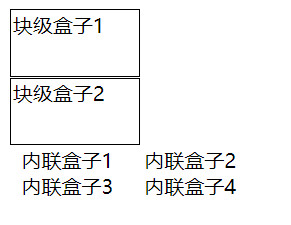

#### 盒子模型
在HTML文档中，每个元素都会在页面上生成一个盒子。因此，HTML页面实际上就是由一堆盒子组成的。默认情况下，每个盒子的边框不可见，背景也是透明的。
每个盒子由4部分构成: 外边距、边框、内边距、内容。

<div style="text-align: center"></div>
虽然浏览器各不相同，但是盒子模型都是由这四部分组成。

###### 标准盒子模型
根据 W3C 的规范，元素内容占据的空间是由 width 属性设置的，而内容周围的 padding 和 border 值是另外计算的；即在标准模式下的盒模型，盒子实际内容（content）的width/height=我们设置的width/height;盒子总宽度/高度=width/height+padding+border+margin。
<div style="text-align: center"></div>

###### IE盒子模型
在该模式下，浏览器的 width 属性不是内容的宽度，而是内容、内边距和边框的宽度的总和；即在怪异模式下的盒模型，盒子的（content）宽度+内边距padding+边框border宽度=我们设置的width(height也是如此)，盒子总宽度/高度=width/height + margin = 内容区宽度/高度 + padding + border + margin。
<div style="text-align: center"></div>

###### 总结：标准盒子模型和IE盒子模型的差别就在于宽度和高度包含的范围不同。

###### CSS3指定盒子模型种类（box-sizing）
box-sizing： 定义了 user agent 应该如何计算一个元素的总宽度和总高度。
* box-sizing: content-box;
宽度和高度分别应用到元素的内容框。在宽度和高度之外绘制元素的内边距和边框。

* box-sizing: border-box;
为元素设定的宽度和高度决定了元素的边框盒。就是说，为元素指定的任何内边距和边框都将在已设定的宽度和高度内进行绘制。通过从已设定的宽度和高度分别减去边框和内边距才能得到内容的宽度和高度。

* box-sizing: inherit;
规定应从父元素继承 box-sizing 属性的值。

即box-sizing属性可以指定盒子模型种类，content-box指定盒子模型为W3C（标准盒模型），border-box为IE盒子模型（怪异盒模型）。

#### 盒子种类
在 CSS 中我们广泛地使用两种“盒子” —— **块级盒子 (block box)** 和 **内联盒子 (inline box)**。这两种盒子会在页面流（page flow）和元素之间的关系方面表现出不同的行为。
###### 块级盒子 (block box)
* 盒子会在内联的方向上扩展并占据父容器在该方向上的所有可用空间，在绝大数情况下意味着盒子会和父容器一样宽
* 每个盒子都会换行
* width 和 height 属性可以发挥作用
* 内边距（padding）, 外边距（margin） 和 边框（border） 会将其他元素从当前盒子周围“推开”
###### 内联盒子 (inline box)
* 盒子不会产生换行。
* width 和 height 属性将不起作用。
* 垂直方向的内边距、外边距以及边框会被应用但是不会把其他处于 inline 状态的盒子推开。
* 水平方向的内边距、外边距以及边框会被应用而且也会把其他处于 inline 状态的盒子推开。

我们通过对盒子display 属性的设置，比如 inline 或者 block ，来控制盒子的外部显示类型。

示例：
```html
<!DOCTYPE html>
<html lang="en">
<head>
    <meta charset="UTF-8">
    <meta name="viewport" content="width=device-width, initial-scale=1.0">
    <title>Document</title>
    <style>
        div {
            height: 50px;
            width: 100px;
            border: 1px solid black;
            margin: 1px;
            padding: 1px;
        }

        span {
            height: 100px;  /* 不起作用 */
            width: 100px;   /* 不起作用 */
            margin-top: 20px; /* 不起作用 */
            margin-bottom: 20px; /* 不起作用 */
            margin-left: 10px; /* 起作用 */
            margin-right: 10px;/* 起作用 */
        }
    </style>
</head>
<body>
    <div>块级盒子1</div>
    <div>块级盒子2</div>

    <span>内联盒子1</span>
    <span>内联盒子2</span> <br>
    <span>内联盒子3</span>
    <span>内联盒子4</span>
</body>
</html>
```
<div style="text-align: center"></div>

#### 盒子的属性
* 边框（border）:可以设置边框的宽窄、样式和颜色
* 内边框（padding）: 可以设置盒子内容区与边框的间距
* 外边距（margin）: 可以设置盒子与相邻元素的间距

###### 盒子边框（border）
边框（border）有4个相关属性：
* 宽度（border-width）:可以使用thin,medium和thick等文本值，也可以使用除百分比和负值之外的任何绝对值
* 样式（border-style）:有none,hidden，dotted,dashed,solid,double,groove,ridge,inset和outset等文本值。
* 颜色（border-color）: 可以使用任意颜色值，包括RGB，HSL，十六进制颜色值和颜色关键字。
* 圆角（border-radius）: 设置圆角，可以使用绝对值也可以使用相对值（百分比）

###### 属性的缩写，内边距/外边距这两个属性原理相同，以顺时针开始设置：
* border-left: 1px; border-right: 2px; // 分别指定左右两边的宽度为1px, 2px
* border: 1px; // 设置的是4边的宽度为1px
* border: 1px 2px; // 设置的是上、下边为1px, 左右边为2px
* border: 1px 2px 3px; // 设置的是上1px, 右2px， 下3px， 左2px
* border: 1px 2px 3px 4px; // 设置的是上1px, 右2px， 下3px， 左4px

示例：
```html
<!DOCTYPE html>
<html lang="en">
<head>
    <meta charset="UTF-8">
    <meta name="viewport" content="width=device-width, initial-scale=1.0">
    <title>Document</title>
    <style>
        div {
            width: 30px;
            height: 30px;
            display: inline-block;
            background-color: yellow;
        }
        div:nth-child(1) {
            /* 设置边框的宽度，样式，颜色 */
            border: 1px solid black; /*Syntax: <line-width> || <line-style> || <color>*/
        }

        div:nth-child(2) {
            /* 只指定某一边的边框 */
            border-left: 1px solid black; /*border: 四边宽度 样式 颜色*/
        }

        div:nth-child(3) {
            border-width: 1px 2px;
            border-style: dashed dotted double inset; /*Syntax: <line-style>{1,4}*/
        }

        div:nth-child(4) {
            /*当设置三边时，左边为红色，与第二个颜色相同*/
            border: 1px solid;
            border-color: blue red green; /*Syntax: <line-style>{1,4}*/
        }

        div:nth-child(5) {
            /* 设置圆角*/
            border: 1px solid red;
            border-radius: 1px 5px 10px 15px; /* 从左上角开始，顺时针*/
        }

    </style>
</head>
<body>
    <div></div>
    <div></div>
    <div></div>
    <div></div>
    <div></div>
</body>
</html>
```
<div style="text-align: center"></div>

###### 内边框（padding）
内边距是盒子内容区与盒子边框之间的距离。
* padding-left: 1px; padding-right: 2px; // 分别指定左右两边的内边距为1px, 2px
* padding: 1px; // 设置的是4边的内边距为1px
* padding: 1px 2px; // 设置的是上、下内边距为1px, 左右内边距为2px
* padding: 1px 2px 3px; // 设置的是内边距上1px, 右2px， 下3px， 左2px
* padding: 1px 2px 3px 4px; // 设置的是内边距上1px, 右2px， 下3px， 左4px

示例：
```html
<!DOCTYPE html>
<html lang="en">
<head>
    <meta charset="UTF-8">
    <meta name="viewport" content="width=device-width, initial-scale=1.0">
    <title>Document</title>
    <style>
        div {
            display: inline-block;
            border: 1px solid black;
        }

        div:nth-child(2) {
            padding: 30px 20px;
        }

        div:nth-child(3) {
            padding-left: 30px;
        }
    </style>
</head>
<body>
    <div>没有内边距</div>
    <div>上下内边距30px，左右内边距20px</div>
    <div>左内边距30px</div>
</body>
</html>
```
<div style="text-align: center"></div>

###### 外边距（margin）
* margin-left: 1px; margin-right: 2px; // 分别指定左右两边的外边距为1px, 2px
* margin: 1px; // 设置的是4边的外边距为1px
* margin: 1px 2px; // 设置的是上、下外边距为1px, 左右外边距为2px
* margin: 1px 2px 3px; // 设置的是外边距上1px, 右2px， 下3px， 左2px
* margin: 1px 2px 3px 4px; // 设置的是外边距上1px, 右2px， 下3px， 左4px

示例：
```html
<!DOCTYPE html>
<html lang="en">
<head>
    <meta charset="UTF-8">
    <meta name="viewport" content="width=device-width, initial-scale=1.0">
    <title>Document</title>
    <style>
        div {
            width: 100px;
            height: 100px;
            border: 1px solid black;
        }

        div:nth-child(2) {
            margin: 30px 20px;
        }

        div:nth-child(3) {
            margin-left: 30px;
        }
    </style>
</head>
<body>
    <div>没有外边距</div>
    <div>上下外边距30px，左右外边距20px</div>
    <div>左外边距30px</div>
</body>
</html>
```

<div style="text-align: center"></div>
