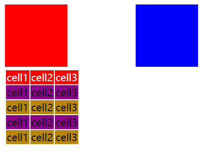

在CSS简介一节中，我们了解到，CSS的语法如下：
```HTML
选择器 { 属性1：属性值； 属性2：属性值}
```
那么有哪些选择器可以使用呢？
* 上下文选择符：基于祖先或同胞元素选择一个元素
* ID和类选择符：基于id和class属性的值选择元素
* 属性选择符：基于属性的有无和特征选择元素

## 上下文选择符
#### 基于祖先
语法
```css
祖先标签 子标签 {声明}
```
或
```css
祖先标签 ... 父标签 子标签 {声明}
```
这里的祖先标签可以是子标签的父标签，也可以是子标签的任何一个上级标签。
示例：
```html
<head>
    <meta charset="UTF-8">
    <meta name="viewport" content="width=device-width, initial-scale=1.0">
    <title>Document</title>
    <style>
        article h3 { color: red; }
        article section p {color: blue;}
    </style>
</head>
<body>
    <article>
        <header>
            <h3>Header</h3>
        </header>
        <section>
            <p>文章段落</p>
        </section>
        <footer>
            <span>
                Footer
            </span>
        </footer>
    </article>
</body>
```
<div style="text-align: center"></div>

###### 子选择符>
语法：
```css
父标签>子标签
```
此时父标签必须包裹着子标签，也就是子标签的父元素只能是父标签。
示例：
```html
<!DOCTYPE html>
<html lang="en">
<head>
    <meta charset="UTF-8">
    <meta name="viewport" content="width=device-width, initial-scale=1.0">
    <title>Document</title>
    <style>
        article>h3 { color: red; }
        article>section>p {color: blue;}
    </style>
</head>
<body>
    <article>
        <header>
            <h3>Header</h3>
        </header>
        <section>
            <p>文章段落</p>
        </section>
        <footer>
            <span>
                Footer
            </span>
        </footer>
    </article>
</body>
</html>

```

<div style="text-align: center"></div>
该示例只是在基于父标签选择符的示例上加了子选择符，跨级选择的header中的还h3就不起作用了。

###### 紧邻同胞选择符+
语法：
```css
标签1 + 标签2
```
标签2必须紧跟在其同胞标签1的后面。
示例：
```html
<!DOCTYPE html>
<html lang="en">
<head>
    <meta charset="UTF-8">
    <meta name="viewport" content="width=device-width, initial-scale=1.0">
    <title>Document</title>
    <style>
        header+section { color: red; }  /*起作用*/
        header+footer {color: blue;} /*不起作用*/
    </style>
</head>
<body>
    <article>
        <header>
            <h3>Header</h3>
        </header>
        <section>
            <p>文章段落</p>
        </section>
        <footer>
            <span>
                Footer
            </span>
        </footer>
    </article>
</body>
</html>
```
<div style="text-align: center"></div>


###### 一般同胞选择符~
语法：
```css
标签1~标签2
```
标签2必须跟（不一定紧跟）在其同胞标签1后面。
示例：
```html
<!DOCTYPE html>
<html lang="en">
<head>
    <meta charset="UTF-8">
    <meta name="viewport" content="width=device-width, initial-scale=1.0">
    <title>Document</title>
    <style>
        header~section { color: red; }  /*起作用*/
        header~footer {color: blue;} /*起作用*/
    </style>
</head>
<body>
    <article>
        <header>
            <h3>Header</h3>
        </header>
        <section>
            <p>文章段落</p>
        </section>
        <footer>
            <span>
                Footer
            </span>
        </footer>
    </article>
</body>
</html>
```
<div style="text-align: center"></div>

###### 通用选择符*
*是一个通配符，匹配任何元素
示例：
```html
<!DOCTYPE html>
<html lang="en">
<head>
    <meta charset="UTF-8">
    <meta name="viewport" content="width=device-width, initial-scale=1.0">
    <title>Document</title>
    <style>
        * { color: red; }
        footer * {color: blue;} /* 覆盖上面的样式*/
    </style>
</head>
<body>
    <article>
        <header>
            <h3>Header</h3>
        </header>
        <section>
            <p>文章段落</p>
        </section>
        <footer>
            <span>
                Footer
            </span>
        </footer>
    </article>
</body>
</html>
```
<div style="text-align: center"></div>

## ID和类选择符
ID和类为我们选择元素提供了另一套手段，利用它们可以不用考虑文档的层次结构。只要在HTML标记中为元素添加了id和class属性，就可以在CSS选择符中使用ID和类名，直接选中文档中特定的区域。
###### 注意
> id和clss不能以数字或特殊符号开头。id具有唯一性，一篇HTML文档不能具有相同命名的id。

#### class属性
常规 语法：
```css
.类名{声明}
```
标签带类选择符，语法：
```css
标签.类名{声明}
```
多类选择符，语法：
```css
.类名1 .类名2{声明}
```
示例：
```html
<!DOCTYPE html>
<html lang="en">
<head>
    <meta charset="UTF-8">
    <meta name="viewport" content="width=device-width, initial-scale=1.0">
    <title>Document</title>
    <style>
        .header{color: red;}  /*常规*/
        div.footer{ color: blue;} /*标签带类选择符*/
        .body.content{color:darkred}  /*多类选择符*/
    </style>
</head>
<body>
    <div class="article">
        <div class="header">文本头部</div>
        <div class="body content">文本内容</div>
        <div class="footer">文本尾部</div>
    </div>
</body>
</html>
```
<div style="text-align: center"></div>

#### id属性
id与class类似，id选择符使用“#”选择。
常规 语法：
```css
#id{声明}
```
标签带id选择符，语法：
```css
标签#id{声明}
```
示例：
```html
<!DOCTYPE html>
<html lang="en">
<head>
    <meta charset="UTF-8">
    <meta name="viewport" content="width=device-width, initial-scale=1.0">
    <title>Document</title>
    <style>
        #header{color: red;}  /*常规*/
        div#body{ color: blue;} /*标签带类选择符*/
    </style>
</head>
<body>
    <div id="article">
        <div id="header">文本头部</div>
        <div id="body">文本内容</div>
        <div id="footer">文本尾部</div>
    </div>
</body>
</html>
```
<div style="text-align: center"></div>
从上面的示例中可以看出，class和id还是有很多相似的地方，那么该如何选择呢？
###### id 还是 class？
个人观点：**能不用就都不用，使用上下文选择符。如果为了调整样式使用class，为了操作数据，配合JavaScript使用id。**

## 属性选择符
语法：
```css
标签名[属性名]
```
或
```
标签名[属性名="属性值"]
```
示例：
```html
<!DOCTYPE html>
<html lang="en">
<head>
    <meta charset="UTF-8">
    <meta name="viewport" content="width=device-width, initial-scale=1.0">
    <title>Document</title>
    <style>
        div[title] {color: red;}
        div[title="footer"] {color: blue;} /*覆盖上面的样式*/
    </style>
</head>
<body>
    <div title="header">header</div>
    <div title="body">body</div>
    <div title="footer">footer</div>
</body>
</html>
```
<div style="text-align: center"></div>

## 伪类
伪类这个叫法源自它们与类相似，但实际上并没有类会附加到标记中的标签上。伪类分两种，UI伪类和结构化伪类。
* UI（User Interfact,用户界面）伪类会在HTML元素处于某个状态时（比如鼠标指针位于链接上），为该元素应用CSS样式
* 结构化伪类会在标记中存在某种结构上的关系时（如某个元素是一组元素中的第一个或最后一个），为相应元素应用CSS样式

#### UI伪类
UI伪类会基于特定HTML元素的状态应用样式。最常使用UI伪类的元素是链接（a元素），利用UI伪类，链接可以在用户鼠标悬停时改变文本颜色，或者去掉文本的下划线等等。
一个冒号(:)表示伪类，两个冒号(::)表示CSS3新增的为元素。

###### 链接伪类
针对链接伪类一共有4个：
* link: 待被点击
* visited: 用户此前点击过这个链接
* hover：悬停在链接上
* active： 链接正在被点击（鼠标在元素上按下，还没有释放）

###### 注意
> 这4个伪类的顺序，link、visited、hover、active。如果不按照这样的顺序使用它们，浏览器可能不会显示预期结果


示例：
```html
<!DOCTYPE html>
<html lang="en">
<head>
    <meta charset="UTF-8">
    <meta name="viewport" content="width=device-width, initial-scale=1.0">
    <title>Document</title>
    <style>
        a{ text-decoration: underline; }
        a:link { color: rgb(20, 112, 8); }
        a:visited { color: black; }
        a:hover { color: red; }
        a:active { color: cyan;}
    </style>
</head>
<body>
    <a href="http://www.iotzzh.com" target="_blank">http://www.iotzzh.com</a>
</body>
</html>
```
<div style="text-align: center"></div>

貌似link的样式并没有被应用起来，当把visited移除时它便会被应用，可见这四个伪类并不是每次都是一起出现的。

###### focus伪类和target伪类
* focus伪类：获得焦点时的样式
```
语法 任何标签：focus{声明}
```

* target伪类：如果用户点击一个指定页面其他元素的链接，则那个元素就是目标（target），可以用：target伪类选中它。

示例：
```html
<!DOCTYPE html>
<html lang="en">
<head>
    <meta charset="UTF-8">
    <meta name="viewport" content="width=device-width, initial-scale=1.0">
    <title>Document</title>

    <style>
        input:focus { outline: 1px solid red; border: 1px solid red;} 

        #first-paragraph:target { color: red;}
        #second-paragraph:target { text-decoration: underline;}

    </style>
</head>
<body>
    <input type="text"><br>

    <a href="#first-paragraph">第一自然段</a>
    <a href="#second-paragraph">第二自然段</a>

    <div id="first-paragraph">这是第一自然段的内容</div>
    <div id="second-paragraph">这是第二自然段的内容</div>
</body>
</html>
```
<div style="text-align: center"></div>

#### 结构化伪类
结构化伪类可以根据标记的结构应用样式，比如根据某元素的父元素的或前面的同胞元素是什么。

###### ：first-child和：last:child
:first-child代表一组同胞元素中的第一个元素，而:last-child则代表最后一个。
###### 注意
:last-child或者是:first-child这样的伪类时，其前后都不应该有其它的兄弟节点，所以解决办法是使用一个div将标签包裹起来即可。

###### :nth-child(n或odd/even)

示例：
```html
<!DOCTYPE html>
<html lang="en">
<head>
    <meta charset="UTF-8">
    <meta name="viewport" content="width=device-width, initial-scale=1.0">
    <title>Document</title>
    <style>
        .box { width: 100px; height: 100px; display: inline-block; }
        .box:first-child { background-color: red;}
        .box:last-child { background-color: blue; }

        table tr:nth-child(odd) {background-color: darkgoldenrod; }
        table tr:nth-child(even) {background-color:darkmagenta; }
        table tr:nth-child(1) { background-color: red; color: white; }
    </style>
</head>
<body>
    <div>
        <div class="box"></div>
        <div class="box"></div>
        <div class="box"></div>
    </div>
    <table>
        <tr>
            <td>cell1</td>
            <td>cell2</td>
            <td>cell3</td>
        </tr>
        <tr>
            <td>cell1</td>
            <td>cell2</td>
            <td>cell3</td>
        </tr>
        <tr>
            <td>cell1</td>
            <td>cell2</td>
            <td>cell3</td>
        </tr>
        <tr>
            <td>cell1</td>
            <td>cell2</td>
            <td>cell3</td>
        </tr>
        <tr>
            <td>cell1</td>
            <td>cell2</td>
            <td>cell3</td>
        </tr>
    </table>
</body>
</html>
```
<div style="text-align: center"></div>

## 伪元素
伪元素就是在文档中若有实无的元素。下面介绍几个常用的伪元素：
#### ::first-letter伪元素
段落首字符
#### ::first-line伪元素
文本段落（一般情况下是段落）的第一行
#### ::before和::after伪元素
可用于在特定元素前面或后面添加特殊内容

示例：
```html
<!DOCTYPE html>
<html lang="en">
<head>
    <meta charset="UTF-8">
    <meta name="viewport" content="width=device-width, initial-scale=1.0">
    <title>Document</title>
    <style>
        .first-letter::first-letter{font-size: large; color: red;}

        .content::first-line {font-style: italic; color: rgba(100, 0, 25, 0.5);}

        .before::before { content: '添加before:'; color: sandybrown;}
        .after::after {content: ':添加after'; color: skyblue;}
    </style>
</head>
<body>
    <div class="first-letter">测试伪元素::first-letter</div>
    <div class="content">
        <p>测试伪元素::first-line 第一自然段</p>
        <p>测试伪元素::first-line 第二自然段</p>
        <p>测试伪元素::first-line 第三自然段</p>
    </div>

    <div class="before">测试before</div>
    <div class="after">测试after</div>

</body>
</html>
```

<div style="text-align: center"></div>