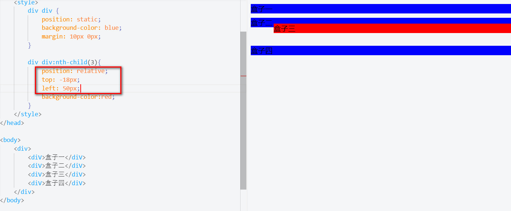
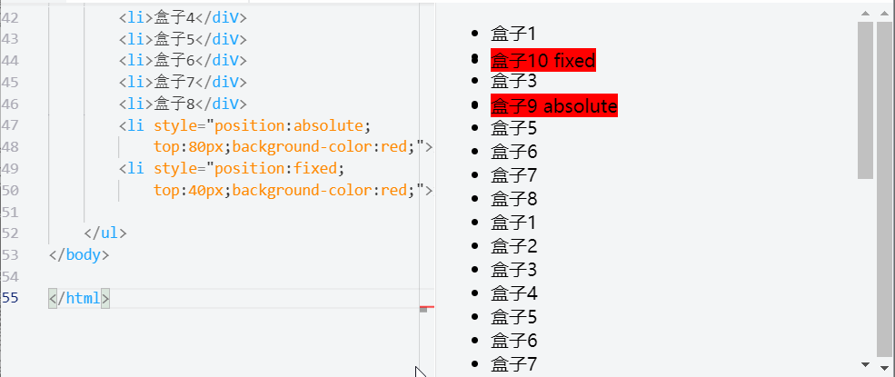
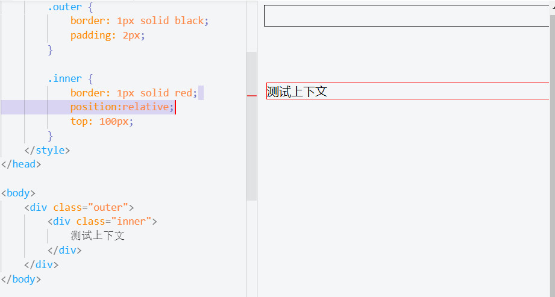
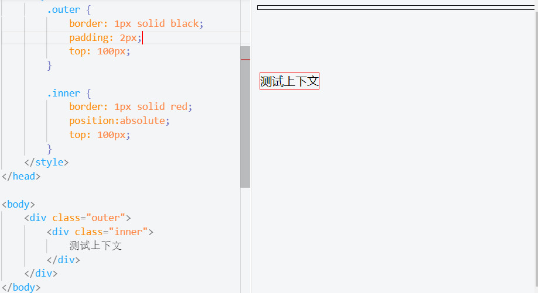
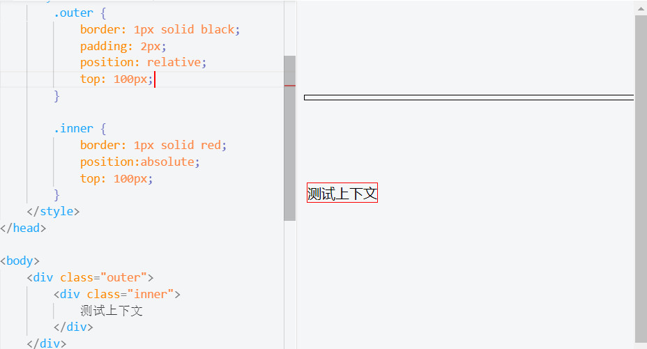

CSS布局的核心是 position 属性，对元素盒子应用这个属性，可以相对于它在常规文档流中的位置重新定位。
<div style="text-align: center"></div>
###### 语法
```css
position: value（默认值：static）
value常见值：
static | relative | absolute | sticky | fixed | inherit

static：默认值。没有定位，元素出现在正常的流中（忽略 top, bottom, left, right 或者 z-index 声明）。

inherit: 规定应该从父元素继承 position 属性的值。

relative: 生成相对定位的元素，相对于其正常位置进行定位。

absolute: 生成绝对定位的元素，相对于 static 定位以外的第一个父元素进行定位。
元素的位置通过 "left", "top", "right" 以及 "bottom" 属性进行规定。

fixed: 生成绝对定位的元素，相对于浏览器窗口进行定位。
元素的位置通过 "left", "top", "right" 以及 "bottom" 属性进行规定。

sticky: 粘性定位可以被认为是相对定位和固定定位的混合。元素在跨越特定阈值前为相对定位，之后为固定定位。
```

#### 静态定位（static）
在静态定位的情况下，每个元素在处在常规文档流中。它们都是块级元素，所以就会在页面中自上而下逐一排列显示，如下：

<div style="text-align: center"></div>

#### 相对定位(relative)
相对定位，相对的而是它原来在文档流中的位置（或者默认位置），可以使用top/right/bottom/left属性改变它的位置。
该关键字下，元素先放置在未添加定位时的位置，**再在不改变页面布局的前提下调整元素位置（因此会在此元素未添加定位时所在位置留下空白）**。position:relative 对 table-*-group, table-row, table-column, table-cell, table-caption 元素无效。
###### tips: 可以给top/left属性设定负值，把元素向上/向左移动。

示例：将第三个div相对原来的位置向上移动18px，向右移动50px。
<div style="text-align: center"></div>

#### 绝对定位(absolute)
元素会被移出正常文档流，并不为元素预留空间，通过指定元素相对于最近的非 static 定位祖先元素的偏移，来确定元素位置。绝对定位的元素可以设置外边距（margins），且不会与其他边距合并。
示例：将第四个div设置为绝对定位，向右移动30px
###### 盒子四的相对元素是body, 盒子三的相对元素是外层div
<div style="text-align: center"></div>

#### 固定定位(fixed)
元素会被移出正常文档流，并不为元素预留空间，而是通过指定元素相对于屏幕视口（viewport）的位置来指定元素位置。元素的位置在屏幕滚动时不会改变。打印时，元素会出现在的每页的固定位置。fixed 属性会创建新的层叠上下文。当元素祖先的 transform, perspective 或 filter 属性非 none 时，容器由视口改为该祖先。
固定定位与绝对定位类似,但不同之处在于，固定定位元素的定位上下文是视口（浏览器窗口或手持设备的屏
幕），因此它不会随页面滚动而移动。如下实例：
<div style="text-align: center"></div>

#### 粘性定位（sticky）
粘性定位可以被认为是相对定位和固定定位的混合。元素在跨越特定阈值前为相对定位，之后为固定定位。
实例：
<div style="text-align: center"></div>


#### 定位上下文
把元素的 position 属性设定为 relative 、 absolute 或fixed 后，继而可以使用 top、right、bottom 和 left 属性，相对于另一个元素移动该元素的位置。这里的“另一个元素”，就是该元素的定位上下文。
如下实例，虽然inner上定义了top： 100px,可是并没有起作用，原因在于内外部div默认都是静态定位，它们之间不存在谁是谁的定位上下文这个问题。换句话说，在常规文档流中，由于外部div没有内容，内部div就会跟它共享相同的起点。只有将position属性设定为relative、absolute或fixed，这个元素的top、right、bottom 和 left 属性才会起作用。
<div style="text-align: center"></div>
<div style="text-align: center"></div>

绝对定位元素的默认上下文是body。然而绝对定位元素的任何祖先元素都可以成为它的定位上下文，只要把相应的祖先元素的position设定为relative即可。
<div style="text-align: center"></div>
<div style="text-align: center"></div>


参考网站：
https://developer.mozilla.org/zh-CN/docs/Web/CSS/position
https://www.w3school.com.cn/cssref/pr_class_position.asp
https://my.oschina.net/u/866703/blog/221809