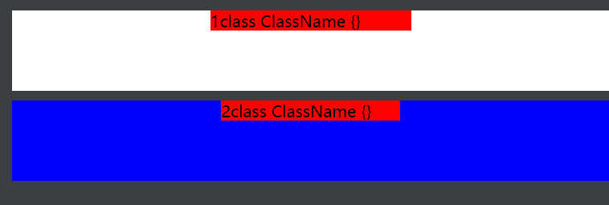

在面试的过程中，经常会被问到有关CSS的一个问题，那便是居中问题。
首先是如何进行水平居中，然后如何进行垂直居中，最后如何进行水平垂直居中。
接下来，一个问题一个问题研究~

水平居中，是基于两个或多个元素之间的位置关系。可能一个父元素和一个子元素，可能一个父元素或多个子元素。
那么父元素和子元素可能存在哪些情况呢？
1. 父元素为行内元素，子元素为行内元素
2. 父元素为行内元素，子元素为块级元素
3. 父元素为块级元素，子元素为行内元素
4. 父元素为块级元素，子元素为块级元素

在设置水平居中的过程中，父元素或者子元素的宽度、高度，子元素单行/多行有时也需要考虑其中。

在研究水平居中/垂直居中之前，先把一些不需要考虑的特殊情况挑出来：
#### 父元素为行内元素，子元素为行内元素（不存在居中问题）
由于父元素，子元素都是行内元素。且行内元素基本都是不可设置宽高的（除去替换元素），所以没有居中的概念。
#### 父元素为行内元素，子元素为块级元素
由于行内元素包含块级元素，导致行内元素也独占一行，可以使用在父元素内添加```text-align: center```，但是不符合开发规范。
###### 注意：不建议在行内元素中嵌套块元素，这样不仅不符合开发规范，还会导致行内元素也独占一行。


## 水平居中
#### 父元素为块级元素，子元素为行内元素
解决方案一：在父元素内添加```text-align: center```。
```html
<!DOCTYPE html>
<html lang="en">

<head>
	<style>
		.parent {
			height: 80px;
			margin: 10px;
		}

		.parent1 {
			background-color: white;
			text-align: center;
		}

        .child1 {
            background-color:red;
        }

        .parent2 {
			background-color: blue;
			text-align: center;
            width: 300px;
		}

        .child2 { background-color: red; }
	</style>
</head>

<body>
	<div class="parent  parent1">
		<code class="child1">1class ClassName {}</code>
    </div>

    <div class="parent  parent2">
        <code class="child2">2class ClassName {}</code>
    </div>
</body>
</html>
```
<div style="text-align: center"></div>

解决方案二： 在父元素添加```display: flex; justify-content: center```，子元素如果不希望高度扩展，在子元素上设置子元素的高度。
```html
<!DOCTYPE html>
<html lang="en">

<head>
	<style>
		.parent {
			height: 80px;
			margin: 10px;
		}

		.parent1 {
			background-color: white;
			display: flex;
			justify-content: center;
		}

        .child1 {
            background-color:red;
            height: 20px;
        }

        .parent2 {
			background-color: blue;
			display: flex;
			justify-content: center;
            width: 300px;
		}

        .child2 { background-color: red; height: 20px; }
	</style>
</head>

<body>
	<div class="parent  parent1">
		<code class="child1">1class ClassName {}</code>
    </div>

    <div class="parent  parent2">
        <code class="child2">2class ClassName {}</code>
    </div>
</body>
</html>
```
<div style="text-align: center"></div>

#### 父元素为块级元素，子元素为块级元素
解决方案一： 在父元素添加```display: flex; justify-content: center```，子元素如果不希望高度扩展，在子元素上设置子元素的高度。
```html
<!DOCTYPE html>
<html lang="en">

<head>
	<style>
		.parent {
			height: 80px;
			margin: 10px;
		}

		.parent1 {
			background-color: white;
			display: flex;
			justify-content: center;
		}

        .child1 {
            background-color:red;
            height: 20px;
        }

        .parent2 {
			background-color: blue;
			display: flex;
			justify-content: center;
            width: 300px;
		}

        .child2 { background-color: red; height: 20px; }
	</style>
</head>

<body>
	<div class="parent  parent1">
		<div class="child1">1class ClassName {}</div>
    </div>

    <div class="parent  parent2">
        <div class="child2">2class ClassName {}</div>
    </div>
</body>
</html>
```
<div style="text-align: center"></div>

解决方案二： 如果子元素宽度固定，在子元素添加```margin: 0 auto```。
```html
<!DOCTYPE html>
<html lang="en">

<head>
	<style>
		.parent {
			height: 80px;
			margin: 10px;
		}

		.parent1 {
			background-color: white;
		}

        .child1 {
            background-color:red;
            height: 20px;
            width: 200px;
            margin: 0 auto;
        }

        .parent2 {
			background-color: blue;
		}

        .child2 { background-color: red; height: 20px; width: 30%; margin: 0 auto; }
	</style>
</head>

<body>
	<div class="parent  parent1">
		<div class="child1">1class ClassName {}</div>
    </div>

    <div class="parent  parent2">
        <div class="child2">2class ClassName {}</div>
    </div>
</body>
</html>
```
<div style="text-align: center"></div>

#### 方案三： 利用position进行定位
父元素添加```position: relative```, 子元素添加```position: absolute;transform: translateX(-50%);```。如果不不适用```transform: translateX(-50%);```就不是真正意义上的居中显示，而是从居中位置开始向后显示，如下实例：
```html
<!DOCTYPE html>
<html lang="en">

<head>
	<style>
		.parent {
			height: 80px;
			margin: 10px;
		}

		.parent1 {
			background-color: white;
			position: relative;
		}

		.child1 {
			background-color: red;
			width: 30%;
			position: absolute;
			left: 50%;
		}

		.parent2 {
			background-color: blue;
			position: relative;
		}

		.child2 {
			background-color: red;
			width: 30%;
			position: absolute;
			left: 50%;
			transform: translateX(-50%);

		}
	</style>
</head>

<body>
	<div class="parent  parent1">
		<div class="child1">1class ClassName {}</div>
	</div>

	<div class="parent  parent2">
		<div class="child2">2class ClassName {}</div>
	</div>
</body>

</html>
```
<div style="text-align: center"></div>


## 垂直居中

## 水平垂直居中