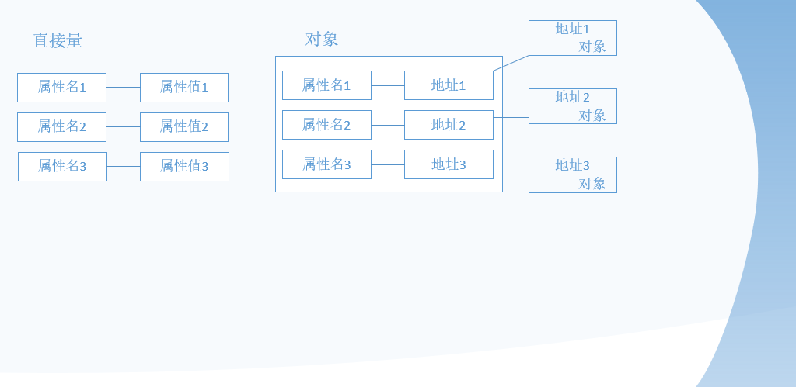

学习一门计算机语言，先要弄清楚它是什么，学习的目的是什么，如何实现的，然后再又目标地进行系统的学习。

那它是什么呢？
## Jsvascript的历史：
* javascript最初由网景（Netscape）公司于1995年开发的一种脚本语言，用于给HTML网页增加动态功能。【布兰登·艾奇（Brendan Eich）】、【Livescript->Javascript】
* 1996年11月，望京公司将Javascript提交给ECMA（欧洲计算机制造商协会）进行标准话，最后又网景、微软和Borland等公司组成的工作组指定了统一的标准—ECMA-262，命名为ECMAScript（简称ES）。【IE3-Jscript】
* 与ES对应的ECMA-262标准从1997年发布第一个版本到现在一共发布了6个版本。第6版于2015年6月份发布，正式命名为ES2015，因为是第6版，所以也可以称为ES6。

## Javascript特点
#### Javascript是一种面向对象的语言
首先我们要明白什么是对象，在学习C#或JAVA时，常用的一句话就是：万物皆对象。面向对象是一种思想，面向对象，能让你写出质量高，效率高，易维护，易扩展等更优质的代码。Javascript里面也可以使用面向对象的思想进行编程。
JS中的对象跟C#或JAVA等面向对象语言中的对象并不一样，它们有着 本质上的区别。其他面向对象的语言都有类的概念，而Javascript中虽有对象，但是 没有类。
#### Javascript是一种脚本语言
脚本语言的功能是修改或者称为“操作”，而不是创造。如果没有浏览器，Jsavscript自己是创造不出页面的。脚本语言是一堆命令的集合，一般来说会有一个解释器，由其负责从头到尾一条一条语言进行解释，然后根据解释的语句含义进行操作。Javascript就是一种比较复杂的脚本语言。
#### Javascript是一种事件驱动的语言
事件驱动是指Javascript引擎并不是再看到之后就会立即执行，而是在某个事件发生之后才会执行。事件驱动包含三个关键内容：事件、事主和处理方法。

## Javascript结构
Javascript的核心是对象，每个对象都可以包含0个或多个属性。对象的属性又两种类型：基础类型（直接量）和对象类型。基础类型的属性不可以再包含属性，而对象类型的属性还可以再包含自己的属性。
**Javascript中的对象可以分为function和object两种类型（注意都是小写）**
javascript中的object类型对象是使用function类型对象创建的。javascript中经常使用的String、Array和Date等对象其实都是function类型的对象，就连Object对象也是function类型的对象。

**Javascript的本质就是一个大的对象，这个对象就是Global Object，它是由宿主环境（例如浏览器）创建出来的， 在浏览器中就是window对象，其他的对象都是它的属性，或者属性的属性**

## Javascript的内存模型
Javascript本质是一个对象，一个对象可以包含多个属性，对象的属性可以分为直接量和对象两种类型，而对象又分为object对象和function对象两种类型。
直接量和对象两种类型的属性在内存中的保存方式不同。直接量是直接用两块内存分别保存属性名和属性值，而对象需要三块内存，分别保存属性名、属性地址和属性内容，如下图：

## Javascript组成
JS主要由三部分组成：ES、DOM、BOM。

* ECMAScript: (3/5/6/7)它是JS语言的标准,规定了JS的编程语法和基础核心知识
* DOM: document object model 文档对象模型,提供给JS很多操作页面中元素的属性和方法
* BOM: browser object model 浏览器对象模型 ,提供了很多操作浏览器 的属性方法,而这些方法都存放在window浏览器对象上。
