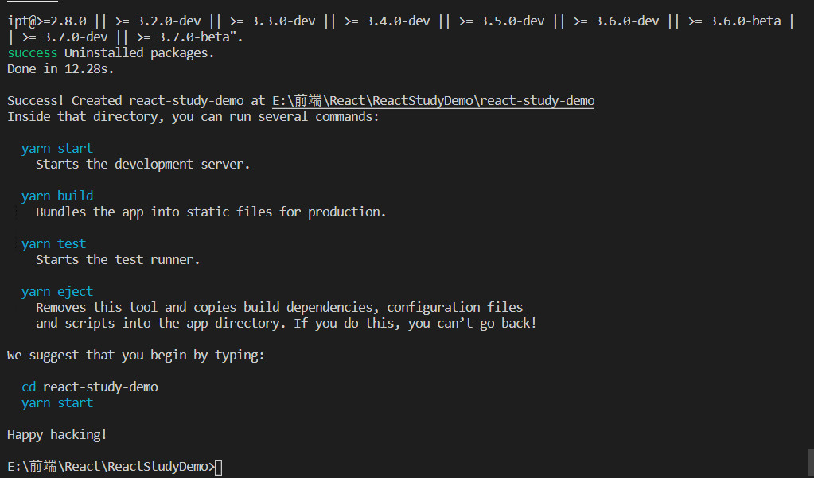
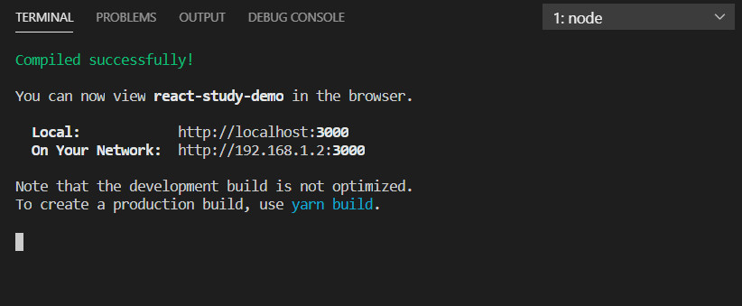

## 初始化项目
#### 创建项目
选定一个空文件夹，执行创建react项目命令
```
create-react-app project-name
```
###### 创建TS项目
```
npx create-react-app my-app-name --template typescript
```



#### 运行项目
打开创建的项目```或者```进入到创建的项目执行命令
```
yarn start
```




#### 删除无用的文件
为了更好的学习起见，可以删除一些无用的文件，之后按需引入加载


#### react developer tools
https://beta.reactjs.org/learn/react-developer-tools

## react项目引入scss
```
npm install node-sass sass-loader --save
```
https://www.jianshu.com/p/d0f7f65c16c9


## 添加路由
```
yarn add react-router-dom
```