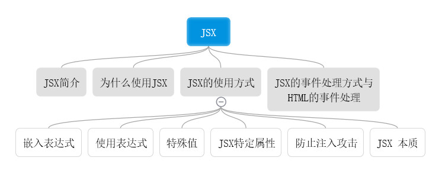
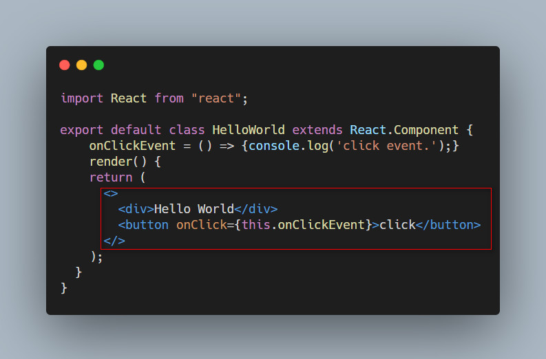

<div style="text-align: center"></div>
## JSX简介
<div style="text-align: center"></div>
或者
```javascript
const element = <h1>Hello, world!</h1>;
```
JSX是JavaScript的语法扩展（eXtension），让我们在JavaScript中可以编写像HTML一样的代码。
JSX看起来和HTML几乎一模一样，都可以使用div,button,span,a,p之类的元素标签，但是JSX中使用的“元素”不局限于HTML中的元素，可以是任何一个React组件。React判断一个元素是HTML元素还是React组件的原则就是看第一个字母是否大写。

## 为什么使用JSX？
React 认为渲染逻辑本质上与其他 UI 逻辑内在耦合，比如，在 UI 中需要绑定处理事件、在某些时刻状态发生变化时需要通知到 UI，以及需要在 UI 中展示准备好的数据。

React 并没有采用将标记与逻辑进行分离到不同文件这种人为地分离方式，而是通过将二者共同存放在称之为“组件”的松散耦合单元之中，来实现关注点分离。

React认为，一个组件因该是具备UI描述和UI数据的完整体，不应该将它们分开处理，于是发明了JSX，作为UI描述和UI数据之间的桥梁。

## JSX的使用方式
#### 嵌入表达式
```javascript
const element = <h1>Hello, {name}</h1>;
```
#### 使用表达式
```javascript
function getGreeting(user) {
  if (user) {
    return <h1>Hello, {formatName(user)}!</h1>;
  }
  return <h1>Hello, Stranger.</h1>;
}
```

#### 布尔类型、Null 以及 Undefined 将会忽略
false, null, undefined, and true 是合法的子元素。但它们并不会被渲染。以下的 JSX 表达式渲染结果相同：
```html
<div />

<div></div>

<div>{false}</div>

<div>{null}</div>

<div>{undefined}</div>

<div>{true}</div>
```

#### JSX特定属性
你可以通过使用引号，来将属性值指定为字符串字面量：
```javascript
const element = <div tabIndex="0"></div>;
```
也可以使用大括号，来在属性值中插入一个 JavaScript 表达式：
```javascript
const element = </img>;
```
###### 警告
> 因为 JSX 语法上更接近 JavaScript 而不是 HTML，所以 React DOM 使用 camelCase（小驼峰命名）来定义属性的名称，而不使用 HTML 属性名称的命名约定。
例如，JSX 里的 class 变成了 className，而 tabindex 则变为 tabIndex。

#### JSX 防止注入攻击
React DOM 在渲染所有输入内容之前，默认会进行转义。它可以确保在你的应用中，永远不会注入那些并非自己明确编写的内容。所有的内容在渲染之前都被转换成了字符串。这样可以有效地防止 XSS（cross-site-scripting, 跨站脚本）攻击。

#### JSX 本质
实际上，JSX 仅仅只是 React.createElement(component, props, ...children) 函数的语法糖，所以JSX并不是必需的。

Babel 会把 JSX 转译成一个名为 React.createElement() 函数调用。
以下两种示例代码完全等效：
```javascript
const element = (
  <h1 className="greeting">
    Hello, world!
  </h1>
```
```javascript
const element = React.createElement(
  'h1',
  {className: 'greeting'},
  'Hello, world!'
);
```

如果你想了解更多 JSX 转换为 JavaScript 的示例，可以尝试使用 [在线 Babel 编译器](https://babeljs.io/repl/#?browsers=defaults%2C%20not%20ie%2011%2C%20not%20ie_mob%2011&build=&builtIns=false&spec=false&loose=false&code_lz=GYVwdgxgLglg9mABACwKYBt1wBQEpEDeAUIogE6pQhlIA8AJjAG4B8AEhlogO5xnr0AhLQD0jVgG4iAXyJA&debug=false&forceAllTransforms=false&shippedProposals=false&circleciRepo=&evaluate=false&fileSize=false&timeTravel=false&sourceType=module&lineWrap=true&presets=react&prettier=false&targets=&version=7.13.14&externalPlugins=)。


###### 注意
在React 17之前，在使用JSX的代码文件中，即使代码中并没有直接使用React，也一定要导入这个React，这是因为JSX最终会被转译成依赖于React的表达式。

#### JSX的onClick事件处理方式与HTML的onclick
###### HTML
* onclick添加的事件处理函数是在全局环境下执行的，这污染了全局环境，很容易产生意料不到的后果
* 给很多DOM元素添加onclick事件，可能会影响网页的性能，毕竟，网页需要的事件处理函数越多，性能就会越低
* 对于使用onclick的DOM元素，如果要动态地从DOM树种删掉地话，需要把对应地事件处理器注销，假如忘了注销，就可能造成内存泄漏，这样地bug很难被发现。

###### JSX
上面说地这些问题，在JSX中都不存在。
* JSX使用事件控制在整个组件范围内，不会影响全局。
* JSX使用事件委托地方式处理点击事件，无论有多少个onClick出现，其实最后都只在DOM树上添加了一个事件处理函数，挂在最顶层地DOM节点上。所有地点击事件都被这个事件处理函数捕获，然后根据具体组件分配给特定函数，使用事件委托地性能要比为每个onClick都挂载一个事件处理函数要高。
* 因为React控制了组件的生命周期，在unmount的时候自然能够清除相关的所有事件处理函数，内存泄漏也不再是一个问题。