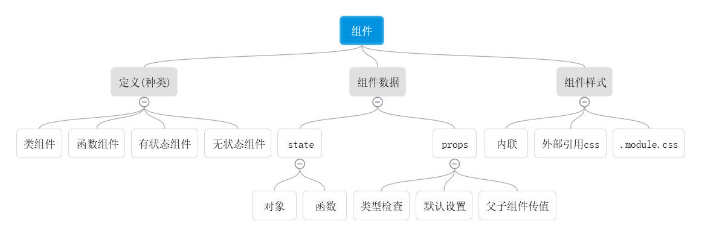

## 组件

组件是React的核心概念，是React应用程序的基石。组件是React开发的一个最小单元，利用“分而治之”的策略，将大的应用分解为很多个小的组件，也方便了组件的复用，更好的践行“高内聚，低耦合”的软件设计原则。

组件有输入、自己的状态和输出，输入在React中叫props，自己的状态在React叫state，输出在React中式render函数返回的值。
总结出的公式(无论props或者state变化，都会触发UI的变化)：
> UI = render(props,state)


## 组件的定义(种类)
组件的定义有两种方式，分别是ES6 class（类组件）和使用函数（函数组件）。
#### 类组件
* class继承自React.Component。
* class内部必须定义render方法，render方法返回代表该组件UI的React元素。

示例：
```javascript
import React from 'react';
import PropeTyps from 'prop-types'

export default class ClassComponent extends React.Component {
    render(){
        return <div>Hello World！</div>
    };
}
```

#### 函数组件
函数组件本质上就是 JavaScript 函数。它接收唯一带有数据的 “props”（代表属性）对象与并返回一个 React 元素。
示例：
```javascript
function Welcome(props) {
  return <h1>Hello, {props.name}</h1>;
}
```

#### 有状态组件和无状态组件
state用来反映组件内部状态的变化，如果一个组件的内部状态是不变的，当然就用不到state，这样的组件称为“无状态组件”，反之，用到state的就是有状态组件。无状态组件可以是类组件，也可以是函数组件。

#### PureComponent
PureComponent是React 15.3引入的一个全新的组件基类，在React内部PureComponent继承自Component，并将isPureComponent属性设置为true。在React内部使用isPureReactComponent来区分是否是PureComponent组件。
PureComponent和Component几乎一样，但是PureComponent的shouldComponentUpdate不会直接返回true，而是会对属性和状态进行**浅层比较**，也就是仅比较**直接属性是否相等**。


## 组件数据
组件的数据分为两种:state和prop
无论是prop或者state的改变，都可能引发组件的重新渲染。prop是组件的对外接口，state是组件的内部状态。
#### prop： propTypes检查
prop是组件的对外接口，那么就应该有某种方式让组件声明自己的接口规范。
在ES6方法定义的组件类中，可以通过增加类的propTypes属性来定义prop规格，这不只是声明，而且是一种限制，在运行时和静态代码检查时，都可以根据propTypes判断外部世界是否正确地使用了组件的属性。

#### prop： defaultProps
defaultProps设置props的默认值，有时一个prop不存在，但是需要一个默认值，就可以使用defaultProps。

#### prop: 实例
TestProps.jsx
```javascript
import React from 'react';
import PropeTyps from 'prop-types'

export default class TestProps extends React.Component {
    render(){
        return <div>
            姓名: {this.props.name}, 年龄： {this.props.age}
        </div>
    };
}

TestProps.PropeTyps = {
    name: PropeTyps.string,
    age: PropeTyps.number
}

TestProps.defaultProps = {
    name: '张中华'
}
```
index.js
```javascript
import React from 'react';
import ReactDOM from 'react-dom';

import TestProps from './test-props/TestProps'

ReactDOM.render(
  <React.StrictMode>
    <TestProps age={18} />
  </React.StrictMode>,
  document.getElementById('root')
);

```
显示结果


#### prop: 其他
* HTML组件属性的值都是字符串类型，即使内嵌JS，也依然是字符串形式表示代码。React组件的prop所支持的数据类型相对丰富很多，除了字符串还支持其他JS的的数据类型，如：布尔类型，对象等。

* 除了传值，还可以利用prop传递函数，以达到子组件向父组件传值的目的。
###### 实例(子组件向父组件传值)
TestProps.jsx
```javascript
import React from 'react';
import PropeTyps from 'prop-types'

export default class TestProps extends React.Component {

    getSex = (sex) => {
        this.props.getSex(sex);
    }

    render(){
        return <div>
            姓名: {this.props.name}, 年龄： {this.props.age}
            <button  onClick={() => this.getSex('男')}>男</button>
            <button  onClick={() => this.getSex('女')}>女</button>
        </div>
    };
}

TestProps.PropeTyps = {
    name: PropeTyps.string,
    age: PropeTyps.number
}

TestProps.defaultProps = {
    name: '张中华'
}
```
index.js
```javascript
import React from 'react';
import ReactDOM from 'react-dom';

import TestProps from './test-props/TestProps'

const getSex = (sex) => {
  ReactDOM.render(
    <React.StrictMode>
      <TestProps age={18} getSex={getSex} />
      <div>{sex}</div>
    </React.StrictMode>,
    document.getElementById('root')
  );
}

ReactDOM.render(
  <React.StrictMode>
    <TestProps age={18} getSex={getSex} />
    <div>{getSex()}</div>
  </React.StrictMode>,
  document.getElementById('root')
);
```
显示结果


#### state
由于React组件不能修改传入的prop，所以记录自身的数据就需要使用state。

###### state：初始化
初始化state只要在组件内，定义this.state对象即可，一般定义在constructor内。

###### state: 读取
在组件内，使用this.state.XXX直接读取即可

###### state：更新
state的更新方式是使用this.setState()方法进行更新。如果直接更新state并不会触发界面更新，因为this.setState()方法除了设置state值外，还触发了界面的修改。

this.setState()方法有两种调用方式，一种是直接传入一个对象，另一种是传入一个函数。
源码：
```javascript
/**
 * Sets a subset of the state. Always use this to mutate
 * state. You should treat `this.state` as immutable.
 *
 * There is no guarantee that `this.state` will be immediately updated, so
 * accessing `this.state` after calling this method may return the old value.
 *
 * There is no guarantee that calls to `setState` will run synchronously,
 * as they may eventually be batched together.  You can provide an optional
 * callback that will be executed when the call to setState is actually
 * completed.
 *
 * When a function is provided to setState, it will be called at some point in
 * the future (not synchronously). It will be called with the up to date
 * component arguments (state, props, context). These values can be different
 * from this.* because your function may be called after receiveProps but before
 * shouldComponentUpdate, and this new state, props, and context will not yet be
 * assigned to this.
 *
 * @param {object|function} partialState Next partial state or function to
 *        produce next partial state to be merged with current state.
 * @param {?function} callback Called after state is updated.
 * @final
 * @protected
 */
Component.prototype.setState = function(partialState, callback) {
  invariant(
    typeof partialState === 'object' ||
      typeof partialState === 'function' ||
      partialState == null,
    'setState(...): takes an object of state variables to update or a ' +
      'function which returns an object of state variables.',
  );
  this.updater.enqueueSetState(this, partialState, callback, 'setState');
};
```

this.setState()方法传入对象与函数的区别在于，传入函数，会根据之前的一个state进行下一次的state的更新，而直接传入对象并不会管前后的state的状态。
###### state: 实例
TestState.jsx
```javascript
import React from 'react';

export default class TestState extends React.Component {
    constructor () {
        super();
        this.state = {
            name1: 'null',
            age1: 0,
            name2: 'null',
            age2: 0,
        }
    }

    changeStateAsync = () => {
        this.setState({ name1: '张' });
        this.setState({ age1: 18 });
    }

    grow2Year1 = ()=> {
        this.setState({ age1: this.state.age1 + 1 });
        this.setState({ age1: this.state.age1 + 1 });
    }

    grow2Year2 = ()=> {
        this.setState((prevState) => ({
            ...prevState,
            age2: prevState.age2 + 1,
        }));

        this.setState((prevState) => ({
            ...prevState,
            age2: prevState.age2 + 1,
        }));
    }

    changeStateSync = () => {
        this.setState((prevState) => ({
            ...prevState,
            name2: 'Zhang'
        }));

        this.setState((prevState) => ({
            ...prevState,
            age2: 18
        }));
    }

    render () {
        return <div>
            <div>我的名字是 {this.state.name1}, 年龄是 {this.state.age1}</div>
            <button onClick={this.changeStateAsync} style={{margin: '5px'}}>赋值</button>
            <button onClick={this.grow2Year1} style={{margin: '5px'}}>连续长两岁</button>

            <div style={{marginTop: '10px'}}>my name is {this.state.name2}, age is {this.state.age2}</div>
            <button onClick={this.changeStateSync} style={{margin: '5px'}}>give value </button>
            <button onClick={this.grow2Year2} style={{margin: '5px'}}>grow2Year</button>
            </div>           
    }
}
```
显示结果


## 组件样式
#### 内联样式
内联样式实际上是一种CSS in JS的写法：将CSS样式写到JS文件中，用JS对象表示CSS样式，然后通过DOM类型节点的style属性引用相应样式对象。在render中定义，如下：


运行结果


由于是样式是作为一个对象写在JS中的，所以也可以将样式提前声明再引用，如下：

```javascript

import React from 'react'

export default class TestStyle extends React.Component {
    
    const style1={color:'red'};

    render(){return<div style={style1}>Hello World</div>}
}
```

#### 外部样式
###### 定义在外部css中
新建一个css文件TestStyle.css
```css
.text {color: red;}
```
引用并使用定义好的CSS样式
```javascript
import React from 'react'
import './TestStyle.css';

export default class TestStyle extends React.Component {
    render(){return<div className="text">Hello World</div>}
}
```

运行结果


###### 使用module.css
学习参考：
http://www.ruanyifeng.com/blog/2016/06/css_modules.html
新建一个css文件TestStyle.module.css

```css
.text {color: red;}
```

引用并使用定义好的CSS样式
```javascript
import React from 'react'
import classnames from './TestStyle.module.css'

export default class TestStyle extends React.Component {
    render(){return<div className={classnames.text}>Hello World</div>}
}
```

运行结果


###### 使用方式比较
* 内联样式写在JS中，不利于复用
* 定义在外部css中， CSS的规则都是全局的，容易错乱覆盖
* 使用module.css是局部的，CSS Modules 允许使用:global(.className)的语法，声明一个全局规则。凡是这样声明的class，都不会被编译成哈希字符串。

## 事件处理
React中的事件是合成事件，并不是原生的DOM事件，React根据W3C规范定义了一套兼容各个浏览器的事件对象。在React中命名事件时，采用驼峰命名方式，而不是原生DOM原生中的小写方式。

在React中使用事件时，最容易混淆的地方就是this的指向问题，这也是JS语言的痛点，虽然后期有了class语法，但是也并不像后端语言那样绑定this到
当前对象。
#### 组件方法（bind）
因为组件内的this并没有绑定到当前对象，所以需要手动去绑定，一般有两种绑定方式，在构造函数中定义或者在元素中直接定义。
###### 在构造函数种定义
```javascript
import React from "react";

export default class TestEventBind1 extends React.Component {
    constructor(props){
        super(props);
        this.state = {count:0}
        this.handleClick = this.handleClick.bind(this);
    }

    handleClick(){
        this.setState({count:this.state.count + 1});
    }

    render() {
        return (
            <div>
                <div>点击次数：{this.state.count}</div>
                <button onClick={this.handleClick}>按钮</button>
            </div>
        )
    }
}
```
###### 元素中直接定义
```javascript
import React from "react";

export default class TestEventBind2 extends React.Component {
    constructor(props){
        super(props);
        this.state = {count:0}
    }

    handleClick(){
        this.setState({count:this.state.count + 1});
    }

    render() {
        return (
            <div>
                <div>点击次数：{this.state.count}</div>
                <button onClick={this.handleClick.bind(this)}>按钮</button>
            </div>
        )
    }
}
```

#### 箭头函数
箭头函数的一个作用就是改变了this的指向问题，在哪定义this就指向谁。这里也有两种方式，一种是在元素内使用，一种是在定义使用。

###### 元素内使用
```javascript
import React from "react";

export default class TestEventArrowFunction1 extends React.Component {
    constructor(props){
        super(props);
        this.state = {count:0}
    }

    handleClick(){
        this.setState({count:this.state.count + 1});
    }

    render() {
        return (
            <div>
                <div>点击次数：{this.state.count}</div>
                <button onClick={() => this.handleClick()}>按钮</button>
            </div>
        )
    }
}
```

###### 定义使用
```javascript
import React from "react";

export default class TestEventArrowFunction2 extends React.Component {
    constructor(props){
        super(props);
        this.state = {count:0}
    }

    handleClick = () =>{
        this.setState({count:this.state.count + 1});
    }

    render() {
        return (
            <div>
                <div>点击次数：{this.state.count}</div>
                <button onClick={this.handleClick}>按钮</button>
            </div>
        )
    }
}
```

#### 组件方法（bind） VS 箭头函数
* bind：在构造函数种定义，如果当存在很多事件时，就会出现很多bind，看起来不好。

* bind：元素中直接定义，每次调用render时，都会创建一个新的事件处理函数，带来额外的的性能开销，但是一般情况下不用在意。

* 箭头函数：元素内使用，每次调用render时，都会创建一个新的事件处理函数，带来额外的的性能开销，但是一般情况下不用在意。

* 箭头函数： 定义使用，该方法也叫属性初始化语法，该方法时ES7提供的新语法，不用考虑this绑定问题，也不用考虑调用render重新创建处理函数的问题。

综上，根据使用场景，选择合适的定义事件的方法。
