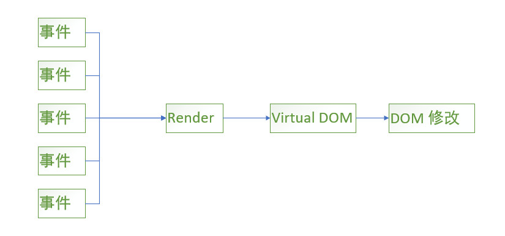
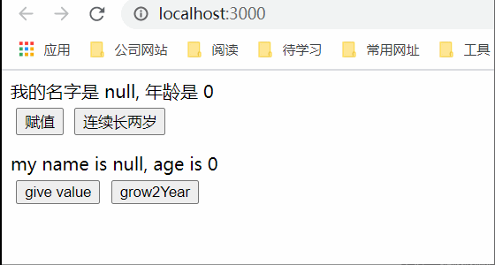
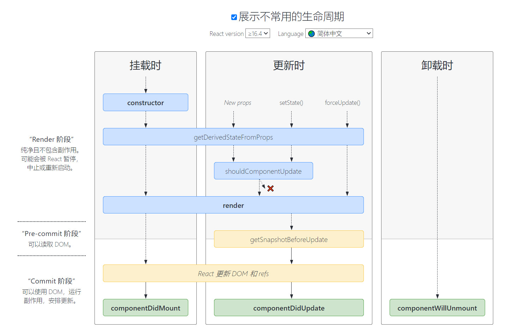

前端UI的本质问题是如何将来源与服务端的动态数据和用户的交互行为高效地反映到复杂地用户界面上。


## 为什么使用React
React通过使用虚拟DOM、状态、单向数据流等设计理念，形成以组件为核心，用组件搭建UI的开发模式，完美地将数据、组件状态和UI映射到一起，极大地提高了开发大型Web应用地效率。
###### React与JQ的对比
React


JQ

在前端开发对性能的要求中，就是尽可能地减少操作DOM。很明显，React利用Virtual DOM这一层，很好的隔离的事件与真实DOM。其次，利用Virtual DOM和DIFF算法，高效的选择更新DOM方式，也是提高性能的一个方式。


## React的特点
* 声明式的视图层
采用JSX语法来声明视图层，利用数据的变化触发视图层的更新。
* 简单的更新流程
由于是声明式的试图定义方式，只需要定义UI状态，React便会负责把它渲染成最终的UI。当状态数据发生变化时，React也会根据最新的状态渲染处新的UI。UI = Render(data)。
* 灵活的渲染实现
React并不是把视图直接渲染成最终的终端界面，而是先把它们渲染成虚拟DOM。虚拟DOM只是普通的JavaScript对象，可以结合其他依赖库把这个对象渲染成不同终端上的UI。例如，使用react-dom在浏览器上渲染，使用Node在服务器上渲染，使用React Native在手机上渲染。
* 高校的DOM操作
有了虚拟DOM的隔离，采用高效的DIFF算法。React尽量减少虚拟DOM到真实DOM的渲染次数，以及每次渲染需要改变的真实DOM节点数。
* 基于组件
在React开发中，组件为最小开发单元。根据“高内聚，低耦合”的软件设计原则，合理的将功能拆分成组件。

###### 核心概念
JSX、组件化、状态管理、局部更新、虚拟DOM、Redux、immutable、HOC（高阶组件）、Fiber等

## JSX
JSX是JavaScript的语法扩展（eXtension），让我们在JavaScript中可以编写像HTML一样的代码。
在React 17之前，在使用JSX的代码文件中，即使代码中并没有直接使用React，也一定要导入这个React，这是因为JSX最终会被转译成依赖于React的表达式。

JSX看起来和HTML几乎一模一样，都可以使用```<div><button></button>```之类的元素，但是JSX中使用的“元素”不局限于HTML中的元素，可以是任何一个React组件。React判断一个元素是HTML元素还是React组件的原则就是看第一个字母是否大写。

#### JSX的onClick事件处理方式与HTML的onclick
* onclick添加的事件处理函数是在全局环境下执行的，这污染了全局环境，很容易产生意料不到的后果
* 给很多DOM元素添加onclick事件，可能会影响网页的性能，毕竟，网页需要的事件处理函数越多，性能就会越低
* 对于使用onclick的DOM元素，如果要动态地从DOM树种删掉地话，需要把对应地事件处理器注销，假如忘了注销，就可能造成内存泄漏，这样地bug很难被发现。
上面说地这些问题，在JSX种都不存在。
* JSX使用事件控制在整个组件范围内，不会影响全局。
* JSX使用事件委托地方式处理点击事件，无论有多少个onClick出现，其实最后都只在DOM树上添加了一个事件处理函数，挂在最顶层地DOM节点上。所有地点击事件都被这个事件处理函数捕获，然后根据具体组件分配给特定函数，使用事件委托地性能要比为每个onClick都挂载一个事件处理函数要高。
* 因为React控制了组件的生命周期，在unmount的时候自然能够清除相关的所有事件处理函数，内存泄漏也不再是一个问题。

组件是React开发的一个最小单元，利用“分而治之”的策略，将大的网站分解为很多个小的组件，也方便了组件的复用。

## 组件
组件的数据分为两种:state和prop
无论是prop或者state的改变，都可能引发组件的重新渲染。prop是组件的对外接口，state是组件的内部状态。

#### prop： propTypes检查
prop是组件的对外接口，那么就应该有某种方式让组件声明自己的接口规范。
在ES6方法定义的组件类中，可以通过增加类的propTypes属性来定义prop规格，这不只是声明，而且是一种限制，在运行时和静态代码检查时，都可以根据propTypes判断外部世界是否正确地使用了组件的属性。

#### prop： defaultProps
defaultProps设置props的默认值，有时一个prop不存在，但是需要一个默认值，就可以使用defaultProps。


#### prop: 实例
TestProps.jsx
```javascript
import React from 'react';
import PropeTyps from 'prop-types'

export default class TestProps extends React.Component {
    render(){
        return <div>
            姓名: {this.props.name}, 年龄： {this.props.age}
        </div>
    };
}

TestProps.PropeTyps = {
    name: PropeTyps.string,
    age: PropeTyps.number
}

TestProps.defaultProps = {
    name: '张中华'
}
```
index.js
```javascript
import React from 'react';
import ReactDOM from 'react-dom';

import TestProps from './test-props/TestProps'

ReactDOM.render(
  <React.StrictMode>
    <TestProps age={18} />
  </React.StrictMode>,
  document.getElementById('root')
);

```
显示结果


#### prop: 其他
* HTML组件属性的值都是字符串类型，即使内嵌JS，也依然是字符串形式表示代码。React组件的prop所支持的数据类型相对丰富很多，除了字符串还支持其他JS的的数据类型，如：布尔类型，对象等。

* 除了传值，还可以利用prop传递函数，以达到子组件向父组件传值的目的。
###### 实例(子组件向父组件传值)
TestProps.jsx
```javascript
import React from 'react';
import PropeTyps from 'prop-types'

export default class TestProps extends React.Component {

    getSex = (sex) => {
        this.props.getSex(sex);
    }

    render(){
        return <div>
            姓名: {this.props.name}, 年龄： {this.props.age}
            <button  onClick={() => this.getSex('男')}>男</button>
            <button  onClick={() => this.getSex('女')}>女</button>
        </div>
    };
}

TestProps.PropeTyps = {
    name: PropeTyps.string,
    age: PropeTyps.number
}

TestProps.defaultProps = {
    name: '张中华'
}
```
index.js
```javascript
import React from 'react';
import ReactDOM from 'react-dom';

import TestProps from './test-props/TestProps'

const getSex = (sex) => {
  ReactDOM.render(
    <React.StrictMode>
      <TestProps age={18} getSex={getSex} />
      <div>{sex}</div>
    </React.StrictMode>,
    document.getElementById('root')
  );
}

ReactDOM.render(
  <React.StrictMode>
    <TestProps age={18} getSex={getSex} />
    <div>{getSex()}</div>
  </React.StrictMode>,
  document.getElementById('root')
);
```
显示结果


#### state
由于React组件不能修改传入的prop，所以记录自身的数据就需要使用state。

###### state：初始化
初始化state只要在组件内，定义this.state对象即可，一般定义在constructor内。

###### state: 读取
在组件内，使用this.state.XXX直接读取即可

###### state：更新
state的更新方式是使用this.setState()方法进行更新。如果直接更新state并不会触发界面更新，因为this.setState()方法除了设置state值外，还触发了界面的修改。

this.setState()方法有两种调用方式，一种是直接传入一个对象，另一种是传入一个函数。
源码：
```javascript
/**
 * Sets a subset of the state. Always use this to mutate
 * state. You should treat `this.state` as immutable.
 *
 * There is no guarantee that `this.state` will be immediately updated, so
 * accessing `this.state` after calling this method may return the old value.
 *
 * There is no guarantee that calls to `setState` will run synchronously,
 * as they may eventually be batched together.  You can provide an optional
 * callback that will be executed when the call to setState is actually
 * completed.
 *
 * When a function is provided to setState, it will be called at some point in
 * the future (not synchronously). It will be called with the up to date
 * component arguments (state, props, context). These values can be different
 * from this.* because your function may be called after receiveProps but before
 * shouldComponentUpdate, and this new state, props, and context will not yet be
 * assigned to this.
 *
 * @param {object|function} partialState Next partial state or function to
 *        produce next partial state to be merged with current state.
 * @param {?function} callback Called after state is updated.
 * @final
 * @protected
 */
Component.prototype.setState = function(partialState, callback) {
  invariant(
    typeof partialState === 'object' ||
      typeof partialState === 'function' ||
      partialState == null,
    'setState(...): takes an object of state variables to update or a ' +
      'function which returns an object of state variables.',
  );
  this.updater.enqueueSetState(this, partialState, callback, 'setState');
};
```

this.setState()方法传入对象与函数的区别在于，传入函数，会根据之前的一个state进行下一次的state的更新，而直接传入对象并不会管前后的state的状态。
###### state: 实例
TestState.jsx
```javascript
import React from 'react';

export default class TestState extends React.Component {
    constructor () {
        super();
        this.state = {
            name1: 'null',
            age1: 0,
            name2: 'null',
            age2: 0,
        }
    }

    changeStateAsync = () => {
        this.setState({ name1: '张' });
        this.setState({ age1: 18 });
    }

    grow2Year1 = ()=> {
        this.setState({ age1: this.state.age1 + 1 });
        this.setState({ age1: this.state.age1 + 1 });
    }

    grow2Year2 = ()=> {
        this.setState((prevState) => ({
            ...prevState,
            age2: prevState.age2 + 1,
        }));

        this.setState((prevState) => ({
            ...prevState,
            age2: prevState.age2 + 1,
        }));
    }

    changeStateSync = () => {
        this.setState((prevState) => ({
            ...prevState,
            name2: 'Zhang'
        }));

        this.setState((prevState) => ({
            ...prevState,
            age2: 18
        }));
    }

    render () {
        return <div>
            <div>我的名字是 {this.state.name1}, 年龄是 {this.state.age1}</div>
            <button onClick={this.changeStateAsync} style={{margin: '5px'}}>赋值</button>
            <button onClick={this.grow2Year1} style={{margin: '5px'}}>连续长两岁</button>

            <div style={{marginTop: '10px'}}>my name is {this.state.name2}, age is {this.state.age2}</div>
            <button onClick={this.changeStateSync} style={{margin: '5px'}}>give value </button>
            <button onClick={this.grow2Year2} style={{margin: '5px'}}>grow2Year</button>
            </div>           
    }
}
```
显示结果



#### 组件的生命周期
React严格定义了组件的生命周期，生命周期可能会经历如下三个过程：
* 装载过程（Mount）
* 更新过程（Update）
* 卸载过程（Unmount）

在使用react组件时，每个组件都包含"生命周期方法",你可以重写这些方法，以便于在运行过程中特定的阶段执行这些方法。
#####  如何了解这些生命周期
###### 文档
你可以在[生命周期路线图](https://projects.wojtekmaj.pl/react-lifecycle-methods-diagram/)中查看react16.3和16.4以及之后的生命周期图谱，
在[react官网](https://zh-hans.reactjs.org/docs/react-component.html)可以对生命周期的使用有个简单的了解。

###### TS
如果装有TS的的朋友也可以看看组件继承的React.Component里面有没有一些蛛丝马迹。
```javascript
    interface Component<P = {}, S = {}, SS = any> extends ComponentLifecycle<P, S, SS> { }
    class Component<P, S> {
        static contextType?: Context<any>;
        context: any;
        constructor(props: Readonly<P> | P);
        constructor(props: P, context: any);
        setState<K extends keyof S>(
            state: ((prevState: Readonly<S>, props: Readonly<P>) => (Pick<S, K> | S | null)) | (Pick<S, K> | S | null),
            callback?: () => void
        ): void;

        forceUpdate(callback?: () => void): void;
        render(): ReactNode;
        readonly props: Readonly<P> & Readonly<{ children?: ReactNode }>;
        state: Readonly<S>;
        refs: {
            [key: string]: ReactInstance
        };
    }
```
通过查看Component我们可以看到它除了有一些自带的方法和属性还继承了ComponentLifecycle，那么这个就是跟生命周期相关的了。
```javascript
    interface ComponentLifecycle<P, S, SS = any> extends NewLifecycle<P, S, SS>, DeprecatedLifecycle<P, S> {
        componentDidMount?(): void;
        shouldComponentUpdate?(nextProps: Readonly<P>, nextState: Readonly<S>, nextContext: any): boolean;
        componentWillUnmount?(): void;
        componentDidCatch?(error: Error, errorInfo: ErrorInfo): void;
    }
```
在ComponentLifecycle里面有一些常用的生命周期而且还继承了NewLifecycle和DeprecatedLifecycle。可能有些朋友会觉得为什么要这样一层一层的继承，而不是直接写在一个接口里面。那就要去了解下面向接口编程了，主要就是为了实现复用和隔离，在这里就不详解了。我们再来看看NewLifecycle和DeprecatedLifecycle。
```javascript
    interface NewLifecycle<P, S, SS> {
        getSnapshotBeforeUpdate?(prevProps: Readonly<P>, prevState: Readonly<S>): SS | null;
        componentDidUpdate?(prevProps: Readonly<P>, prevState: Readonly<S>, snapshot?: SS): void;
    }
```
```javascript
    interface DeprecatedLifecycle<P, S> {
        /**
         * Called immediately before mounting occurs, and before `Component#render`.
         * Avoid introducing any side-effects or subscriptions in this method.
         *
         * Note: the presence of getSnapshotBeforeUpdate or getDerivedStateFromProps
         * prevents this from being invoked.
         *
         * @deprecated 16.3, use componentDidMount or the constructor instead; will stop working in React 17
         * @see https://reactjs.org/blog/2018/03/27/update-on-async-rendering.html#initializing-state
         * @see https://reactjs.org/blog/2018/03/27/update-on-async-rendering.html#gradual-migration-path
         */
        componentWillMount?(): void;
        /**
         * Called immediately before mounting occurs, and before `Component#render`.
         * Avoid introducing any side-effects or subscriptions in this method.
         *
         * This method will not stop working in React 17.
         *
         * Note: the presence of getSnapshotBeforeUpdate or getDerivedStateFromProps
         * prevents this from being invoked.
         *
         * @deprecated 16.3, use componentDidMount or the constructor instead
         * @see https://reactjs.org/blog/2018/03/27/update-on-async-rendering.html#initializing-state
         * @see https://reactjs.org/blog/2018/03/27/update-on-async-rendering.html#gradual-migration-path
         */
        UNSAFE_componentWillMount?(): void;
        /**
         * Called when the component may be receiving new props.
         * React may call this even if props have not changed, so be sure to compare new and existing
         * props if you only want to handle changes.
         *
         * Calling `Component#setState` generally does not trigger this method.
         *
         * Note: the presence of getSnapshotBeforeUpdate or getDerivedStateFromProps
         * prevents this from being invoked.
         *
         * @deprecated 16.3, use static getDerivedStateFromProps instead; will stop working in React 17
         * @see https://reactjs.org/blog/2018/03/27/update-on-async-rendering.html#updating-state-based-on-props
         * @see https://reactjs.org/blog/2018/03/27/update-on-async-rendering.html#gradual-migration-path
         */
        componentWillReceiveProps?(nextProps: Readonly<P>, nextContext: any): void;
        /**
         * Called when the component may be receiving new props.
         * React may call this even if props have not changed, so be sure to compare new and existing
         * props if you only want to handle changes.
         *
         * Calling `Component#setState` generally does not trigger this method.
         *
         * This method will not stop working in React 17.
         *
         * Note: the presence of getSnapshotBeforeUpdate or getDerivedStateFromProps
         * prevents this from being invoked.
         *
         * @deprecated 16.3, use static getDerivedStateFromProps instead
         * @see https://reactjs.org/blog/2018/03/27/update-on-async-rendering.html#updating-state-based-on-props
         * @see https://reactjs.org/blog/2018/03/27/update-on-async-rendering.html#gradual-migration-path
         */
        UNSAFE_componentWillReceiveProps?(nextProps: Readonly<P>, nextContext: any): void;
        /**
         * Called immediately before rendering when new props or state is received. Not called for the initial render.
         *
         * Note: You cannot call `Component#setState` here.
         *
         * Note: the presence of getSnapshotBeforeUpdate or getDerivedStateFromProps
         * prevents this from being invoked.
         *
         * @deprecated 16.3, use getSnapshotBeforeUpdate instead; will stop working in React 17
         * @see https://reactjs.org/blog/2018/03/27/update-on-async-rendering.html#reading-dom-properties-before-an-update
         * @see https://reactjs.org/blog/2018/03/27/update-on-async-rendering.html#gradual-migration-path
         */
        componentWillUpdate?(nextProps: Readonly<P>, nextState: Readonly<S>, nextContext: any): void;
        /**
         * Called immediately before rendering when new props or state is received. Not called for the initial render.
         *
         * Note: You cannot call `Component#setState` here.
         *
         * This method will not stop working in React 17.
         *
         * Note: the presence of getSnapshotBeforeUpdate or getDerivedStateFromProps
         * prevents this from being invoked.
         *
         * @deprecated 16.3, use getSnapshotBeforeUpdate instead
         * @see https://reactjs.org/blog/2018/03/27/update-on-async-rendering.html#reading-dom-properties-before-an-update
         * @see https://reactjs.org/blog/2018/03/27/update-on-async-rendering.html#gradual-migration-path
         */
        UNSAFE_componentWillUpdate?(nextProps: Readonly<P>, nextState: Readonly<S>, nextContext: any): void;
    }
```

这里我把16.3不赞成使用的注释保留了下来，里面有些链接可以了解下react生命周期的发展过程。


React生命周期的使用分为挂载阶段、更新阶段和销毁阶段，当有存在错误时也提供了异常处理的函数。

<div style="text-align: center"></div>

###### 挂载阶段
* constructor()
* static getDerivedStateFromProps()
* render()
* componentDidMount()
###### 更新阶段
* static getDerivedStateFromProps()
* shouldComponentUpdate()
* render()
* getSnapshotBeforeUpdate()
* componentDidUpdate()

###### 卸载
componentWillUnmount()

###### 错误处理
* static getDerivedStateFromError()
* componentDidCatch()


参考网址：
[生命周期路线图](https://projects.wojtekmaj.pl/react-lifecycle-methods-diagram/):
https://projects.wojtekmaj.pl/react-lifecycle-methods-diagram/

