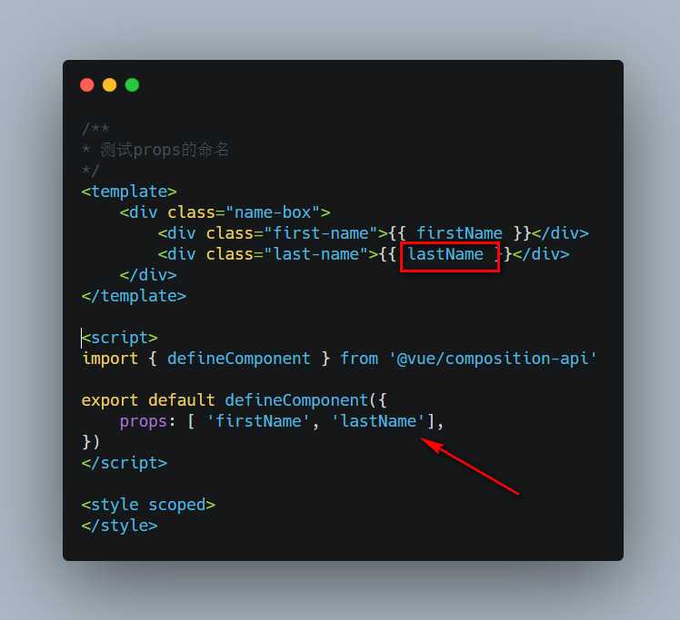
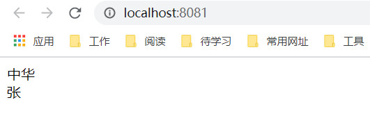

<div style="text-align: center"></div>
一个组件的封装，基本上都会用到数据管理。就像你编写一个函数，有时候需要入参，函数内部拥有变量，然后有一个返回结果。对应到组件里面，有时也会带入参数（props）,内部变量（data）和返回结果（ui）。伪代码如下：
```javascript
function(props) {
    let data = {...};
    // 通过外部参数和内部数据返回一个UI视图
    return render(props, data)
}
```
接下来我们看看props和data的使用方式。
## Props
props 作为外部参数传递给组件，一般可以传入多种类型，例如字符串，布尔类型，数组，对象等。为了更好的规范传入的props，有时也可以在组件内部规定好传入组件的props的数据类型。在组件内部使用时，就像函数一样，虽然js是解释性语言，修改props也不会报错，但是不要在组件内部修改props的值。

所以，vue中使用props的数据都是单向传递的，父-> 子，每当父组件的porps变化时，子组件也会重新渲染。

#### props核心概念
* Prop 的大小写命名
* 单向数据流
* props数据类型
* 静态或者动态的porps
* props数据类型验证，必填，设置默认值等


###### Prop 的大小写命名
先看看简单的Prop的大小写命名，由于HTML 中的 attribute 名是大小写不敏感的，所以浏览器会把所有大写字符解释为小写字符。这意味着当你使用 DOM 中的模板时，camelCase (驼峰命名法) 的 prop 名需要使用其等价的 kebab-case (短横线分隔命名) 命名。
示例：
App.vue
```html
<template>
  <Props1 firstName="中华" last-name="张"></Props1>
</template>

<script>
import Props1 from '@/components/Props/Props1'

export default {
  name: 'App',
  components: {
    Props1,
  }
}
</script>
```
Props1.vue
```html
/**
* 测试props的命名
*/
<template>
    <div class="name-box">
        <div class="first-name">{{ firstName }}</div>
        <div class="last-name">{{ last-name }}</div>
    </div>
</template>
<script>
import { defineComponent } from '@vue/composition-api'

export default defineComponent({
    props: [ 'firstName', 'last-name'],
})
</script>
<style scoped>

</style>
```
这里先不做转换看看会出什么结果：
<div style="text-align: center"></div>

###### 注意：如果我们不转换，这里就得不到值！
<div style="text-align: center"></div>
<div style="text-align: center"></div>

#### 单向数据流
prop传递方向：parent -> child
所有的 prop 都使得其父子 prop 之间形成了一个单向下行绑定：父级 prop 的更新会向下流动到子组件中，但是反过来则不行。这样会防止从子组件意外变更父级组件的状态，从而导致你的应用的数据流向难以理解。

另外，每次父级组件发生变更时，子组件中所有的 prop 都将会刷新为最新的值。这意味着你不应该在一个子组件内部改变 prop。如果你这样做了，Vue 会在浏览器的控制台中发出警告。

#### 静态或者动态的porps
props可以传递动态的，也可以传递静态的, 如下示例，firstName就是使用动态方式传递的，你可以将data的firstName改变，界面也会重新渲染。
```html
<template>
  <Props1 :firstName="firstName" last-name="张"></Props1>
</template>

<script>
import Props1 from '@/components/Props/Props1'

export default {
  name: 'App',
  components: {
    Props1,
  },
  data() {
      return {
          firstName: '中华'
      }
  }
}
</script>
```
####  props数据类型 && props数据类型验证，必填，设置默认值等
在上面的示例中，我们可以利用props将数据从父组件传递给子组件，props的数据类型除了上面的String类型，还可以传递的类型有：Number、Boolean、Array、Object、Function、Promise等。

我们在子组件中定义好了将要接收的props的名字，可是有时我们需要定义下props的类型该怎么做呢，或者有些需要必填、设置默认值又该怎么操作呢？

接下来看个小例子：
App.vue
```html
<template>
  <Props1 firstName="中华" last-name="张" :interests="interests"></Props1>
</template>

<script>
import Props1 from '@/components/Props/Props1'

export default {
  name: 'App',
  components: {
    Props1,
  },
  data() {
    return {
      interests: "read"
    }
  }
}
</script>
```
Props1.vue
```html
/**
* 测试props的命名
*/
<template>
    <div class="name-box">
        <div class="first-name">firstName： {{ firstName }}</div>
        <div class="last-name">lastName： {{ lastName }}</div>
        <div class="age">age： {{ age }}</div>
        <div class="interests">interests： {{ interests }}</div>

    </div>
</template>
<script>
import { defineComponent } from '@vue/composition-api'

export default defineComponent({
    props: {
        firstName: {
            type: String,
            required: true,
        },
        lastName: [String, Function], // 可以有多种类型
        age: {
            type: Number,
            default: 18,
        },
        interests: {
            type:String, 
            validator: function (value) {
                return value == 'read'; // 如果传的值不是read，在控制台会弹出警告，在程序上不会看出区别
            }

        }
    },
})
</script>
<style scoped>

</style>
```
<div style="text-align: center"></div>

## data
组件的数据管理，出来外部传入的数据，还有内部的数据，就是data。
组件的 data 选项是一个函数。Vue 在创建新组件实例的过程中调用此函数。它应该返回一个对象，然后 Vue 会通过响应性系统将其包裹起来，并以 $data 的形式存储在组件实例中。
示例：
```html
<template>
    <div class="container">
        初始值是： {{ initCount }}
        点击的次数： {{ count }}
        <button @click="clickBtn">按钮</button>
    </div>
</template>

<script>
export default {
    props: ['initCount'],
    data() {
        return {
            count: 0
        }
    },
    methods: {
        clickBtn() {
            this.count++;
        }
    }
}

</script>

<style scoped>
button {
    color: red;
    border: 1px solid #909090;
}
</style>
```
在上面的例子中，在data中定义了一个count，作为内部数据管理，显示在界面上。