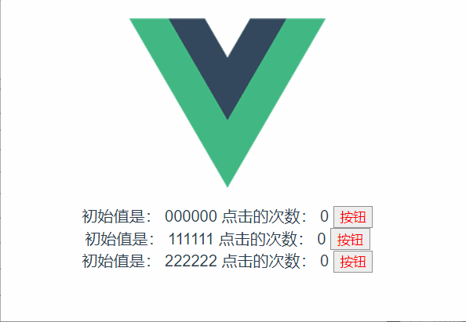

组件是vue中最推崇的，也是最强大的功能之一，就是为了提高重用性，减少重复性的开发。在vue中，代码按照templeate、script、style的模块方式拆分。我们创建一个名为Count的的vue组件，看看是怎么使用的。

## 示例


#### vue组件代码(Count.vue)：
```html
<template>
    <div class="container">
        初始值是： {{ initCount }}
        点击的次数： {{ count }}
        <button @click="clickBtn">按钮</button>
    </div>
</template>

<script>
export default {
    props: ['initCount'],
    data() {
        return {
            count: 0
        }
    },
    methods: {
        clickBtn() {
            this.count++;
        }
    }
}
</script>

<style scoped>
button {
    color: red;
    border: 1px solid #909090;
}
</style>
```
#### 调用方式（在App.vue中调用）：
```html
<template>
  
  <Count initCount="000000" />
  <Count initCount="111111" />
  <Count initCount="222222" />
</template>

<script>
import Count from './components/Count.vue';

export default {
  name: 'App',
  components: {
    Count,
  }
}
</script>

<style>
#app {
  font-family: Avenir, Helvetica, Arial, sans-serif;
  -webkit-font-smoothing: antialiased;
  -moz-osx-font-smoothing: grayscale;
  text-align: center;
  color: #2c3e50;
  margin-top: 60px;
}
</style>

```

* 模板（template）:模板声明了数据和最终展现给用户的DOM之间的映射关系。
* 初始数据（data）： 一个组件的初始数据状态。对于可复用的组件来说，通常是私有的状态。
* 外部参数（props）: 组件之间通过参数来进行数据的传递和共享，默认传递方向是自上而下的，但也可以显示声明为双向绑定。
* 方法（methods）: 一般为组件内部的私有方法。
* 生命周期钩子函数（lifecycle hooks）: 一个组件会触发多个生命周期钩子函数，比如created,destroyed等，在这次钩子函数中，可以封装一些自定义的逻辑。

暂且对组件的认识到此为止，有了一个简单的了解之后，先看看vue提供的一些基础语法，数据绑定，指令，修饰符等。
