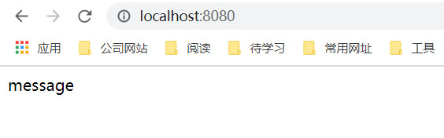

指令（Directives）是vue模板中最常用的一项功能，它带有前缀v-。指令的主要职责就是当其表达式的值改变时，相应地将某些行为应用到DOM上。接下来将对每一个指令，一一了解一下。

## 内置指令
#### v-pre
编译时跳过当前元素和它的子元素。可以用来显示原始的Mustache标签。跳过大量没有指令的节点会加快编译。
###### 示例
```html
<template>
    <div v-pre>
           {{ count }} 
    </div>
</template>

<script>
export default {
    data() {
        return {
            count: 0
        }
    }
}
</script>
```
<div style="text-align: center"></div>

#### v-cloak
v-cloak指令保持在元素上直到关联实例结束编译。当和CSS规则如[v-cloak] { display: none; }一起使用时，这个指令可以隐藏未编译的Mustache标签直到实例准备完毕，否则在渲染界面时，有可能用户会先看到Mustache标签，然后看到编译后的数据。

#### v-text
v-text指令可以更新元素的textContent。在内部，{{Mustache}}插值也被编译未textNode的一个v-text指令。
###### 示例
```html
<template>
    <div>
        <div v-text="message"></div>
        <div>{{message}}</div>
    </div>
</template>

<script>
export default {
    data() {
        return {
            message: 'Hello zzh'
        }
    }
}
</script>
```
<div style="text-align: center"></div>

#### v-html
更新元素的innerHtml。内容按照普通的HTML插入，忽略数据绑定，如果想复用模板片段，则应当使用partials。
###### 注意
不建议在网站上直接动态渲染任意HTML片段，很容易导致XSS攻击。

###### 示例
```html
<template>
    <div>
        <div v-html="message"></div>
    </div>
</template>

<script>
export default {
    data() {
        return {
            message: '<div><span>message</span></div>'
        }
    }
}
</script>
```
<div style="text-align: center"></div>

#### v-model
v-model指令用来在input、select、text、checkbox、radio等表单控件元素上创建双向数据绑定。根据控件类型v-model自动选取正确的方法更新元素。
除此之外，v-model后面还可以添加多个参数（number/lazy/debounce）
* number: 输入自动转换成Number类型（如果原值的转换结果为NaN，则返回原值）。
* lazy: 在默认情况下，v-model在input事件中同步输入框的值和数据，我们可以添加一个lazy特性，从而数据改到change事件中发生。
* trim: 去除空格
* debounce: 设置延时同步数据,**2.0以上版本中取消了debounce**


通过下面的示例中可以看出，貌似参数并不起作用~
###### 示例
<div style="text-align: center"></div>
```html
<template>
    <div>
        <form>
            姓名： 
            <input type="text" v-model.lazy.trim="name" placeholder="please input name" /> <br/>
            年龄：
            <input type="text" v-model.number="age" placeholder="please input age" number /> <br/>
            性别： 
            <input type="radio" v-model="sex" id="man" value="man" />
            <label for="man">男</label>
            <input type="radio" v-model="sex" id="woman" value="woman" />
            <label for="woman">女</label> <br/>
            爱好：
            <input type="checkbox" v-model="interest" id="book" value="book" />
            <label for="book">阅读</label>
            <input type="checkbox" v-model="interest" id="play" value="play" />
            <label for="play">玩</label>
            <input type="checkbox" v-model="interest" id="program" value="program" />
            <label for="program">编程</label>
        </form>
        <div class="form-info">
            <h3>个人信息</h3>
            <div>姓名： {{ name }}</div>
            <div>年龄： {{ age }}</div>
            <div>性别： {{ sex }}</div>
            <div>爱好： {{ interest }}</div>
        </div>
    </div>
</template>

<script>
export default {
    data() {
        return {
            name: '',
            age: '',
            sex: '',
            interest: [],
        }
    }
}
</script>
```

#### v-bind
v-bind指令用于响应更新HTML特性，将一个或多个attribute，或者一个组件prop动态绑定到表达式。v-bind可以简写用冒号“:”。

在绑定prop时，prop必须在子组件中声明。可以用修饰符指定不同的绑定类型。修饰符有：
* .camel: 将绑定的特性名字转换回驼峰命名。只能用于普通HTML特性的绑定，通常用于绑定驼峰命名的SVG特性，比如viewBox。

以下两种在vue3中已移除：
* .sync: 双向绑定，只能用于prop绑定
* .once: 单次绑定，只能用于prop绑定

###### 示例
```html
<!-- 缩写 -->


<!-- 动态 attribute 名缩写 -->
<button :[key]="value"></button>

<!-- 内联字符串拼接 -->


<!-- class 绑定 -->
<div :class="{ red: isRed }"></div>
<div :class="[classA, classB]"></div>
<div :class="[classA, { classB: isB, classC: isC }]">
  <!-- style 绑定 -->
  <div :style="{ fontSize: size + 'px' }"></div>
  <div :style="[styleObjectA, styleObjectB]"></div>

  <!-- 绑定一个全是 attribute 的对象 -->
  <div v-bind="{ id: someProp, 'other-attr': otherProp }"></div>

  <!-- prop 绑定。"prop" 必须在 my-component 声明 -->
  <my-component :prop="someThing"></my-component>

  <!-- 通过 $props 将父组件的 props 一起传给子组件 -->
  <child-component v-bind="$props"></child-component>

  <!-- XLink -->
  <svg><a :xlink:special="foo"></a></svg>
</div>
```
#### v-on
v-on指令用于绑定事件监听器。事件类型由参数指定；表达式可以是一个方法的名字或一个内联语句；如果没有修饰符，也可以省略。缩写为“@”。
###### 修饰符
* .stop - 调用 event.stopPropagation()。
* .prevent - 调用 event.preventDefault()。
* .capture - 添加事件侦听器时使用 capture 模式。
* .self - 只当事件是从侦听器绑定的元素本身触发时才触发回调。
* .{keyAlias} - 仅当事件是从特定键触发时才触发回调。
* .once - 只触发一次回调。
* .left - 只当点击鼠标左键时触发。
* .right - 只当点击鼠标右键时触发。
* .middle - 只当点击鼠标中键时触发。
* .passive - { passive: true } 模式添加侦听器

###### 示例
```html
<!-- 方法处理器 -->
<button v-on:click="doThis"></button>

<!-- 动态事件 -->
<button v-on:[event]="doThis"></button>

<!-- 内联语句 -->
<button v-on:click="doThat('hello', $event)"></button>

<!-- 缩写 -->
<button @click="doThis"></button>

<!-- 动态事件缩写 -->
<button @[event]="doThis"></button>

<!-- 停止冒泡 -->
<button @click.stop="doThis"></button>

<!-- 阻止默认行为 -->
<button @click.prevent="doThis"></button>

<!-- 阻止默认行为，没有表达式 -->
<form @submit.prevent></form>

<!-- 串联修饰符 -->
<button @click.stop.prevent="doThis"></button>

<!-- 键修饰符，键别名 -->
<input @keyup.enter="onEnter" />

<!-- 点击回调只会触发一次 -->
<button v-on:click.once="doThis"></button>

<!-- 对象语法 -->
<button v-on="{ mousedown: doThis, mouseup: doThat }"></button>
```

#### v-if/v-else/v-else-if
根据表达式的真假值来有条件地渲染元素。在切换时元素及它的数据绑定 / 组件被销毁并重建。如果元素是 ```<template>```，将提取它的内容作为条件块。
当条件变化时该指令触发过渡效果。
#### 示例
```html
<template>
    <div class="container">
        <div v-if="showName">展示名字</div>
        <div v-else>不展示名字</div>

        <div v-if="sex === '男'">男</div>
        <div v-else-if="sex === '女'">女</div>
        <div v-else>不男不女</div>
    </div>
</template>

<script>
import { defineComponent } from '@vue/composition-api';

export default defineComponent({
    data() {
        return {
            showName:true,
            sex: ''
        }
    },
})
</script>

```
<div style="text-align: center"></div>

#### v-show
根据表达式的真假值，切换元素的 display CSS property。
当条件变化时该指令触发过渡效果。


#### ref
ref 被用来给元素或子组件注册引用信息。引用信息将会注册在父组件的 $refs 对象上。如果在普通的 DOM 元素上使用，引用指向的就是 DOM 元素；如果用在子组件上，引用就指向组件实例。

###### 注意
因为HTML不区分大小写，camelCase风格的名字，比如v-ref:someRef将全部转换为小写。可以用v-ref:some-ref设置this.$refs.someRef。

###### 示例
Parent.vue
```html
<template>
    <div>
        <Child num="8" ref="child"></Child>
    </div>
</template>

<script>
import Child from './VRefChild.vue';

export default {
    components: {
        Child,
    },
    mounted(){
        console.log(this.$refs.child.getNum()); // 8
    }
}
</script>
```
Child.vue
```html
<template>
    <div>
        我是子组件{{ num }}
    </div>
</template>

<script>
export default {
    props: ['num'],
    methods: {
        getNum() {
            return this.num;
        }
    }
}
</script>
```

## 参考网址
https://vue3js.cn/docs/zh/api/directives.html#v-text
