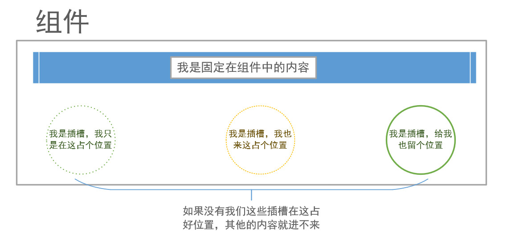
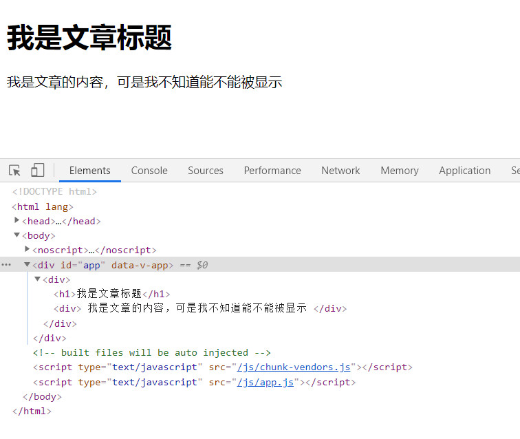
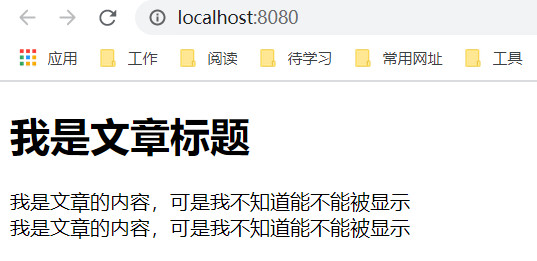

Vue 实现了一套内容分发的 API，这套 API 的设计灵感源自 Web Components 规范草案，将 ```<slot>``` 元素作为承载分发内容的出口。

## 为什么需要插槽
插槽，顾名思义，就是在组件容器中添加一个一个的插槽。哈哈，就是这么生硬的解释。来张图，缓解一下~
<div style="text-align: center"></div>

在使用vue组件时，假设我定义了一个父组件，叫Article.vue, 此时，这个组件里面只定义好了一个标题显示，我希望也能在组件里面写一些内容，该怎么做呢？
Article.vue
```html
<template>
    <div>
        <h1>我是文章标题</h1>
    </div>
</template>
``` 
App.vue
```html
<template>
  <Article>
    {{ content }}
  </Article>
</template>

<script>
import Article from './components/组件分发/Article';

export default {
  name: 'App',
  components: {
    Article,
  },
  data() {
    return {
      content:'我是文章的内容，可是我不知道能不能被显示',
    }
  },
}
</script>
```
<div style="text-align: center"></div>
很明显，如果我在一个组件内部写内容，其实并不会被显示，该组件起始标签和结束标签之间的任何内容都会被抛弃，所以这就引入了插槽的功能，提前预定好位置，让父组件往里面填充内容。所以把上面的article.vue稍微修改一下，加个插槽：
```html
<template>
    <div>
        <h1>我是文章标题</h1>
        <div><slot>你把文章内容显示在这里好了</slot></div>
    </div>
</template>
```
再看看结果，内容就显示出来了，而且会把默认内容给覆盖掉。这里如果你不填写内容，默认内容就会显示出来。
<div style="text-align: center"></div>
到这里，应该知道插槽的作用了吧。

## 具名插槽
在上面的例子中，我们已经知道了为什么使用插槽，而且也知道了如何使用插槽。可是根据最上面的那张图可以看出，一个组件中可以定义很多插槽，那么该如何实现呢？
这个时候就有了具名插槽，也就是带有具体名字的插槽。
在上面的例子中，如果我们除了想定义文章内容，还想定义文章的尾部该怎么做呢？单纯的加个slot插槽吗？
```html
<template>
    <div>
        <h1>我是文章标题</h1>
        <div><slot>你把文章内容显示在这里好了</slot></div>
        <div><slot>我是文章的尾部</slot></div>
    </div>
</template>
```
<div style="text-align: center"></div>
显然不是这样子，这会造成内容会被渲染两次。只能为其加上名字才可以正确的使用。

Article.vue
```html
<template>
    <div>
        <h1>我是文章标题</h1>
        <div><slot name="content">你把文章内容显示在这里好了</slot></div>
        <div><slot name="footer">我是文章的尾部</slot></div>
    </div>
</template>
```

App.vue
```html
<template>
  <Article>
    <content>{{ content }}</content>
    <footer>{{ footer }}</footer>
  </Article>
</template>

<script>
import Article from './components/组件分发/Article';

export default {
  name: 'App',
  components: {
    Article,
  },
  data() {
    return {
      content:'我是文章的内容，可是我不知道能不能被显示',
      footer:'我是文章的尾部，我在尾部显示',
    }
  },
}
</script>
```
<div style="text-align: center"></div>
从具名插槽的使用中可以看出，还有一些标签语义化的味道，让代码的可读性增强不少。当然了，如果你命名不规范，那就谁也拯救不了了~


在向具名插槽提供内容的时候，我们可以在一个 template元素上使用 v-slot 指令，并以v-slot 的参数的形式提供其名称。示例如下：
App.vue
```html
<template>
  <Article>
    <!-- <content>{{ content }}</content>
    <footer>{{ footer }}</footer> -->
    <template v-slot:content>
      <div>{{ content }}</div>
    </template>

    <template #footer>
      <div>{{ footer }}</div>
    </template>
  </Article>
</template>

<script>
import Article from './components/组件分发/Article';

export default {
  name: 'App',
  components: {
    Article,
  },
  data() {
    return {
      content: '我是文章的内容，可是我不知道能不能被显示',
      footer: '我是文章的尾部，我在尾部显示',
    }
  },
}
</script>
```
<div style="text-align: center"></div>
效果与之前是一样的。这么写相较于之前的那种写法的好处在于，v-slot:content在写法上更加灵活，可以有更多的扩展功能， 例如缩写、使用动态插槽名等。

###### 注意: 这里使用具名插槽还可以使用缩写```<template #footer>```
