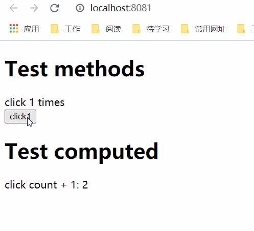

## methods
我们用 methods 选项向组件实例添加方法，它是一个包含所需方法的对象。
Vue 自动为 methods 绑定 this，以便于它始终指向组件实例。这将确保方法在用作事件监听或回调时保持正确的 this 指向。在定义 methods 时应避免使用箭头函数，因为这会阻止 Vue 绑定恰当的 this 指向。
这些 methods 和组件实例的其它所有 property 一样可以在组件的模板中被访问。在模板中，它们通常被当做事件监听使用。

###### 总结
在methods里面定义好方法，然后在组件内的其他地方进行调用。

###### 示例
常用的示例，在button上添加一个click事件，当点击button时，出发methods里面的clickBtn方法。跟原生的书写方法很类似，只是原生的把方法写到了script标签内。vue的写法还是和原生开发很相似的，将单个组件内的html/css/js融合到一个文件内，降低了组件间的耦合性。
```html
<template>
    <div class="container">
        初始值是： {{ initCount }}
        点击的次数： {{ count }}
        <button @click="clickBtn">按钮</button>
    </div>
</template>

<script>
export default {
    props: ['initCount'],
    data() {
        return {
            count: 0
        }
    },
    methods: {
        clickBtn() {
            this.count++;
        }
    }
}

</script>

<style scoped>
button {
    color: red;
    border: 1px solid #909090;
}
</style>
```

## computed
中文：计算属性
模板内的表达式非常便利，但是设计它们的初衷是用于简单运算的。在模板中放入太多的逻辑会让模板过重且难以维护。对于任何包含响应式数据的复杂逻辑，你都应该使用计算属性。

```html
<template>
    <div class="container">
        <h1>Test methods</h1>
        <div>click {{ count }} times</div>
        <button @click="click1">click1</button>

        <h1>Test computed</h1>
        <div>click count + 1: {{ countPlusOne }}</div>
    </div>
</template>

<script>
import { defineComponent } from '@vue/composition-api'
export default defineComponent({
    data() {
        return {
            count: 0,
        }
    },
    methods: {
        click1: function() {
            this.count++;
        }
    },
    computed: {
        countPlusOne: function() {
            return this.count + 1;
        },
    }
})
</script>

<style scoped>
</style>
```
<div style="text-align: center"></div>

#### 计算属性缓存 vs 方法
我们可以将同一函数定义为一个方法而不是一个计算属性。两种方式的最终结果确实是完全相同的。然而，不同的是计算属性是基于它们的反应依赖关系缓存的。计算属性只在相关响应式依赖发生改变时它们才会重新求值。

###### 对比总结
个人理解，方法，计算属性，通过名字就知道它们的用途了。方法里面主要写一些事件处理的方法过程。而计算属性，以作为属性为主，具有依赖缓存的功能。
方法多由界面触发，计算属性多为实现数据与界面的绑定，数据会因依赖的的变化而变化，从而触发界面的重新渲染。

## watch
Vue 提供了一种更通用的方式来观察和响应当前活动的实例上的数据变动：侦听属性。当你有一些数据需要随着其它数据变动而变动时，便可能使用监听属性。

虽然计算属性在大多数情况下更合适，但有时也需要一个自定义的侦听器。这就是为什么 Vue 通过 watch 选项提供了一个更通用的方法，来响应数据的变化。当需要在数据变化时执行异步或开销较大的操作时，这个方式是最有用的。

###### 注意
watch最好不要滥用，能用计算属性的地方，最好不要用watch, 毕竟计算属性已经做好了对数据的监听，不需要自己去做。

###### 那么什么情况下使用侦听属性呢
先看看watch相比computed有哪些特殊的支持：
* 支持异步操作
* 监听复杂的数据
* 可以获取变化前的数据进行比较处理

###### 示例
```html
<template>
  <div class="container">
    <input @change="change" v-model="value" />
  </div>
</template>

<script>
import { defineComponent } from '@vue/composition-api'

export default defineComponent({
  data() {
    return {
      value: ''
    }
  },
  watch: {
    value: function (currentValue, oldValue) {
        console.log(`当前的数据：${currentValue}`);
        console.log(`之前的数据：${oldValue}`);
        console.log('\n');
        // todo
    }
  }
})
</script>

<style lang="sass" scoped>
</style>
```
<div style="text-align: center"></div>

#### 方法 vs. 计算属性 vs. 侦听属性
* methods: 存放的方法是一些内部方法、事件的回调等。
* watch: 用于监听数据的实时的变化。在数据变化的回调中执行异步操作或者开销很大的时候使用。
* computed: 也是实时监听数据变化，做出相应的变化，跟watch不同的是他可以被看成一个data里面的属性值来使用。所以当我们需要监听一个值并且需要生成一个新的属性时就可以使用computed。
