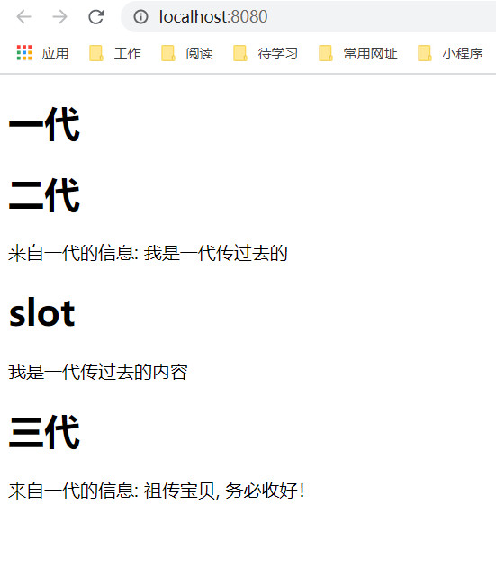

## 父传子（父->子）
#### props
在组件数据管理中，我们知道，可以利用porps将父组件数据传递给子组件。

###### 示例
Generator1.vue
```html
<template>
    <h1> 一代 </h1>
    <Generator2 info="我是一代传过去的"></Generator2>
</template>

<script>
import { defineComponent } from '@vue/composition-api'
import Generator2 from '@/components/数据传递/Generator2';

export default defineComponent({
    setup() {
        
    },
    components: { Generator2 }
})
</script>
```
Generator2.vue
```html
<template>
    <div>
        <h1>二代</h1>
        <span>来自一代的信息: {{ info }}</span>
    </div>
</template>

<script>
import { defineComponent } from '@vue/composition-api'

export default defineComponent({
    setup() {},
    props: {
        info: {
            type: String
        }
    },
    data() {},
})
</script>
```

<div style="text-align: center"></div>

#### slot
slot也算是一种从父组件向子组件传递消息的一种方式。
###### 示例
Generator1.vue
```html
<template>
    <h1> 一代 </h1>
    <Generator2 info="我是一代传过去的">
        <template v-slot:content>
            <h1>slot</h1>
            <div>我是一代传过去的内容</div>
        </template>
    </Generator2>
</template>

<script>
import { defineComponent } from '@vue/composition-api'
import Generator2 from '@/components/数据传递/Generator2';

export default defineComponent({
    setup() {
        
    },
    components: { Generator2 }
})
</script>
```
Generator2.vue
```html
<template>
    <div>
        <h1>二代</h1>
        <span>来自一代的信息: {{ info }}</span>
        <slot name="content"></slot>
    </div>
</template>

<script>
import { defineComponent } from '@vue/composition-api'

export default defineComponent({
    setup() {},
    props: {
        info: {
            type: String
        }
    },
    data() {},
})
</script>
```
<div style="text-align: center"></div>


## 祖先传后代
有时可能从上至下有多代传递，那么自然可以使用props一代一代传下去，也可以使用provider/inject。
###### 示例
Generator1.vue
```html
<template>
    <h1> 一代 </h1>
    <Generator2 info="我是一代传过去的">
        <template v-slot:content>
            <h1>slot</h1>
            <div>我是一代传过去的内容</div>
        </template>
    </Generator2>
</template>

<script>
import { defineComponent } from '@vue/composition-api'
import Generator2 from '@/components/数据传递/Generator2';

export default defineComponent({
    setup() {
        
    },
    provide: {
        message: '祖传宝贝, 务必收好！'
    },
    components: { Generator2 }
})
</script>
```
Generator2.vue
```html
<template>
    <div>
        <h1>二代</h1>
        <span>来自一代的信息: {{ info }}</span>
        <slot name="content"></slot>
        <Generator3></Generator3>
    </div>
</template>

<script>
import { defineComponent } from '@vue/composition-api';
import Generator3 from '@/components/数据传递/Generator3';

export default defineComponent({
    setup() {},
    components: { Generator3 },
    props: {
        info: {
            type: String
        }
    },
    data() {},
})
</script>
```
Generator3.vue
```html
<template>
    <div>
        <h1>三代</h1>
        <span>来自一代的信息: {{ message }}</span>
    </div>
</template>

<script>
import { defineComponent } from '@vue/composition-api'

export default defineComponent({
    setup() {},
    data() {},
    inject: ['message'],
})
</script>
```
<div style="text-align: center"></div>

## 子传父
在上面的例子中，数据流都是自上而下的，利用on/$emit()事件的方式，也可以实现在下而上的数据传递。
###### 示例
Generator4.vue
```html
<template>
    <h1> 四代 </h1>
    <div>
        <span>来自子代的内容： {{ childContent }}</span>
    </div>
    <Generator5 v-on:changeContent="change"></Generator5>
</template>

<script>
import { defineComponent } from '@vue/composition-api'
import Generator5 from '@/components/数据传递/Generator5';

export default defineComponent({
    setup() {
        
    },
    components: { Generator5 },
    data() {
        return {
            childContent: '',
        }
    },
    methods: {
        change(val) {
            this.childContent = val.content;
        },
    }
})
</script>
```
Generator5.vue
```html
<template>
    <h1> 五代 </h1>
    <button @click="click">按钮</button>
</template>

<script>
import { defineComponent } from '@vue/composition-api'

export default defineComponent({
    setup() {},
    methods: {
        click() {
            this.$emit('changeContent', {content: '我是子组件传递给父组件的'});
        }
    }
})
</script>
```

<div style="text-align: center"></div>

## 总结
除了上面的一些方法，关于数据的处理其实常用的还有vuex,由于之后还会详细学习，便不在这里做介绍了。下面的bus也会在之后单独讲解，也不在此做过多的介绍，就是利用监听者模式实现的一种传递数据的方式。还有就是利用选择的方式:$parent / $children与 ref，不是主动传递的。
#### 向下传递
props, provider/inject, slot, vuex， bus

#### 向上传递
on/emit, vuex, bus, 

#### 无关组件传递
vuex，bus
