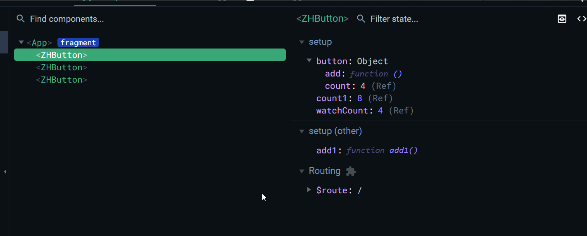

## 前言
vue3的优势在此就不多说了，相较于vue2是更小、更快、更强了，具体可以参考以下地址：
###### vue3的优势参考：
https://zhuanlan.zhihu.com/p/351445575
https://bbs.huaweicloud.com/blogs/300280

那么在我们平时开发中，接触到最多的便是vue组件了，也就是每天写的.vue文件里面的template,script,css。
###### 插一句：
写代码期待达到的目标是怎样的呢？ 可靠、可维护（可读）、可扩展。在此基础上，产生了一种编程方式：面向对象编程。面向对象编程不仅可以应用于后端语言，在前端也可以应用。毕竟“javascript不是面向对象的，它是一种基于对象的语言，你遇到的所有东西几乎都是对象”。既然说到面向对象，自然想到的便是：高内聚低耦合。

在此基础上，我们再来看看vue3的.vue文件。vue2的不同之处在scrpit部分，具体需要了解Composition API vs Optios API以及vue3的setup语法。
Composition API： https://vuejs.org/guide/extras/composition-api-faq.html#what-is-composition-api
script setup: https://vuejs.org/api/sfc-script-setup.html#script-setup
```html
<template>
xxxx
yyyy
zzzz
aaaa
bbbb
.....
</template>

<script>
const a = '';
const b = 1;
const fun1 = () {};
const fun2 = () {};
.....
</script>

<style>
.a {}
.b {}
.c {}
....
</style>
```
很明显，我们平时写的业务组件都是内容很丰富的，有些通用的可以抽离成组件，但是也依旧存在很多特有的部分。那么我们的vue组件就会越来越大。那么这个时候，为了代码具有更好的可读性和可维护性，我们便开始对这个组件进行拆分。其实如果不是为了可维护的话，写到一个文件内也是挺好的，毕竟符合了高内聚的要求，至于高内聚有什么好处就不在此赘述了（啰嗦一句）。但是这时，为了不破坏其高内聚的特点，所以会将拆分出来的文件，放置到一个文件夹内。

## 拆分
#### 组件
那么切分最开始的地方就是template了，当页面过于丰富时，我们会根据自己的经验将页面内的不同模块进行拆分到更小的组件中，同时这里也增加了一定的代码量和复杂程度。例如，组件间的通信，更多的重复的模板固定内容template, script,css等。但有舍就有得吗，如果写了代码太多太乱连自己都看不懂了，有了bug也无法修复了或者修复时间过长，不就成了更大的灾难了么。所以只是把问题前置，前人栽树，后人乘凉。

#### 样式
如果觉得在一轮拆分后，vue组件还是很大，这个时候也可以将css拆分出去。其实这一步个人觉得可有可无，看个人喜好，毕竟style标签当不需要编辑时也是被折叠起来的，影响并不是很大。但是就我个人平时喜欢拆分出去。因为现在都是用css的预处理语言，scss/less。当利用vs code进行样式开发时，可以更好的与template进行对照。


#### JS
在vue3之前, 应该很少会有人想把JS里面的代码抽离出去，当然一些可脱离this的方法除外。然而，composition api的到来，把这种想法变的不那么困难了。

先看一下option api和composition api的比较，这个时候我们不再受vue2原有的结构约束，可以把实现某一功能的代码的数据，方法，声明周期，监听等放置到一起，更加利于维护。

从图上可以看出，我们的组件中可能会存在应对各个部分的一段又一段的代码。当业务不断的需要，代码不断的扩充，新接手的人是否还会按照原来的代码块进行划分？这一段一段的代码能否再进行拆分，让vue文件中只需要看到执行和执行结果，而不需要看到执行过程？我先后进行了一些探索：
###### 探索一：单纯的抽离变量和方法，利用export导出和import导入（不可用）
先说不可用的原因：这里在index.ts export出去的变量或方法，在vue文件中，都被看做是全局的，当存在多个地方使用时，当一处变化时，其他地方都会同时产生变化。
index.ts
```javascript
import { ref } from 'vue';

export const count = ref(0);
export const add = () => { ++count.value; };
```
index.vue
```html
<template>
    <div>count: {{ count }}</div>
    <button @click="add">+</button>
</template>

<script lang="ts" setup>
import { count, add } from './index';
</script>
```
结果：


###### 探索二：利用class，模拟静态类的方式（不可用）
先说不可用的原因：这里的index.ts里面定义了一个class，里面写一些静态属性和静态方法，也都是全局的。

index.ts
```javascript
export default class Index {
    constructor() {}
    static count = ref(0);
    static add = () => {
        ++ this.count.value;
    };
};
```
index.vue
```html
<template>
    <div>count: {{ Index.count }}</div>
    <button @click="Index.add">+</button>
</template>

<script lang="ts" setup>
import Index from './index';
</script>
```
结果同上。

###### 探索三：定义类型，后进行实例化（可用，但vue develop tools调试有点问题）

###### 目录
```
Button
│   index.vue
│   index.scss
│   index.js  
```

index.ts
```javascript
export default class Button {
    constructor() {}
    count = ref(0);
    add = () => {
        ++ this.count.value;
    };
};
```
index.vue
```html
<template>
    <div style="padding: 5px; border: 1px solid black; margin: 5px;">
        <h5>通过class进行实例化进行划分</h5>
        <div>count: {{ button.count }}</div>
        <button @click="button.add">+</button>

        <h5>监听：通过class进行实例化进行划分 - 里面的ref值</h5>
        <div>watch count value: {{ watchCount }} </div>

        <h5>直接在setup中写</h5>
        <div>count1：{{ count1 }}</div>
        <button @click="add1">加</button>
    </div>

</template>

<script lang="ts" setup>
import { onMounted, reactive, ref, watch } from 'vue';
import Button from './index';

const button = new Button();
const watchCount = ref(0);
watch(button.count, (newVal: number) => {
    watchCount.value = newVal;
});


const count1 = ref(0);
const add1 = () => {
    ++count1.value;
};
</script>

<script lang="ts">
export default { name: 'ZHButton' }
</script>
```
结果：


###### 优点
这样子就可以对setup里面的代码进行拆分了，可以让代码更好的隔离，而且强制限制了不同功能的代码放置在同一个文件中。

###### 缺点
目前就我发现的缺点是，vue develop tools无法编辑object下的响应式属性值，如果是直接在setup里面写就可以编辑，如下：

个人目前觉得优点大于缺点的，也可能vue develop tools过段时间就支持了呢。

