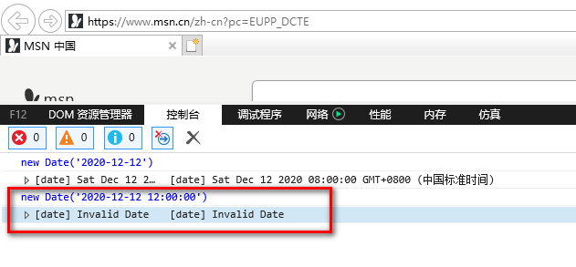
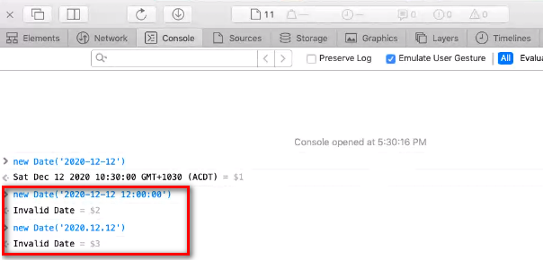

## webkit内核和blink内核对new Date('YYYY-MM-DD hh:mm:ss')处理不同
在小程序开发中,可能会遇到android机器上显示正常，到苹果手机上显示异常(invalid date)问题，目前发现的原因是由于不同的机器使用的解析JS的引擎不同。

在这里使用IE11（webkit）, safari(webkit)和chrome（blink）进行测试，Edge已经基于Chromium开发，故不考虑单独测试。

#### 基于chrome的测试结果

#### 基于IE11的测试结果

#### 基于safari的测试结果

#### 知识拓展
各平台脚本执行环境以及用于渲染非原生组件的环境是各不相同的：

* 在 iOS 上，小程序逻辑层的 javascript 代码运行在 JavaScriptCore 中，视图层是由 WKWebView 来渲染的，环境有 iOS 12、iOS 13 等；

* 在 Android 上，小程序逻辑层的 javascript 代码运行在 V8 中，视图层是由自研 XWeb 引擎基于 Mobile Chrome 内核来渲染的；

* 在 开发工具上，小程序逻辑层的 javascript 代码是运行在 NW.js 中，视图层是由 Chromium Webview 来渲染的。

* 在 PC 上，小程序逻辑层 javascript 和视图层 javascript 都是用 Chrome 内核

* 在 Mac 上，小程序逻辑层的 javascript 代码运行在 JavaScriptCore 中，视图层是由 WKWebView 来渲染的，与 iOS 一致

https://developers.weixin.qq.com/miniprogram/dev/framework/runtime/env.html

#### 结论
在做时间转换时，避免使用new Date('YYYY-MM-DD hh:mm:ss'),new Date('YYYY.MM.DD') 目前还没有得到所有浏览器的支持。
在内部处理时间时尽量使用时间对象，需要转换成字符串的情况下使用格式：YYYY-MM-DD, 如果在对接口或者在显示的时候需要修改格式，在最后一步进行转换操作。